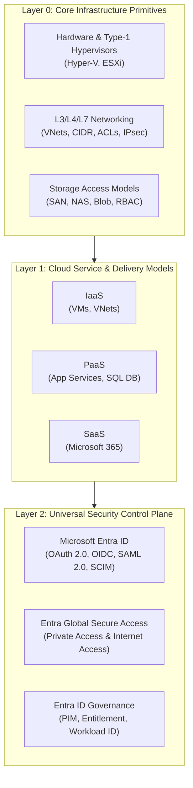
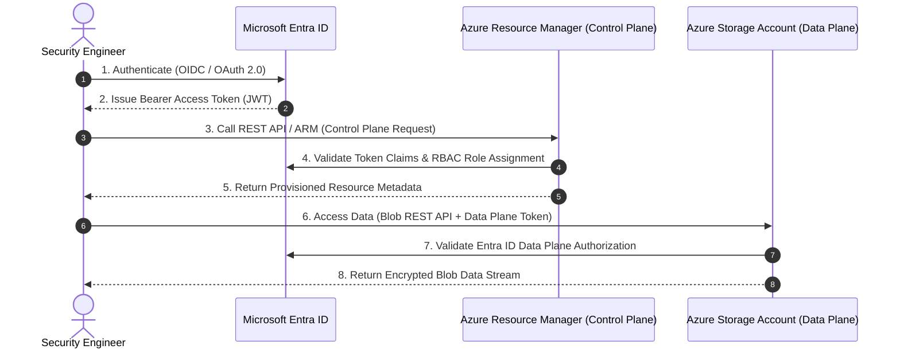
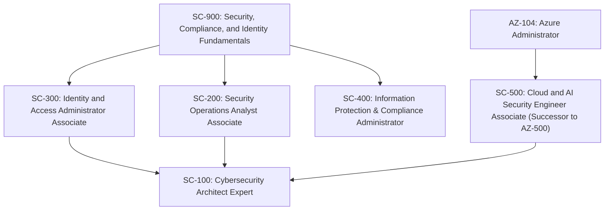
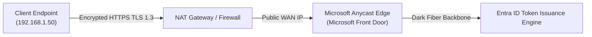
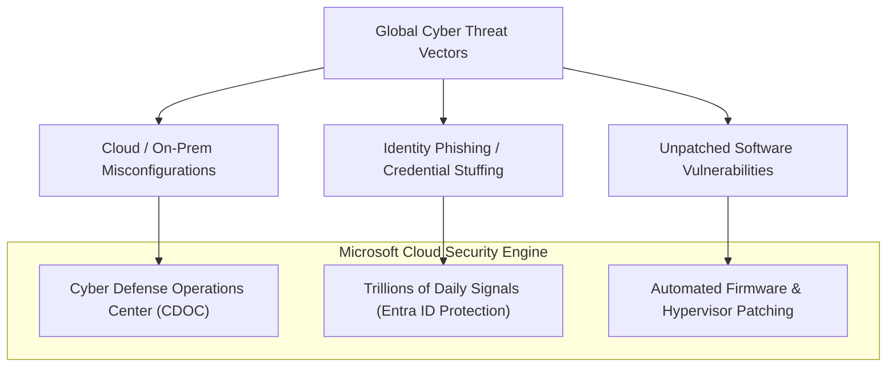
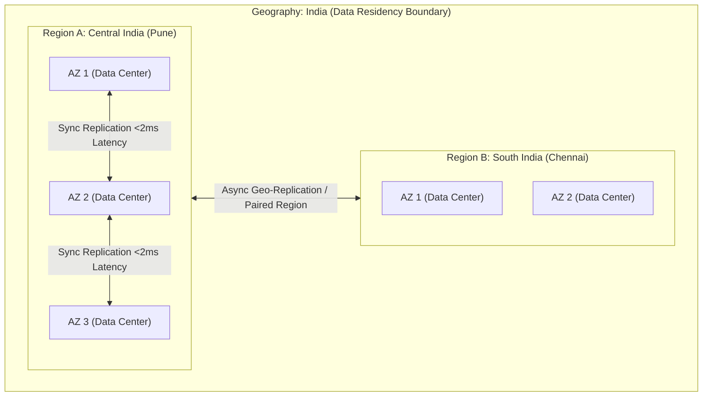
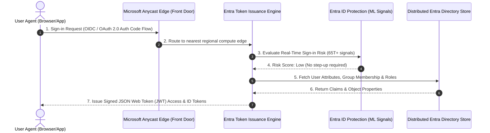

# SC-300 Day 01: Cloud Fundamentals & Identity Security in Microsoft Entra ID

> **Source Video Title:** SC-300 Course Introduction | Cloud Fundamentals & Identity Security in Microsoft Entra ID | Day 1  
> **Source URL:** [https://www.youtube.com/watch?v=Z-EF31TS7_k](https://www.youtube.com/watch?v=Z-EF31TS7_k&list=PL86wiCAX5vmTg8uubUrlHOqXrjXk6p-73&index=1)  
> **Instructor:** Raghuveer  
> **Refactored & Expanded By:** Senior Principal Engineer & Distinguished Technical Fellow (ex-FAANG / MANGOS)  
> **Target Certification Track:** Microsoft Certified: Identity and Access Administrator Associate (SC-300) | Bridge to Cybersecurity Architect (SC-100), SC-200 & Cloud and AI Security Engineer Associate (SC-500 - Successor to AZ-500)  
> **Technical Currency:** Updated as of **August 2026**

---

## Executive Summary & Curriculum Blueprint

Welcome to **Day 01** of the Microsoft Entra ID Security Masterclass. 

In enterprise security engineering, the single biggest point of failure is **fragmented knowledge**—mastering high-level identity GUI portals while remaining completely blind to the underlying networking, compute virtualization, storage access controls, and distributed control planes that identity governs.

This document transforms the raw Day 01 lecture transcript into an **authoritative, first-principles engineering reference**. We break down every concept into its fundamental primitives: **What** it is, **Why** it exists, **How** it works under the hood, **Where** and **When** to deploy it in production, and **What happens behind the scenes** at hyperscale.



---

## Module 1: The Master Philosophy — De-Fragmenting Security Knowledge

### 1.1 The "Fragmented Knowledge" Trap in Enterprise Engineering

In legacy IT security, engineers were siloed into narrow domains: Active Directory administrators managed domain controllers, network engineers managed firewalls, storage engineers managed SAN/NAS arrays, and cloud admins clicked buttons in cloud portals.

```
┌─────────────────────────────────────────────────────────────────────────┐
│                      FRAGMENTED SECURITY KNOWLEDGE                      │
├───────────────────┬───────────────────┬────────────────┬────────────────┤
│  Identity (IAM)   │   Networking      │    Compute     │    Storage     │
│  "Entra ID GUI"   │   "Firewalls"     │   "VM Admins"  │   "SAN / NAS"  │
└─────────┬─────────┴─────────┬─────────┴───────┬────────┴────────┬───────┘
          │                   │                 │                 │
          └───────────────────┴────────┬────────┴─────────────────┘
                                       ▼
                       MISCONFIGURATIONS & BREACHES
```

> [!CAUTION]
> **Distinguished Fellow Architectural Warning:**  
> In modern Cloud Native and Zero Trust architectures, **Identity IS the new perimeter**. You cannot write an effective Microsoft Entra Conditional Access policy or secure a Storage Account if you do not understand Private Endpoints, CIDR subnets, Azure Resource Manager (ARM) RBAC, or managed identities. 
> 
> Fragmented knowledge creates subtle security gaps—such as allowing Entra ID authenticated users to bypass network perimeters, or securing an App Registration while leaving its Azure Blob storage backing store open via Shared Key authentication.

### 1.2 The Interdependence Matrix

Identity in Microsoft Azure operates across two distinct planes:
1. **Control Plane (Management Plane):** Governed by Azure Resource Manager (ARM) using Entra ID RBAC to determine *who can create, update, or delete Azure resources*.
2. **Data Plane:** Governed by application-level protocols or resource-specific RBAC (e.g., Azure Blob Data Contributor) to determine *who can read, write, or execute data within a resource*.



---

## Module 2: Microsoft Cybersecurity Certification Ecosystem (2026 Architecture)

### 2.1 The Certification Roadmap & Strategic Positioning

Microsoft has structured its cybersecurity certifications around specialized role-based domains. Understanding how SC-300 integrates with the broader ecosystem is vital for career trajectory and enterprise solution design.



| Certification | Focus Domain | Core Technologies Covered | Primary Persona |
| :--- | :--- | :--- | :--- |
| **SC-900** | Security Fundamentals | High-level Entra ID, Defender, Purview overview | Entry-level / Management |
| **SC-300** | Identity & Access Management | Entra ID, Hybrid Sync, PIM, Governance, App Registrations, Workload Identities | Senior Identity/Cloud Security Engineer |
| **SC-200** | Security Operations (SecOps) | Microsoft Defender XDR, Microsoft Sentinel, KQL Threat Hunting | SOC Analyst / Incident Responder |
| **SC-500** *(New)* | Cloud & AI Security | Azure Infrastructure, Defender for Cloud, Network Security, AI Workloads & Autonomous Agent Security (Succeeds AZ-500) | Cloud & AI Security Engineer |
| **SC-100** | Cybersecurity Architecture | Zero Trust Architecture, CAF, WAF, Governance, Enterprise Risk Mitigation | Lead / Principal Cybersecurity Architect |

### 2.2 Deep Dive into SC-300 Exam Domains (August 2026 Update)

The SC-300 exam is updated continuously to reflect new Microsoft Entra capabilities. As of August 2026, the four core domains are structured as follows:

```
┌──────────────────────────────────────────────────────────────────────────┐
│                   SC-300 EXAM DOMAIN WEIGHTINGS (2026)                  │
├──────────────────────────────────────────────────────────────┬───────────┤
│ Domain 1: Implement and Manage User Identities              │  20 - 25% │
│ Domain 2: Implement Authentication & Access Management      │  25 - 30% │
│ Domain 3: Plan and Implement Workload Identities             │  20 - 25% │
│ Domain 4: Plan and Automate Identity Governance             │  25 - 30% │
└──────────────────────────────────────────────────────────────┴───────────┘
```

#### Domain Breakdown:
1. **Implement and Manage User Identities (20–25%)**
   - Tenant configuration, custom domain names, administrative units (AUs).
   - User and group management (Dynamic Groups, Group-based licensing).
   - External Identities (B2B Collaboration, Cross-Tenant Access Settings, Entra External ID).
   - Hybrid Identity (Entra Connect Sync, Entra Cloud Sync, Password Hash Sync, PTA, Federation).
2. **Implement Authentication and Access Management (25–30%)**
   - Modern authentication protocols (OAuth 2.0, OpenID Connect, SAML 2.0, WS-Fed).
   - Passwordless authentication (FIDO2 passkeys, Microsoft Authenticator, Windows Hello for Business).
   - Self-Service Password Reset (SSPR) and On-Premises Password Writeback.
   - Entra ID Conditional Access (Signal-based access controls, Session controls, Authentication Strengths).
   - Entra ID Protection (User Risk vs. Sign-in Risk, automated remediation).
3. **Plan and Implement Workload Identities (20–25%)**
   - Managed Identities (System-assigned vs. User-assigned).
   - Application Registrations, Service Principals, and App Roles.
   - Workload Identity Federation (OIDC integration with GitHub Actions, Kubernetes, AWS).
   - Defender for Cloud Apps (MCAS) and App Governance integration.
4. **Plan and Automate Identity Governance (25–30%)**
   - Entitlement Management (Access Packages, Catalogs, Connected Organizations).
   - Privileged Identity Management (PIM for Entra Roles, Azure Resources, PIM for Groups).
   - Access Reviews for Users, Guests, and Service Principals.
   - Lifecycle Workflows (Automated Joiner-Mover-Leaver HR-driven provisioning).
   - Entra Permissions Management (CIEM across Azure, AWS, GCP).

> [!IMPORTANT]
> **The OEM Documentation Mandate in Consulting & Enterprise Security:**  
> In principal-level consulting and architecture, **never rely on third-party blogs or informal tutorials for security baseline designs**. Always base design decisions directly on Original Equipment Manufacturer (OEM) documentation (e.g., Microsoft Learn, RFC specifications, ISO/NIST benchmarks). OEM documentation represents the legal and technical authority; if a third-party pattern fails in production, the liability falls entirely on the architect.

---

## Module 3: Infrastructure & Systems Prerequisites from First Principles

To master Entra ID, an engineer must understand the core computing, networking, and storage primitives upon which identity operates.

### 3.1 Compute & Virtualization Architecture

Cloud computing does not eliminate hardware; it abstracts hardware behind a software virtualization layer managed by the Cloud Service Provider (CSP).

```
┌─────────────────────────────────────────────────────────────────────────┐
│                     TYPE-1 HYPERVISOR ARCHITECTURE                      │
├─────────────────────────────────────────────────────────────────────────┤
│  Virtual Machine A (Windows)  │  Virtual Machine B (Linux)               │
│  [Guest OS + Apps + Drivers]  │  [Guest OS + Apps + Drivers]             │
├───────────────────────────────┴─────────────────────────────────────────┤
│                   TYPE-1 HYPERVISOR (Microsoft Hyper-V)                │
├─────────────────────────────────────────────────────────────────────────┤
│                   BARE-METAL HARDWARE (CPU, RAM, NIC, SAN)              │
└─────────────────────────────────────────────────────────────────────────┘
```

#### First Principles Breakdown:
- **Bare-Metal Hardware:** Physical CPU (Intel/AMD x86_64 or ARM64), RAM, Motherboard, Network Interface Cards (NICs), Host Bus Adapters (HBAs).
- **Type-1 (Bare-Metal) Hypervisor:** Runs directly on physical hardware without an underlying host OS (e.g., Microsoft Hyper-V, VMware ESXi). In Azure, a customized, hardened version of Hyper-V controls hardware allocation.
- **Hardware Virtualization Mechanics:**
  - **vCPU Allocation:** Mapped directly to physical CPU threads using hardware extensions (Intel VT-x / AMD-V).
  - **Memory Virtualization:** Enforced via Second Level Address Translation (SLAT) / Extended Page Tables (EPT) to prevent VM memory bleed.
  - **Microarchitectural Isolation:** Enforces strict execution boundaries between multi-tenant VMs running on the same physical blade.

---

### 3.2 Networking Primitives for Security Engineers

Identity services communicate over IP networks. A failure in network design directly compromises authentication traffic.



#### Core Network Concepts Required for SC-300:

1. **IP Addressing & CIDR Notation:**
   - **IPv4 RFC 1918 Private Ranges:** `10.0.0.0/8`, `172.16.0.0/12`, `192.168.0.0/16`. Unroutable over the public internet.
   - **Subnet Mask Math:** A `/24` subnet provides $2^{32-24} = 256$ addresses (251 usable in Azure, as 5 addresses are reserved for network, gateway, DNS, and broadcast).
2. **OSI 7-Layer Model Context:**
   - **Layer 3 (Network):** IP routing, Virtual Networks (VNets), User Defined Routes (UDRs).
   - **Layer 4 (Transport):** TCP/UDP ports. Azure Network Security Groups (NSGs) filter traffic at Layers 3 and 4.
   - **Layer 7 (Application):** HTTP/HTTPS traffic. Web Application Firewalls (WAF), TLS terminating proxies, and Entra Private Access / Internet Access (Security Service Edge).
3. **Control Plane vs. Data Plane Networking:**
   - Control plane requests travel to `management.azure.com` over TLS.
   - Data plane traffic communicates directly with service endpoints (e.g., `https://mystorage.blob.core.windows.net`) or through Private Endpoints (`10.x.x.x` private IPs inside a VNet).

---

### 3.3 Storage Access Models & Authentication Evolution

Storage security has evolved from shared static credentials to dynamic identity-bound role assignments.

```
LEGACY ACCESS PATTERN (Vulnerable):
User/App ───► Storage Shared Access Signature (SAS Key) ───► Full Storage Access
              (Static key, hardcoded, high leak risk)

MODERN ENTRA ID ACCESS PATTERN (Zero Trust):
User/App ───► Entra ID OAuth 2.0 Auth ───► Bearer Token ───► Storage Blob REST API
                                                              (RBAC Validated per request)
```

| Storage Paradigm | Architecture | Security Protocol | Entra ID Integration |
| :--- | :--- | :--- | :--- |
| **Block Storage** | SAN / iSCSI, VHDX virtual disks | Azure Managed Disks (OS/Data) | Azure Disk Encryption (ADE) + AKV Key Release |
| **File Storage** | NAS / SMB 3.1.1 / NFS 4.1 | Azure Files | Entra ID Kerberos / On-Prem AD DS Authentication |
| **Object Storage** | Unstructured Flat Data | Azure Blob Storage | Entra ID RBAC (`Storage Blob Data Contributor`) |

---

## Module 4: On-Premises Infrastructure Challenges vs. Cloud Value Proposition

To explain **Why** enterprises migrate to Microsoft Azure and Entra ID, we must evaluate the technical and economic limitations of legacy on-premises data centers.

### 4.1 Comparative Architectural Matrix

| Parameter | On-Premises Data Center | Microsoft Azure & Entra ID |
| :--- | :--- | :--- |
| **Maintenance Overhead** | High (Physical hardware, HVAC, firmware updates, cabling, OS patching). | Low/Zero Hardware Maintenance (Managed by CSP via SLAs). |
| **Financial Model** | **CapEx** (Capital Expenditure): High upfront hardware purchases. | **OpEx** (Operational Expenditure): Pay-As-You-Go, consumption-based. |
| **Agility / Innovation** | **Frozen in Time:** Systems locked to purchased hardware capabilities. | **Continuous Evolution:** Instant access to new instance types, AI models, and security services. |
| **Scalability** | **Vertical/Hardware Bound:** Long procurement cycles for new servers. | **Hyper-Elastic:** Automatic Horizontal Scaling (Scale Sets, Auto-scaling). |
| **Security R&D** | Limited by organizational IT security budget. | **Hyperscale Security:** \$1B+ annual security budget, 3,500+ security experts. |
| **Network Backbone** | Constrained by local ISP links (typically 1–10 Gbps). | **Microsoft Global Fiber Backbone:** Dedicated dark fiber (100–400 Gbps). |

---

### 4.2 Financial Architecture: CapEx vs. OpEx Economics

```
CapEx (On-Premises):
[ Year 0: $500,000 Hardware Purchase ] ──► Depreciation over 5 Years ──► Tech Debt

OpEx (Cloud Consumption Model):
[ Month 1: $4,200 ] ──► [ Month 2: $3,800 ] ──► Scale down/up dynamically as business demands
```

#### First Principles Definitions:
- **Capital Expenditure (CapEx):** Heavy upfront capital investments in physical assets (servers, storage arrays, network switches, data center real estate). Depreciation is written off over a 3-to-5-year financial life cycle.
- **Operational Expenditure (OpEx):** Operational running expenses billed dynamically as utility consumption. In Azure, compute resources are billed per second of execution time.
- **Economies of Scale:** Microsoft purchases hundreds of thousands of server blades and network components directly from OEMs at hyper-volume discounts, passing cost savings to enterprise tenants through lower per-minute resource pricing.

---

### 4.3 The Cloud Security Paradigm Shift: Addressing Misconceptions

Legacy security engineers frequently assert: *"On-premises data centers are more secure because I can physically touch the servers."*

> [!NOTE]
> **Distinguished Fellow Security Analysis:**  
> Physical proximity to a server cabinet does not equate to logical security. The vast majority of modern enterprise breaches are **credential attacks, social engineering, identity phishing, and software misconfigurations**—none of which are prevented by a locked data center door.



1. **Massive Threat Intelligence:** Microsoft Entra ID analyzes over **65 trillion telemetry signals daily** (sign-in attempts, password hashes, device health checks, threat intelligence feeds), instantly identifying compromised credentials across global tenants.
2. **Zero-Trust Isolation:** Physical hosts are partitioned using microarchitectural isolation, encrypted hardware enclaves (Confidential Computing), and strict RBAC boundaries.

---

## Module 5: Cloud Deployment & Service Delivery Models

### 5.1 Deployment Models Overview

```
┌─────────────────────────────────────────────────────────────────────────┐
│                         CLOUD DEPLOYMENT MODELS                         │
├─────────────────┬─────────────────┬──────────────────┬──────────────────┤
│  Public Cloud   │  Private Cloud  │   Hybrid Cloud   │ Community Cloud  │
│ (Azure Global)  │ (Azure Stack /  │ (On-Prem AD DS + │ (Azure Gov GCC-  │
│                 │   Dedicated)    │    Entra ID)     │   High, China)   │
└─────────────────┴─────────────────┴──────────────────┴──────────────────┘
```

1. **Public Cloud:** Multi-tenant shared infrastructure logically isolated by hypervisors and Entra tenant boundaries. High availability, infinite scale.
2. **Private Cloud:** Infrastructure dedicated exclusively to one organization. High operational cost, mandatory for legacy compliance constraints.
3. **Hybrid Cloud:** Integrates on-premises data centers with Azure public cloud using secure connectivity (VPN, ExpressRoute, Azure Arc) and Identity Synchronization (Entra Connect Sync / Cloud Sync).
4. **Community / Sovereign Cloud:** Isolated physical deployments reserved for specific compliance jurisdictions (e.g., Azure Government GCC-High for US defense compliance, Azure China operated by 21Vianet).

---

### 5.2 Service Delivery Models & The Shared Responsibility Matrix

Understanding the breakdown of operational responsibility across Infrastructure as a Service (IaaS), Platform as a Service (PaaS), and Software as a Service (SaaS) is critical for assigning security controls.

```
┌─────────────────────────────────────────────────────────────────────────┐
│                    SHARED RESPONSIBILITY MATRIX                         │
├──────────────────────┬──────────────┬──────────────┬────────────────────┤
│ Responsibility Layer │     IaaS     │     PaaS     │        SaaS        │
├──────────────────────┼──────────────┼──────────────┼────────────────────┤
│ Information & Data   │  CUSTOMER    │  CUSTOMER    │     CUSTOMER       │
│ Devices & Endpoints  │  CUSTOMER    │  CUSTOMER    │     CUSTOMER       │
│ Accounts & Identity  │  CUSTOMER    │  CUSTOMER    │     CUSTOMER       │
├──────────────────────┼──────────────┼──────────────┼────────────────────┤
│ Identity Infrastructure│ SHARED     │  SHARED      │     MICROSOFT      │
│ Operating System     │  CUSTOMER    │  MICROSOFT   │     MICROSOFT      │
│ Network Controls     │  CUSTOMER    │  SHARED      │     MICROSOFT      │
│ Applications         │  CUSTOMER    │  MICROSOFT   │     MICROSOFT      │
├──────────────────────┼──────────────┼──────────────┼────────────────────┤
│ Physical Data Center │  MICROSOFT   │  MICROSOFT   │     MICROSOFT      │
│ Physical Network     │  MICROSOFT   │  MICROSOFT   │     MICROSOFT      │
│ Physical Hosts       │  MICROSOFT   │  MICROSOFT   │     MICROSOFT      │
└──────────────────────┴──────────────┴──────────────┴────────────────────┘
```

> [!IMPORTANT]
> **The Constant Responsibility Immutable Rule:**  
> Regardless of whether you deploy **IaaS, PaaS, or SaaS**, the customer **ALWAYS** retains 100% responsibility for:
> 1. Data Classification & Governance
> 2. Endpoint Device Security
> 3. Identity & Access Management (User accounts, credentials, MFA, RBAC assignments)

---

## Module 6: Cloud Architecture Primitives & Global Infrastructure

Microsoft Azure’s global physical infrastructure dictates how identity services achieve high availability (HA) and disaster recovery (DR).

### 6.1 Infrastructure Hierarchy Mechanics

```
Geography (e.g., India, United States, Europe)
 └── Region (e.g., Central India [Pune], South India [Chennai], West India [Mumbai])
      └── Availability Zone (AZ 1, AZ 2, AZ 3 - Independent Power/Cooling/Network)
           └── Physical Data Center Blades (Hypervisor Racks & Storage Enclosures)
```



1. **Geography:** A defined geopolitical boundary (e.g., India, US, Europe, Asia-Pacific) containing two or more regions. Ensures data residency and compliance boundaries (e.g., RBI guidelines for financial data remaining within India).
2. **Azure Region:** A set of data centers deployed within a latency-defined perimeter, connected through a dedicated low-latency regional network.
3. **Availability Zones (AZs):** Physically separate data center locations within an Azure region. Each AZ has independent power, cooling, and networking facilities. 
   - **Intra-AZ Latency Envelope:** $< 2\text{ ms}$ round-trip latency, enabling synchronous data replication.
4. **Regional Pairs:** Each Azure region is paired with another region within the same geography at least 300 miles away (e.g., East US $\leftrightarrow$ West US, Central India $\leftrightarrow$ South India). During major platform outages, recovery prioritized targeting one region of every pair first.

---

### 6.2 Service Trust Portal (STP) & Sovereign Compliance

Enterprises operating in highly regulated verticals (BFSI, Healthcare, Defense) cannot rely on simple assurances. Microsoft provides verifiable compliance reports via the **Service Trust Portal (STP)** (`https://servicetrust.microsoft.com`).

- **Independent Audit Reports:** ISO/IEC 27001, SOC 1 / SOC 2 / SOC 3 reports, PCI-DSS assessments.
- **Geography-Specific Compliance:** RBI (Reserve Bank of India) guidelines, HIPAA (US Healthcare), GDPR (EU Data Protection), FedRAMP High.

---

## Module 7: Hyperscale Identity Mechanics — Microsoft Entra ID Under the Hood

### 7.1 Distributed Architecture & Scalability Engine

Microsoft Entra ID is **not** a traditional Windows Server Active Directory Domain Controller running on an Azure Virtual Machine. It is a **tenant-based, globally distributed, microservice-architected cloud identity platform**.

```
TRADITIONAL ON-PREM ACTIVE DIRECTORY:
[ Kerberos / NTLM ] ──► LDAP / RPC ──► Domain Controller (Windows Server OS)
- Monolithic database (ntds.dit)
- Replicated via SYSVOL / FSMO roles
- Per-site network bounds

MICROSOFT ENTRA ID (CLOUD NATIVE):
[ HTTP / HTTPS TLS 1.3 ] ──► REST APIs ──► OAuth 2.0 / OIDC Token Engine
- Globally distributed data store (Azure AD Directory Store)
- Microservices scale dynamically across global edge networks (Anycast)
- 99.99% Enterprise SLA
```



#### High Availability & High Concurrency Performance Math:
- **Concurrency Handling:** Entra ID processes tens of billions of authentications daily.
- **Horizontal Scaling:** The token issuance engine dynamically provisions stateless compute containers at edge locations worldwide to absorb sudden spikes in login requests (e.g., 100,000 employees signing in at 9:00 AM).
- **Service Level Agreement (SLA):** Microsoft provides a **99.99% uptime SLA** for Microsoft Entra ID P1 and P2 editions (covering authentication and token issuance).

---

### 7.2 The Modern Entra Security & Identity Suite (August 2026 Portfolio)

Microsoft Entra is an expanded family of identity and network access solutions. Security administrators must understand where each component fits:

```
┌─────────────────────────────────────────────────────────────────────────┐
│                      MICROSOFT ENTRA SUITE (2026)                       │
├─────────────────────────────────────────────────────────────────────────┤
│ 1. Microsoft Entra ID (Free, P1, P2)                                    │
│    Core Directory, MFA, SSPR, Conditional Access, Identity Protection   │
├─────────────────────────────────────────────────────────────────────────┤
│ 2. Microsoft Entra ID Governance                                        │
│    PIM, Entitlement Management, Access Reviews, Lifecycle Workflows      │
├─────────────────────────────────────────────────────────────────────────┤
│ 3. Microsoft Entra Workload ID                                          │
│    Managed Identities, Workload Identity Protection, OIDC Federation    │
├─────────────────────────────────────────────────────────────────────────┤
│ 4. Microsoft Entra Global Secure Access (Security Service Edge - SSE)   │
│    - Entra Private Access (Zero Trust Network Access / ZTNA)            │
│    - Entra Internet Access (Secure Web Gateway / SWG)                   │
├─────────────────────────────────────────────────────────────────────────┤
│ 5. Microsoft Entra Permissions Management (CIEM)                        │
│    Multi-Cloud Permission Analytics (Azure, AWS, GCP)                   │
├─────────────────────────────────────────────────────────────────────────┤
│ 6. Microsoft Entra Verified ID                                          │
│    Decentralized Credentials (W3C Open Standards)                       │
└─────────────────────────────────────────────────────────────────────────┘
```

---

### 7.3 Entra Licensing Nuances (Practical Enterprise Lab Context)

Understanding licensing SKUs is critical to avoid enterprise deployment failures:

```
┌─────────────────────────────────────────────────────────────────────────┐
│                       ENTRA LICENSING STACK (2026)                      │
├─────────────────────────────────────────────────────────────────────────┤
│ Microsoft 365 E5  =  Office 365 E5  +  EMS E5  +  Windows E5            │
│                      (Includes P2)     (Entra ID P2)                     │
└─────────────────────────────────────────────────────────────────────────┘
```

> [!WARNING]
> **Enterprise Licensing Trap (Office 365 E5 vs. Microsoft 365 E5):**  
> An **Office 365 E5** tenant does **NOT** include Microsoft Entra ID P1 or P2 licenses by default! 
> To enable Conditional Access, SSPR, PIM, Identity Protection, or Access Reviews, you must explicitly add **Enterprise Mobility + Security E5 (EMS E5)** or standalone **Microsoft Entra ID P2** licenses to your tenant. 
> Furthermore, features like PIM and Conditional Access enforce capabilities per-licensed-user. Unlicensed lab users will fail to trigger automated governance policies.

---

## Module 8: Hands-On Verification & Principal Fellow Lab Guide

As an elite security engineer, never rely solely on GUI portal representations. You must verify identity configurations via command-line tools (**PowerShell Microsoft.Graph Module** and **Azure CLI**).

### 8.1 Lab 1.1: Inspecting Entra Tenant Details & Licensing via PowerShell

#### Execution Command:
```powershell
# Step 1: Connect to Microsoft Graph API with required administrative scopes
Connect-MgGraph -Scopes "Organization.Read.All", "Directory.Read.All"

# Step 2: Query tenant organization details from Graph REST API
Get-MgOrganization | Select-Object Id, DisplayName, VerifiedDomains, CreatedDateTime | Format-List

# Step 3: Query active License SKUs provisioned in the tenant
Get-MgSubscribedSku | Select-Object SkuPartNumber, ActiveUnits, ConsumedUnits | Format-Table -AutoSize
```

#### Line-by-Line Technical Breakdown:
1. `Connect-MgGraph -Scopes ...`: Initiates an OAuth 2.0 Authorization Code flow against `https://graph.microsoft.com`. Requests an access token with delegated permissions `Organization.Read.All` and `Directory.Read.All`.
2. `Get-MgOrganization`: Calls the `GET /v1.0/organization` REST endpoint, returning tenant GUID, primary domain names, and tenant creation timestamp.
3. `Get-MgSubscribedSku`: Calls `GET /v1.0/subscribedSkus` to output provisioned billing SKUs (e.g., `ENTERPRISEPREPACK` for M365 E5, `AIP_SCC_PT2` for Entra ID P2), verifying active license counts versus consumed license counts.

---

### 8.2 Lab 1.2: Verifying Azure Subscriptions & ARM Region Locations via Azure CLI

#### Execution Command:
```azcli
# Step 1: Authenticate Azure CLI using Entra ID credentials
az login

# Step 2: List current account context and tenant ID
az account show --output json

# Step 3: Query available Azure locations and paired DR regions for a tenant
az account list-locations --query "[?metadata.regionCategory=='Recommended'].{Name:name, DisplayName:displayName, RegionalPair:metadata.pairedRegion[0].name}" --output table
```

#### Line-by-Line Technical Breakdown:
1. `az login`: Launches default browser to perform interactive OIDC authentication, caching bearer tokens in `~/.azure/accessTokens.json`.
2. `az account show`: Parses local token context to display the active subscription ID, tenant ID (`tenantId`), and user Principal Name (`user.name`).
3. `az account list-locations`: Queries the ARM provider endpoint `GET /subscriptions/{id}/locations` and filters output using JMESPath expressions to render recommended Azure regions alongside their paired Disaster Recovery regions.

---

## Module 9: Executive Knowledge Check & First-Principles Exam Readiness

To verify complete conceptual mastery, review the core architectural synthesis table:

### 9.1 The "What, Why, How, Where, When" Core Matrix

| Topic | What is it? | Why does it exist? | How does it work under the hood? | Where & When to use it? |
| :--- | :--- | :--- | :--- | :--- |
| **Entra ID Control Plane** | Identity provider for Azure Resource Manager (ARM). | Prevents unauthorized modification of cloud infrastructure. | ARM intercepts calls and validates Entra JWT claims against Azure RBAC role assignments. | Enforce across all Azure subscriptions for administrative access control. |
| **CapEx to OpEx** | Financial shift from hardware capital buy to cloud consumption. | Eliminates hardware tech debt and multi-million dollar data center buys. | CSP buys hardware at scale; tenant pays per-second of compute/storage consumption. | Apply when migrating on-premises workloads to optimize cloud financial efficiency. |
| **Availability Zones** | Physically isolated data centers within an Azure region. | Protects workloads against localized power, cooling, or network failures. | Synchronous data replication across data centers with $< 2\text{ ms}$ latency envelope. | Deploy mission-critical VMs, SQL DBs, and Entra application proxies with SLA requirements. |
| **Entra ID SLA (99.99%)** | Uptime SLA for authentication and token issuance. | Guarantees business continuity for enterprise SSO authentication. | Microservice stateless token engines scaled horizontally across global Anycast edges. | Required baseline for enterprise SSO federations and critical SaaS apps. |
| **EMS E5 / Entra P2 SKU** | Enterprise security add-on licensing suite. | Unlocks advanced zero-trust controls (Conditional Access, PIM, Identity Protection). | Per-user license metadata attached to user objects in Entra Directory Store. | Must be assigned to all administrative and standard accounts governing sensitive data. |

---

### 9.2 Distinguished Fellow Architectural Scenarios

#### Scenario 1: The Misconfigured Hybrid Storage Breach
* **Question:** A financial customer configures an Azure Storage Account to host sensitive payroll CSV files. They assign `Storage Blob Data Reader` RBAC role to an Entra ID group. However, a developer creates a Shared Access Signature (SAS) key with full read/write access and hardcodes it into a client-side JavaScript file. Is the storage account secure?
* **Answer:** **No.** While Entra ID RBAC is properly configured, storage accounts by default allow dual authentication paths (Entra ID OAuth AND Account Shared Keys). The SAS key bypasses Entra ID Conditional Access, MFA, and Audit Logging entirely.
* **Remediation:** Disable Shared Key Access on the Storage Account via Azure Policy (`allowSharedKeyAccess = false`), enforcing **Entra ID OAuth 2.0 as the sole authentication mechanism**.

#### Scenario 2: The Unlicensed PIM Administrative Trap
* **Question:** A Global Administrator creates a Privileged Identity Management (PIM) role assignment to make a user an Eligible Global Admin. The tenant holds an Office 365 E5 subscription without EMS E5 or Entra ID P2. What happens when the user attempts to activate their role?
* **Answer:** PIM activation will fail or be blocked. Office 365 E5 lacks Entra ID P2 capabilities. PIM requires an active **Entra ID P2** license assigned to the activating user object.

---

## Conclusion & Next Steps

Day 01 has established the foundational groundwork: de-fragmenting security knowledge, understanding compute, networking, and storage primitives, analyzing cloud financial models, and mapping the hyperscale architecture of Microsoft Entra ID.

### Preparation for Day 02:
In **Day 02**, we transition directly into **Azure Virtual Networking, Subnet Provisioning, VNet Peering, and Network Security Groups (NSGs)**—exploring how network controls integrate with Microsoft Entra ID to enforce identity-aware network perimeters.

> *"Fix the class of problem, not just the instance. Master the primitives, and the portal buttons take care of themselves."*