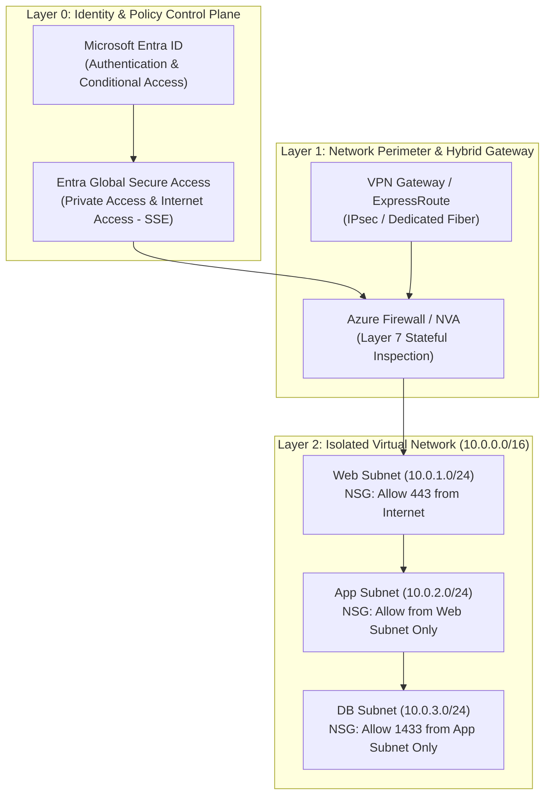
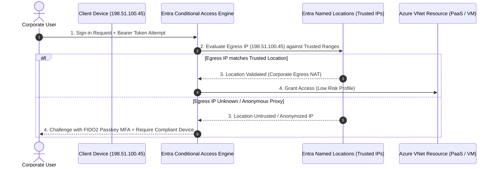
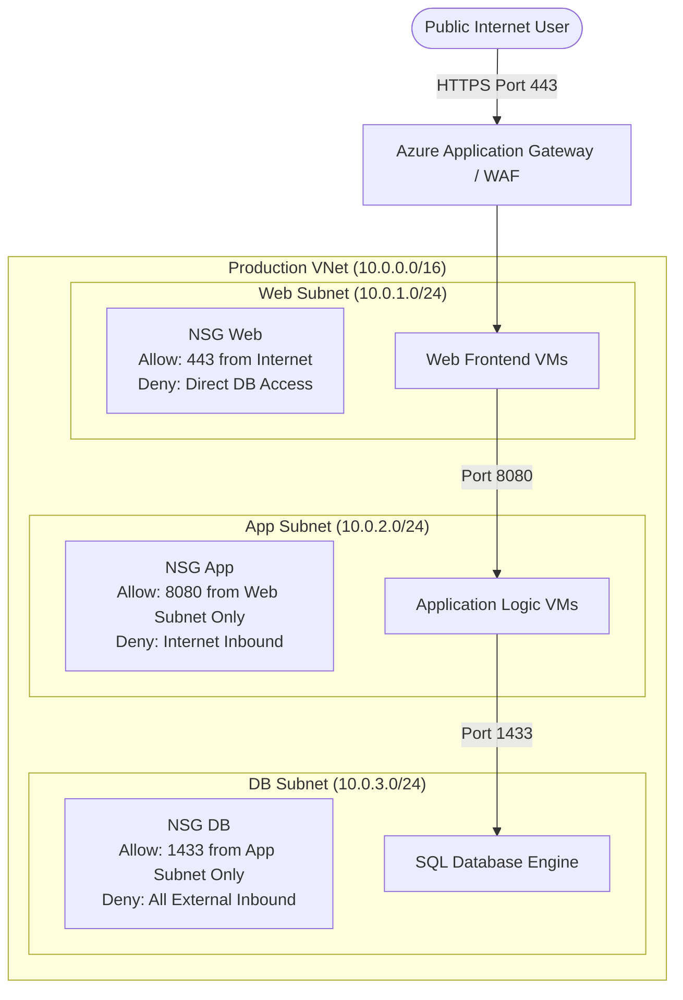
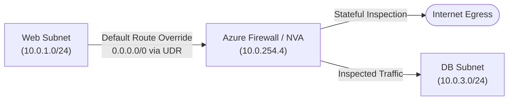
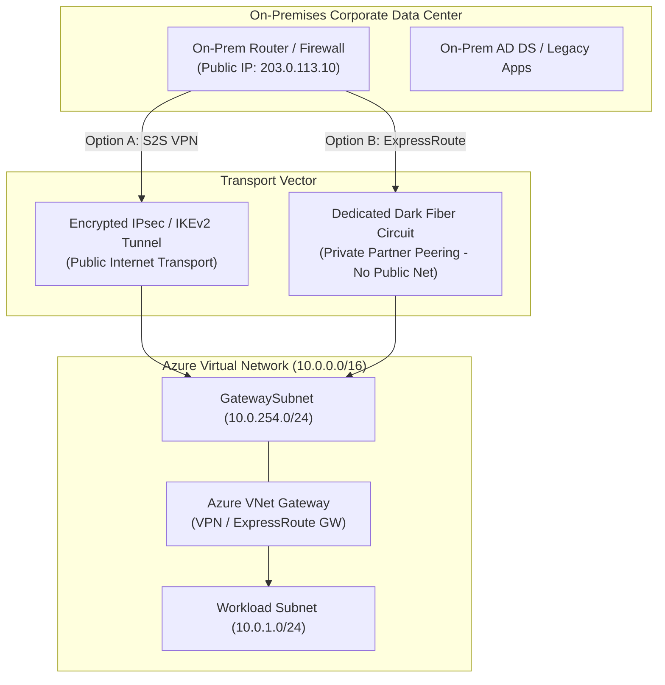
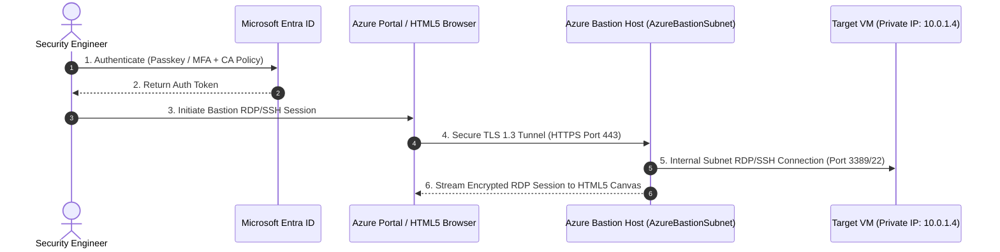

# SC-300 Day 02: Azure Networking & Virtual Network Provisioning in Microsoft Entra ID

> **Source Video Title:** Azure Networking & Virtual Network Provisioning in Microsoft Entra ID | Day 2  
> **Source URL:** [https://www.youtube.com/watch?v=Ut382eQHQzM](https://www.youtube.com/watch?v=Ut382eQHQzM&list=PL86wiCAX5vmTg8uubUrlHOqXrjXk6p-73&index=2)  
> **Instructor:** Raghuveer  
> **Refactored & Expanded By:** Senior Principal Engineer & Distinguished Technical Fellow (ex-FAANG / MANGOS)  
> **Target Certification Track:** Microsoft Certified: Identity and Access Administrator Associate (SC-300) | Bridge to Cybersecurity Architect (SC-100), SC-200 & Cloud and AI Security Engineer Associate (SC-500 - Successor to AZ-500)  
> **Technical Currency:** Updated as of **August 2026**

---

## Executive Summary & Curriculum Blueprint

Welcome to **Day 02** of the Microsoft Entra ID Security Masterclass.

Identity without network awareness is an incomplete security perimeter. Modern enterprise defense requires **Identity-Driven Network Security**—where Microsoft Entra ID authentication signals integrate directly with Azure Virtual Networks (VNets), Network Security Groups (NSGs), Private Endpoints, and Global Secure Access (Security Service Edge - SSE).

This document transforms the raw Day 02 lecture transcript into a **masterclass engineering reference**. We break down Azure virtual networking from first principles: **What** it is, **Why** it exists, **How** packet routing and segmentation work under the hood, **Where** and **When** to deploy hybrid topologies, and **How** network signals drive Entra ID Conditional Access and Zero Trust architectures.



---

## Module 1: The First-Principles Rationale — Why Networking Matters for Entra ID

### 1.1 The Convergence of Identity and Network Security

In legacy architecture, network security was trusted based on IP location: inside the corporate office LAN meant "trusted," while outside meant "untrusted." Modern cloud attacks (credential stuffing, session hijacking, stolen tokens) invalidate this assumption.

```
LEGACY PERIMETER MODEL (Broken):
[ Corporate LAN ] ──► (Implicit Trust) ──► Internal Applications / Data
[ Public Internet ] ──► (Untrusted) ──► Perimeter Firewall

ZERO TRUST MODEL (Modern Entra ID + Network Integration):
[ Request (User + Device) ] ──► [ Entra ID Conditional Access ] ──► [ Network Micro-Segmentation ]
                                  - Identity Signal (MFA/Risk)      - Private Endpoints
                                  - Network Location (Named IP)    - NSG Micro-perimeter
                                  - Device Health (Intune Compliant)
```

> [!CAUTION]
> **Distinguished Fellow Architectural Warning:**  
> A common enterprise mistake is treating Entra ID and Azure Networking as isolated silos. If an identity engineer configures Conditional Access without understanding **Named Locations**, **VNet Private Endpoints**, or **Egress IP Routing**, malicious actors with valid credentials can access sensitive Azure resources directly from untrusted public networks. 
> 
> Conversely, a network engineer who blocks all outbound traffic without carving out endpoints for Entra ID authentication (`login.microsoftonline.com`) will break authentication across the entire cloud tenant.

---

### 1.2 How Entra ID Consumes Network Signals

Entra ID uses network topology metadata to enforce access boundaries:



---

## Module 2: Azure Virtual Networking Foundations from First Principles

### 2.1 What is an Azure Virtual Network (VNet)?

An Azure Virtual Network (VNet) is a software-defined representation of your own isolated network in the cloud. It acts as an isolation boundary for compute workloads, providing IP addressing, subnetting, route table control, and security filtering.

```
┌─────────────────────────────────────────────────────────────────────────┐
│                    AZURE VIRTUAL NETWORK (VNet)                         │
│                    Address Space: 10.0.0.0/16                            │
├─────────────────────────────────────────────────────────────────────────┤
│  Web Subnet: 10.0.1.0/24   │  App Subnet: 10.0.2.0/24                  │
│  Usable IPs: 10.0.1.4 - 254│  Usable IPs: 10.0.2.4 - 254                 │
├────────────────────────────┼────────────────────────────────────────────┤
│  DB Subnet: 10.0.3.0/24    │  Gateway Subnet: 10.0.254.0/24             │
│  Usable IPs: 10.0.3.4 - 254│  Reserved for VPN/ExpressRoute Gateway      │
└────────────────────────────┴────────────────────────────────────────────┘
```

#### First Principles Breakdown:
- **Private IP Address Space:** Defined using RFC 1918 private address ranges:
  - `10.0.0.0/8` ($16,777,216$ IPs)
  - `172.16.0.0/12` ($1,048,576$ IPs)
  - `192.168.0.0/16` ($65,536$ IPs)
- **Subnetting Mechanics:** Dividing a large VNet address space into smaller logical blocks (subnets) for micro-segmentation, administrative boundaries, and security routing.

---

### 2.2 The Azure 5-IP Reserved Address Rule

In standard IPv4 networking, 2 addresses per subnet are unassignable: the **Network Address** (`.0`) and the **Broadcast Address** (`.255`).

In Azure Virtual Networks, **5 IP addresses per subnet are strictly reserved** by Microsoft for platform infrastructure management.

```
Example: Subnet 10.0.1.0/24 (Total 256 IPs)

┌──────────┬─────────────────────────────┬────────────────────────────────┐
│ IP       │ Reserved Purpose            │ Accessible by User Workloads?  │
├──────────┼─────────────────────────────┼────────────────────────────────┤
│ 10.0.1.0 │ Network Address             │ NO (Standard IPv4 Network ID)  │
│ 10.0.1.1 │ Default Gateway             │ NO (Azure VNet Default Router) │
│ 10.0.1.2 │ Azure DNS Resolver          │ NO (Mapped to 168.63.129.16)   │
│ 10.0.1.3 │ Azure DNS Secondary Resolver│ NO (Reserved for platform HA)  │
│ 10.0.1.255│ Subnet Broadcast Address   │ NO (Azure VNet non-broadcast)  │
└──────────┴─────────────────────────────┴────────────────────────────────┘
Usable Workload IP Range: 10.0.1.4 through 10.0.1.254 (Total 251 Usable IPs)
```

> [!IMPORTANT]
> **Subnet Size Math Formula:**  
> $\text{Usable IPs per Subnet} = 2^{(32 - \text{Prefix Length})} - 5$  
> - For a `/24` subnet: $2^{(32-24)} - 5 = 256 - 5 = \mathbf{251\text{ usable IPs}}$.  
> - For a `/28` subnet: $2^{(32-28)} - 5 = 16 - 5 = \mathbf{11\text{ usable IPs}}$.  
> - Minimum supported subnet size in Azure: `/29` (8 total IPs, $\mathbf{3\text{ usable IPs}}$).

---

### 2.3 IP Addressing Models: Private vs. Public IPs

```
┌─────────────────────────────────────────────────────────────────────────┐
│                           IP ADDRESSING TYPES                           │
├───────────────────────────────┬─────────────────────────────────────────┤
│ Private IP Addresses          │ Public IP Addresses                     │
├───────────────────────────────┼─────────────────────────────────────────┤
│ • RFC 1918 compliant          │ • Globally unique IPv4/IPv6             │
│ • Unroutable on Public Internet│ • Routable on Public Internet           │
│ • Assigned to NICs within VNet│ • Associated with NAT Gateways, ALBs,   │
│ • Dynamic or Static allocation│   or VMs for public ingress/egress      │
└───────────────────────────────┴─────────────────────────────────────────┘
```

#### Dynamic vs. Static Allocation Mechanics:
- **Dynamic Allocation:** Azure DHCP assigns an available IP address from the subnet pool when the resource boots up. If the VM is stopped (deallocated), the IP address is released back to the pool.
- **Static Allocation (IP Reservation):** Binds a specific IP address (e.g., `10.0.1.10`) permanently to a Network Interface Card (NIC). Mandatory for Domain Controllers, Network Virtual Appliances (NVAs), and core DNS servers.

---

### 2.4 Data Transfer & Bandwidth Economics (Ingress vs. Egress)

Understanding cloud data transfer billing is critical for financial architecture.

```
         INBOUND TRAFFIC (Ingress)            OUTBOUND TRAFFIC (Egress)
 Internet / On-Prem ──► Azure VNet   │   Azure VNet ──► Internet / On-Prem
          [ FREE / $0.00 ]           │    [ CHARGED Per GB / Tiered ]
```

| Traffic Vector | Cost Structure | Architectural Rationale |
| :--- | :--- | :--- |
| **Data Ingress (Inbound)** | **FREE (\$0.00 / GB)** | CSP incentive to ingest data into Azure data centers. |
| **Data Egress (Outbound)** | **CHARGED (\$0.087+ / GB)** | Billed based on data volume leaving Azure regions to Internet or On-Premises. |
| **Intra-VNet Traffic** | **FREE (\$0.00 / GB)** | Traffic within the same VNet address space across subnets. |
| **Intra-Region VNet Peering** | **Low Cost (\$0.01 / GB in/out)** | Cross-VNet traffic within the same Azure region. |
| **Global VNet Peering** | **Medium Cost (\$0.035+ / GB)** | Cross-region VNet traffic traversing Microsoft's global fiber backbone. |

---

## Module 3: Network Segmentation & Security Filtering

### 3.1 The 3-Tier Enterprise Web Application Architecture

To prevent lateral movement during a security breach, application architectures must enforce strict **micro-segmentation** across logical tiers.



> [!CAUTION]
> **Anti-Pattern Trap (Flat VNet Design):**  
> Placing Web servers, Application servers, and Databases inside a single subnet with no Network Security Groups allows an attacker who compromises a Web VM to instantly execute lateral port scans and access backend SQL databases directly over internal IP addresses.

---

### 3.2 Network Security Groups (NSGs) Under the Hood

A **Network Security Group (NSG)** is a stateful Layer 3 / Layer 4 packet-filtering firewall bound to a subnet or a Network Interface Card (NIC).

```
┌─────────────────────────────────────────────────────────────────────────┐
│                      NSG RULE EVALUATION ENGINE                         │
├─────────────────────────────────────────────────────────────────────────┤
│ Rule Priority Range: 100 (Highest Priority) to 4096 (Lowest Priority)   │
│ Processing order: Sequential (First match determines outcome)           │
├─────────────────────────────────────────────────────────────────────────┤
│ Default Inbound Rules (Built-in Priority 65000 - 65500):                │
│ • AllowVNetInBound        (Priority 65000): Allow 10.0.0.0/16 to 10.0.0.0/16 │
│ • AllowAzureLoadBalancerInBound (Priority 65001): Health probes         │
│ • DenyAllInBound          (Priority 65500): Block all other ingress     │
└─────────────────────────────────────────────────────────────────────────┘
```

#### Rule Mechanics:
1. **Stateful Inspection:** If an inbound request is allowed (e.g., HTTPS port 443), the corresponding outbound response traffic is automatically allowed regardless of outbound NSG rules.
2. **Evaluation Order:** Evaluated sequentially based on **Priority Number (100–4096)**. Once a packet matches a rule's criteria (Source IP, Source Port, Destination IP, Destination Port, Protocol), evaluation stops immediately.

---

### 3.3 User Defined Routes (UDRs) & Route Tables

By default, Azure system route tables automatically route traffic between all subnets within a VNet, across peered VNets, and directly out to the internet (`0.0.0.0/0`).

To force traffic through a centralized **Network Virtual Appliance (NVA)** or **Azure Firewall**, you must create a **Route Table** with **User Defined Routes (UDRs)**.



#### UDR Rule Structure:
- **Address Prefix:** `0.0.0.0/0` (Internet-bound traffic).
- **Next Hop Type:** `VirtualAppliance`.
- **Next Hop IP Address:** `10.0.254.4` (Internal IP of Azure Firewall / NVA).

---

## Module 4: Enterprise Hybrid Connectivity Architecture

To connect on-premises data centers with Azure Virtual Networks, security architects deploy one of three primary connectivity patterns:

```
┌─────────────────────────────────────────────────────────────────────────┐
│                     HYBRID CONNECTIVITY OPTIONS                         │
├─────────────────┬───────────────────────────┬───────────────────────────┤
│ Point-to-Site   │ Site-to-Site VPN          │ Azure ExpressRoute        │
│ (P2S VPN)       │ (S2S VPN)                 │ (Private Dedicated Fiber) │
├─────────────────┼───────────────────────────┼───────────────────────────┤
│ Remote Workers  │ Branch Office / On-Prem   │ Enterprise Data Center    │
│ OpenVPN / IKEv2 │ IPsec / IKEv2 Tunnel      │ Private Layer 2 / Layer 3 │
│ Over Public Net │ Over Public Internet      │ Bypasses Public Internet  │
│ Bandwidth: Low  │ Bandwidth: Up to 10 Gbps  │ Bandwidth: Up to 100 Gbps │
└─────────────────┴───────────────────────────┴───────────────────────────┘
```



### Architectural Comparison:
1. **Site-to-Site (S2S) VPN:**
   - Transport: Encrypted IPsec/IKE tunnel over the public internet.
   - Cost: Moderate (VNet Gateway hourly charges + bandwidth).
   - Use Case: Small-to-medium enterprise connections, non-critical branch offices.
2. **Azure ExpressRoute:**
   - Transport: Dedicated private Layer 2/3 connection provided by telecom partners (Equinix, AT&T, Verizon).
   - Cost: High (Dedicated port speed billing + circuit charges).
   - Benefits: Low latency ($< 5\text{ ms}$), high bandwidth (up to 100 Gbps), 99.95% SLA, complete isolation from public internet routing.

---

## Module 5: Advanced Network Perimeter & Zero Trust Services

### 5.1 Azure Bastion — Secure Administrative Access

Exposing SSH (Port 22) or RDP (Port 3389) directly to the public internet using Public IPs on Virtual Machines invites immediate automated brute-force and zero-day exploit attacks.

```
LEGACY VULNERABLE RDP ACCESS:
Admin Workstation ──► [ RDP Port 3389 Over Public IP ] ──► Azure Virtual Machine
                      (High Attack Surface, Port Scanned)

SECURE AZURE BASTION ACCESS (Zero Trust):
Admin Browser ──► [ HTTPS Port 443 / Entra ID Auth ] ──► Azure Bastion PaaS ──► [ Private IP RDP ] ──► Target VM
                                                          (Inside GatewaySubnet)
```



#### Azure Bastion SKU Architecture Matrix (2026 Live Capabilities):

| Feature / Metric | Developer SKU | Basic SKU | Standard SKU | Premium SKU (2026) |
| :--- | :---: | :---: | :---: | :---: |
| **Primary Target** | Dev/Test Workloads | Moderate Production | Advanced Production | High-Security / Regulated |
| **Cost Model** | Free (Shared Pool) | Hourly PaaS Rate | Hourly PaaS Rate | Hourly PaaS Rate |
| **`AzureBastionSubnet`**| **Not Required** | Mandatory (`/26`) | Mandatory (`/26`) | Mandatory (`/26`) |
| **VNet Peering** | Unsupported | Supported | Supported | Supported |
| **Host Scaling** | Fixed (Single) | Fixed (2 Instances) | Scalable (2–50 Instances) | Scalable (2–50 Instances) |
| **Native Client (CLI)**| Unsupported | Unsupported | Supported (SSH/RDP) | Supported (SSH/RDP) |
| **Session Recording** | Unsupported | Unsupported | Unsupported | **Supported (Graphical Audit)**|
| **Private-Only IP** | Unsupported | Unsupported | Unsupported | **Supported (No Public IP)** |

---

### 5.2 Entra Global Secure Access (Security Service Edge - SSE - August 2026 State)

As of **August 2026**, Microsoft's Security Service Edge (SSE) solution—**Microsoft Entra Global Secure Access**—converges identity and network access into a unified control plane.

```
┌─────────────────────────────────────────────────────────────────────────┐
│               MICROSOFT ENTRA GLOBAL SECURE ACCESS (SSE)                │
├──────────────────────────────────────┬──────────────────────────────────┤
│ Microsoft Entra Private Access       │ Microsoft Entra Internet Access  │
├──────────────────────────────────────┼──────────────────────────────────┤
│ • Zero Trust Network Access (ZTNA)   │ • Secure Web Gateway (SWG)       │
│ • Replaces traditional VPNs          │ • Protects SaaS and Web traffic  │
│ • Cloaks private apps behind Entra ID│ • Tenant-restricted internet egress│
│ • Enforces CA per app invocation     │ • Network Content Filtering (DLP)│
│ • Seamless External Guest Access     │ • AI Gateway Prompt Injection    │
└──────────────────────────────────────┴──────────────────────────────────┘
```

#### Key 2026 General Availability (GA) Feature Releases:
1. **Network Content Filtering (DLP):** Blocks or restricts unauthorized network transfers of sensitive file types (e.g., PDFs, spreadsheets) to generative AI endpoints and SaaS apps.
2. **AI Gateway Prompt Injection Protection:** Real-time network-level inspection shielding enterprise generative AI workloads from malicious prompt injection attacks.
3. **iOS & iPadOS Native Client Integration:** Routes M365 and private traffic natively using Microsoft Defender for Endpoint without requiring secondary agent installs.
4. **Windows BYOD Support:** Enables unmanaged partner and contractor devices to securely connect to private micro-segment resources bound by Entra Conditional Access device health policies.

---

## Module 6: Hands-On Verification & Principal Fellow Lab Guide

### 6.1 Lab 2.1: Provisioning a Multi-Subnet VNet & NSG via Azure CLI

#### Execution Script:
```azcli
# Step 1: Create a dedicated Resource Group for Networking
az group create \
  --name rg-corp-network-prod \
  --location centralindia

# Step 2: Provision a Virtual Network with an initial Web Subnet
az network vnet create \
  --resource-group rg-corp-network-prod \
  --name vnet-corp-prod-01 \
  --address-prefixes 10.0.0.0/16 \
  --subnet-name snet-web \
  --subnet-prefixes 10.0.1.0/24

# Step 3: Provision additional App and DB Subnets
az network vnet subnet create \
  --resource-group rg-corp-network-prod \
  --vnet-name vnet-corp-prod-01 \
  --name snet-app \
  --address-prefixes 10.0.2.0/24

az network vnet subnet create \
  --resource-group rg-corp-network-prod \
  --vnet-name vnet-corp-prod-01 \
  --name snet-db \
  --address-prefixes 10.0.3.0/24

# Step 4: Create a Network Security Group (NSG) for the Web Tier
az network nsg create \
  --resource-group rg-corp-network-prod \
  --name nsg-snet-web-prod

# Step 5: Add Stateful Inbound Rule allowing HTTPS (Port 443)
az network nsg rule create \
  --resource-group rg-corp-network-prod \
  --nsg-name nsg-snet-web-prod \
  --name Allow-HTTPS-Inbound \
  --priority 100 \
  --source-address-prefixes Internet \
  --destination-port-ranges 443 \
  --direction Inbound \
  --access Allow \
  --protocol Tcp

# Step 6: Associate NSG to the Web Subnet
az network vnet subnet update \
  --resource-group rg-corp-network-prod \
  --vnet-name vnet-corp-prod-01 \
  --name snet-web \
  --network-security-group nsg-snet-web-prod
```

#### Line-by-Line Technical Breakdown:
1. `az group create ...`: Provisions an Azure Resource Manager container (`rg-corp-network-prod`) in `centralindia` (Pune data center region).
2. `az network vnet create ...`: Creates the parent `10.0.0.0/16` Virtual Network and carves out the first `/24` subnet (`10.0.1.0/24`) providing 251 usable IPs.
3. `az network vnet subnet create ...`: Instantiates separate, non-overlapping `/24` subnets for Application logic (`10.0.2.0/24`) and Database engines (`10.0.3.0/24`).
4. `az network nsg create ...`: Builds a stateful packet filtering rule container (`nsg-snet-web-prod`).
5. `az network nsg rule create ...`: Defines Priority 100 rule permitting TCP Port 443 ingress from the `Internet` service tag.
6. `az network vnet subnet update ...`: Binds the NSG security container directly to `snet-web`, enforcing ingress evaluation for all NICs inside the subnet.

---

### 6.2 Lab 2.2: Provisioning Azure Named Locations in Entra ID via PowerShell

Integrate corporate network egress IPs directly into Microsoft Entra ID for Conditional Access evaluation.

#### Execution Script:
```powershell
# Step 1: Connect to Microsoft Graph API with Policy Administration scope
Connect-MgGraph -Scopes "Policy.ReadWrite.ConditionalAccess"

# Step 2: Define Corporate Trusted Egress Public IP Ranges (CIDR)
$ipRange = New-Object -TypeName Microsoft.Graph.PowerShell.Models.MicrosoftGraphIpNamedLocation
$ipRange.DisplayName = "Corporate Headquarters Egress NAT"
$ipRange.IsTrusted = $true

$ipSegment = New-Object -TypeName Microsoft.Graph.PowerShell.Models.MicrosoftGraphCidrAddressRange
$ipSegment.CidrAddress = "198.51.100.0/24"
$ipRange.IpRanges = @($ipSegment)

# Step 3: Post Named Location object to Entra ID Policy API
New-MgConditionalAccessNamedLocation -BodyParameter $ipRange
```

#### Line-by-Line Technical Breakdown:
1. `Connect-MgGraph -Scopes "Policy.ReadWrite.ConditionalAccess"`: Obtains a Bearer token authorizing write access to Entra Conditional Access Policy endpoints.
2. `New-Object ... MicrosoftGraphIpNamedLocation`: Constructs a Graph REST entity specifying trusted status (`IsTrusted = $true`) for an IP named location.
3. `New-MgConditionalAccessNamedLocation`: Executes `POST https://graph.microsoft.com/v1.0/identity/conditionalAccess/namedLocations`, registering the corporate egress NAT block (`198.51.100.0/24`) into the Entra policy engine.

---

## Module 7: Executive Knowledge Check & First-Principles Exam Readiness

### 7.1 The "What, Why, How, Where, When" Core Matrix

| Topic | What is it? | Why does it exist? | How does it work under the hood? | Where & When to use it? |
| :--- | :--- | :--- | :--- | :--- |
| **Azure VNet** | Software-defined isolated cloud network. | Provides IP addressing and network isolation boundary. | Encapsulated packet routing over physical hypervisor hosts using SDN controllers. | Mandated for all IaaS VMs and PaaS Private Endpoints. |
| **5-IP Reservation** | Azure platform IP address reservation per subnet. | Reserves IPs for Gateway (`.1`), DNS (`.2`/`.3`), Network (`.0`), Broadcast (`.255`). | VNet SDN engine automatically drops workload assignments on reserved addresses. | Always factor into subnet capacity planning ($2^{\text{host bits}} - 5$). |
| **Network Security Group (NSG)** | Stateful L3/L4 packet filter firewall. | Enforces micro-segmentation across subnets and NICs. | Sequential evaluation by priority rule number (100–4096). | Bind to every subnet in a VNet; enforce deny-by-default cross-tier rules. |
| **Azure Bastion** | Fully managed PaaS proxy for RDP/SSH. | Eliminates exposure of Public IPs on VMs for management. | Streams encrypted RDP/SSH traffic over HTTPS TLS 1.3 to browser via HTML5. | Deploy in `AzureBastionSubnet` for secure admin access without jump-boxes. |
| **Entra Named Locations** | Trusted IP / Country definitions in Entra ID. | Feeds network location signals into Conditional Access engine. | Matches client public egress IP against Graph API registered CIDR ranges. | Enforce in CA policies to bypass MFA on trusted corporate networks or block risky countries. |

---

### 7.2 Distinguished Fellow Architectural Scenarios

#### Scenario 1: The Missing Gateway Subnet Trap
* **Question:** An enterprise network engineer attempts to deploy an Azure VPN Gateway inside a VNet named `vnet-corp-01`. They select the subnet `snet-web` (`10.0.1.0/24`). The deployment fails instantly. Why?
* **Answer:** Azure VPN Gateways and ExpressRoute Gateways strictly require a dedicated, specifically named subnet called **`GatewaySubnet`**. Placing a Gateway in a standard workload subnet violates ARM deployment constraints.
* **Remediation:** Create a dedicated subnet named **`GatewaySubnet`** (recommended `/27` or `/26` prefix length) before initiating Gateway provisioning.

#### Scenario 2: The Blocked Entra ID Auth Traffic Incident
* **Question:** A security admin applies a strict User Defined Route (`0.0.0.0/0` via Azure Firewall) and a deny-all NSG rule. Suddenly, Azure VMs running Linux fail to join Entra ID or obtain Managed Identity tokens from `http://169.254.169.254`. What happened?
* **Answer:** Managed Identity token requests target the **Azure Instance Metadata Service (IMDS)** non-routable link-local IP (`169.254.169.254`). If outbound NSGs block link-local traffic or Azure Firewall blocks FQDNs for `login.microsoftonline.com`, Entra ID token acquisition fails.
* **Remediation:** Ensure NSGs explicitly permit outbound traffic to the **`AzureActiveDirectory`** Service Tag on Port 443 and do not block link-local IMDS traffic.

---

## Conclusion & Next Steps

Day 02 has established the network foundation: understanding virtual networks, 5-IP subnet reservations, 3-tier micro-segmentation with NSGs, hybrid VPN/ExpressRoute topologies, Azure Bastion, and Entra ID Named Locations.

### Preparation for Day 03:
In **Day 03**, we advance to **Azure Virtual Network Peering, NSGs Deep Dive, and Storage Services Integration**—exploring how cross-VNet peering routes identity traffic and how Azure Storage incorporates Entra ID RBAC and Service Endpoints.

> *"Identity without network isolation is an illusion. Master the packet path, and your perimeters will never fail."*