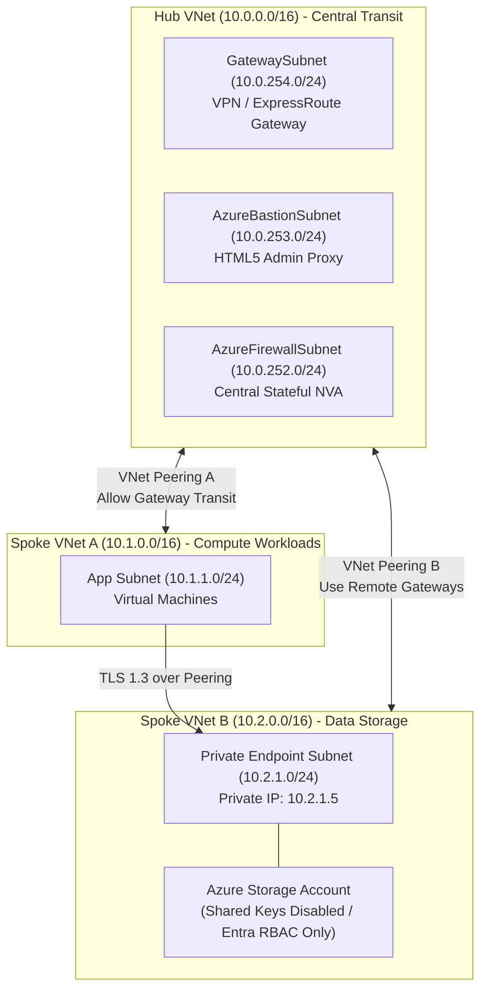
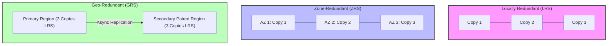
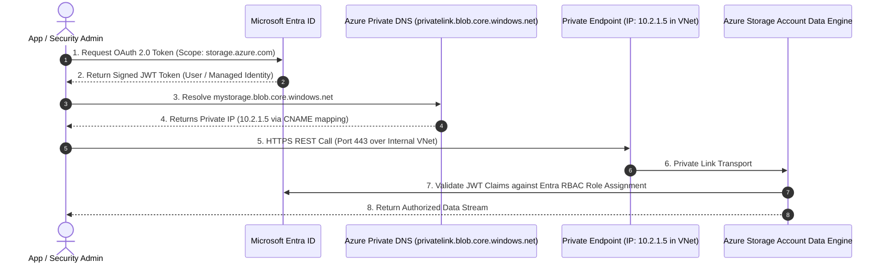

# SC-300 Day 03: Azure Virtual Network Peering, NSGs & Storage Services Integration

> **Source Video Title:** Azure Virtual Network Peering, NSGs & Storage Services | Day 3  
> **Source URL:** [https://www.youtube.com/watch?v=3QGrIE5n-U8](https://www.youtube.com/watch?v=3QGrIE5n-U8&list=PL86wiCAX5vmTg8uubUrlHOqXrjXk6p-73&index=3)  
> **Instructor:** Raghuveer  
> **Refactored & Expanded By:** Senior Principal Engineer & Distinguished Technical Fellow (ex-FAANG / MANGOS)  
> **Target Certification Track:** Microsoft Certified: Identity and Access Administrator Associate (SC-300) | Bridge to Cybersecurity Architect (SC-100), SC-200 & Cloud and AI Security Engineer Associate (SC-500 - Successor to AZ-500)  
> **Technical Currency:** Updated as of **August 2026**

---

## Executive Summary & Curriculum Blueprint

Welcome to **Day 03** of the Microsoft Entra ID Security Masterclass.

In enterprise cloud security architecture, isolated Virtual Networks must communicate securely without exposing data to the public internet. Furthermore, corporate data repositories—such as Azure Storage Accounts—must transition from legacy static access keys to **Entra ID Identity-Based Role-Based Access Control (RBAC)** enforced over **Private Endpoints**.

This document transforms the raw Day 03 lecture transcript into an **executive engineering reference**. We analyze cross-VNet peering routing mechanics, dedicated system subnets, storage redundancy math, access tier lifecycles, Private Link packet paths, and Microsoft Entra ID authentication from first principles.



---

## Module 1: Virtual Network Peering & Routing Topology

### 1.1 What is Virtual Network Peering?

**Virtual Network Peering** seamlessly connects two Azure Virtual Networks (VNets) through Microsoft's private global dark fiber backbone. Peered VNets appear as a single logical network for connectivity purposes, allowing VMs in different VNets to communicate directly using private IP addresses with ultra-low latency and zero internet exposure.

```
┌─────────────────────────────────────────────────────────────────────────┐
│                       AZURE VNET PEERING TYPES                          │
├───────────────────────────────┬─────────────────────────────────────────┤
│ Intra-Region VNet Peering     │ Global VNet Peering                     │
├───────────────────────────────┼─────────────────────────────────────────┤
│ • Connects VNets within the   │ • Connects VNets across different Azure │
│   same Azure Region.          │   Regions (e.g., East US to West Europe)│
│ • Latency: Sub-millisecond.   │ • Latency: Dependent on distance.       │
│ • Transport: Local Data Center│ • Transport: Microsoft Global Fiber     │
│   Switching Fabric.           │   Backbone Network.                     │
└───────────────────────────────┴─────────────────────────────────────────┘
```

---

### 1.2 Non-Transitive Peering & Transit Mechanics

> [!CAUTION]
> **Distinguished Fellow Architectural Rule (Non-Transitivity):**  
> VNet Peering is **strictly non-transitive**. If VNet A is peered with VNet B, and VNet B is peered with VNet C, **VNet A CANNOT communicate with VNet C** through VNet B by default. 
> 
> To enable transitive routing between Spokes, you must deploy a Central Hub with an **Azure Firewall / NVA** or configure **User Defined Routes (UDRs)**.

```mermaid
graph LR
    VNetA["Spoke VNet A<br/>(10.1.0.0/16)"] <-->|Peering AB| VNetB["Hub VNet B<br/>(10.0.0.0/16)"]
    VNetB <-->|Peering BC| VNetC["Spoke VNet C<br/>(10.2.0.0/16)"]
    
    VNetA -.-x|BLOCKED<br/>(Non-Transitive)| VNetC
```

#### Gateway Transit Flags Configuration:
When setting up VNet Peering between a Central Hub (holding a VPN/ExpressRoute Gateway) and a Spoke VNet, four specific ARM flags determine transit behavior:

| Location | Peering Setting Flag | Value | Architectural Purpose |
| :--- | :--- | :--- | :--- |
| **Hub VNet** | `allowVirtualNetworkAccess` | `True` | Permits traffic between Hub and Spoke VNet address spaces. |
| **Hub VNet** | `allowGatewayTransit` | `True` | **Allows Spoke VNets to share the Hub's VPN/ExpressRoute Gateway.** |
| **Spoke VNet** | `useRemoteGateways` | `True` | **Instructs Spoke workloads to route on-prem traffic through Hub Gateway.** |
| **Both** | `allowForwardedTraffic` | `True` | Allows traffic not originating from inside the VNet (e.g., routed via NVA). |

---

## Module 2: Azure Service Limits & Reserved Subnet Architecture

### 2.1 Quotas, Service Limits & Capacity Management

Enterprises operating at scale must engineer architectures within Azure Resource Manager (ARM) quota limits.

```
┌─────────────────────────────────────────────────────────────────────────┐
│                   KEY AZURE NETWORK SERVICE LIMITS                      │
├───────────────────────────────────────────────┬─────────────────────────┤
│ Limit Parameter                               │ Default Hard/Soft Limit │
├───────────────────────────────────────────────┼─────────────────────────┤
│ VNets per Azure Subscription                  │ 1,000                   │
│ Subnets per Virtual Network                   │ 3,000                   │
│ VNet Peering Connections per VNet             │ 500                     │
│ Network Security Groups (NSGs) per Subscription│ 500                    │
│ Rules per Network Security Group              │ 1,000                   │
│ Private Endpoints per Virtual Network         │ 1,000                   │
└───────────────────────────────────────────────┴─────────────────────────┘
```

---

### 2.2 Reserved Subnet Architectural Mandates

Certain Azure PaaS services require dedicated subnets with specific naming conventions and prefix sizing.

```
┌─────────────────────────────────────────────────────────────────────────┐
│                    SPECIALIZED SYSTEM RESERVED SUBNETS                  │
├───────────────────┬──────────────────────┬──────────────────────────────┤
│ Subnet Name       │ Min Prefix Length    │ Purpose                      │
├───────────────────┼──────────────────────┼──────────────────────────────┤
│ GatewaySubnet     │ /27 (Recommended /26)│ VPN Gateway / ExpressRoute   │
│ AzureBastionSubnet│ /26                  │ Azure Bastion PaaS Proxy     │
│ AzureFirewallSubnet│ /26                 │ Azure Firewall Core Service  │
│ ContainerSubnet   │ /24                  │ Azure Container Instances    │
└───────────────────┴──────────────────────┴──────────────────────────────┘
```

> [!WARNING]
> **Reserved Subnet Naming Enforcement:**  
> The subnet names **`GatewaySubnet`**, **`AzureBastionSubnet`**, and **`AzureFirewallSubnet`** are case-sensitive ARM resource identifiers. Misspelling a reserved name (e.g., `gatewaysubnet` or `MyGatewaySubnet`) will cause ARM template deployment failures.

---

## Module 3: Azure Storage Architecture from First Principles

Azure Storage provides cloud-native, durable, highly available data infrastructure.

### 3.1 The 4 Core Storage Service Types

```
┌─────────────────────────────────────────────────────────────────────────┐
│                      AZURE STORAGE SERVICES TAXONOMY                    │
├─────────────────┬─────────────────┬─────────────────┬───────────────────┤
│ Azure Blobs     │ Azure Files     │ Azure Queues    │ Azure Tables      │
├─────────────────┼─────────────────┼─────────────────┼───────────────────┤
│ Unstructured    │ Fully Managed   │ Asynchronous    │ NoSQL Key-Value   │
│ Object Storage  │ Cloud File Shares│ Message Queuing │ Structured Data   │
│ (Images, Video, │ (SMB 3.1.1 /    │ (Decoupling     │ Store (Schemaless │
│ Logs, Data Lakes│  NFS 4.1)       │ Microservices)  │ Fast Lookups)     │
└─────────────────┴─────────────────┴─────────────────┴───────────────────┘
```

---

### 3.2 Redundancy & Availability Options

Azure Storage maintains multiple copies of data to protect against hardware failures, data center outages, and regional disasters.



| Redundancy Model | Data Replicas | Availability SLA | Failure Resilience Level |
| :--- | :--- | :--- | :--- |
| **LRS** (Locally Redundant) | 3 copies in 1 Data Center | 99.9% | Protects against single rack/drive hardware failure. |
| **ZRS** (Zone-Redundant) | 3 copies across 3 AZs | 99.99% | Protects against an entire data center facility failure. |
| **GRS** (Geo-Redundant) | 6 copies across 2 Regions | 99.99% | Protects against complete regional disasters (Async failover). |
| **GZRS** (Geo-Zone-Redundant) | 6 copies (3 AZs + 3 Secondary)| 99.999% | Maximum durability (Combines ZRS in primary + GRS in secondary). |

---

### 3.3 Blob Access Tier Lifecycle Management

Blob Storage provides four access tiers tailored for cost optimization based on access frequency:

```
[ HOT TIER ] ──────► [ COOL TIER ] ──────► [ COLD TIER ] ──────► [ ARCHIVE TIER ]
Active Data          Min 30 Days           Min 90 Days          Min 180 Days
Lowest Access Cost   Lower Storage Cost    Low Cost Storage     Lowest Storage Cost
High Storage Cost    Higher Access Cost    Medium Access Cost   Offline / Rehydrate Latency
```

| Access Tier | Typical Use Case | Min Retention | Availability SLA | Rehydration Latency |
| :--- | :--- | :--- | :--- | :--- |
| **Hot** | Active processing, website media | N/A | 99.9% | Online (Instant) |
| **Cool** | Short-term backups, monthly reports | 30 Days | 99.0% | Online (Instant) |
| **Cold** (2026) | Medium-term audit logs, raw telemetry| 90 Days | 99.0% | Online (Instant) |
| **Archive** | Long-term compliance, legal hold | 180 Days | Offline | **High Priority: <1 Hr / Standard: 15 Hrs** |

> [!IMPORTANT]
> **Archive Rehydration Math & Trap:**  
> Blob objects in the Archive tier are **offline** and cannot be read directly by applications. To read an archived blob, you must **Rehydrate** it by changing its tier to Hot or Cool (or copying it to a new blob). Early deletion or rehydration before the minimum retention period (e.g., 180 days for Archive) incurs an early deletion penalty fee.

---

## Module 4: Securing Storage Services with Microsoft Entra ID & Private Link

### 4.1 The Security Vulnerability of Legacy Storage Access

Historically, applications authenticated to Azure Storage using **Storage Account Keys** (Access Key 1 / Key 2) or **Shared Access Signature (SAS) tokens**.

```
LEGACY INSECURE ACCESS:
App/User ──► [ Access Key / SAS Token ] ──► Storage Account REST API
             - Bypasses Entra Conditional Access
             - Bypasses Multi-Factor Authentication (MFA)
             - No granular identity audit trail in Entra ID
```

---

### 4.2 Modern Zero Trust Storage Pattern: Entra ID RBAC + Private Link

Modern security architecture enforces two mandatory controls:
1. **Disable Storage Account Shared Key Authentication** (`allowSharedKeyAccess = false`).
2. **Inject Private Endpoints (Azure Private Link)** to eliminate public IP endpoints.



#### Standard Entra ID Data Plane RBAC Roles:
- **`Storage Blob Data Owner`:** Full access to Blob containers and data (including setting RBAC permissions).
- **`Storage Blob Data Contributor`:** Read, write, and delete Blob containers and data.
- **`Storage Blob Data Reader`:** Read-only access to Blob data and containers.

---

### 4.3 Service Endpoints vs. Private Endpoints Comparison

```
┌─────────────────────────────────────────────────────────────────────────┐
│                    SERVICE ENDPOINTS vs. PRIVATE ENDPOINTS              │
├───────────────────────────────┬─────────────────────────────────────────┤
│ Service Endpoints             │ Private Endpoints (Private Link)        │
├───────────────────────────────┼─────────────────────────────────────────┤
│ • Keeps Public IP on Storage. │ • Removes Public IP; assigns Private    │
│ • Routes traffic over Azure   │   IP (e.g., 10.2.1.5) inside VNet.     │
│   backbone to public endpoint.│ • Complete isolation from public WAN.   │
│ • Configured at Subnet level. │ • Configured via Network Interface (NIC).│
│ • Cost: Free.                 │ • Cost: Hourly fee + Data processing.   │
└───────────────────────────────┴─────────────────────────────────────────┘
```

---

## Module 5: Hands-On Verification & Principal Fellow Lab Guide

### 5.1 Lab 3.1: Configuring VNet Peering with Gateway Transit via Azure CLI

#### Execution Script:
```azcli
# Step 1: Create Hub VNet (Central Transit)
az network vnet create \
  --resource-group rg-corp-network-prod \
  --name vnet-hub-prod \
  --address-prefixes 10.0.0.0/16 \
  --subnet-name GatewaySubnet \
  --subnet-prefixes 10.0.254.0/24

# Step 2: Create Spoke VNet (Compute Workloads)
az network vnet create \
  --resource-group rg-corp-network-prod \
  --name vnet-spoke-app \
  --address-prefixes 10.1.0.0/16 \
  --subnet-name snet-workload \
  --subnet-prefixes 10.1.1.0/24

# Step 3: Initiate Peering from Hub to Spoke (Allow Gateway Transit)
az network vnet peering create \
  --resource-group rg-corp-network-prod \
  --name peer-hub-to-spoke-app \
  --vnet-name vnet-hub-prod \
  --remote-vnet vnet-spoke-app \
  --allow-vnet-access \
  --allow-gateway-transit

# Step 4: Complete Peering from Spoke to Hub (Use Remote Gateways)
az network vnet peering create \
  --resource-group rg-corp-network-prod \
  --name peer-spoke-app-to-hub \
  --vnet-name vnet-spoke-app \
  --remote-vnet vnet-hub-prod \
  --allow-vnet-access \
  --use-remote-gateways
```

#### Line-by-Line Technical Breakdown:
1. `az network vnet create (--name vnet-hub-prod)`: Builds the central Transit Hub VNet with a mandatory dedicated `/24` **`GatewaySubnet`**.
2. `az network vnet create (--name vnet-spoke-app)`: Provision a non-overlapping Spoke VNet address space (`10.1.0.0/16`).
3. `az network vnet peering create (--allow-gateway-transit)`: Configures the Hub side of the peering link, advertising its VPN Gateway capabilities to the Spoke.
4. `az network vnet peering create (--use-remote-gateways)`: Configures the Spoke side of the peering link, instructing Spoke VMs to route cross-premise traffic through the Hub's remote Gateway.

---

### 5.2 Lab 3.2: Provisioning a Zero Trust Secure Storage Account via Azure CLI

#### Execution Script:
```azcli
# Step 1: Provision a Storage Account with ZRS Redundancy and Hot Access Tier
az storage account create \
  --name stcorppayrollprod2026 \
  --resource-group rg-corp-network-prod \
  --location centralindia \
  --sku Standard_ZRS \
  --kind StorageV2 \
  --access-tier Hot \
  --min-tls-version TLS1_2

# Step 2: MANDATORY HARDENING - Disable Shared Key Access & Public Network Access
az storage account update \
  --name stcorppayrollprod2026 \
  --resource-group rg-corp-network-prod \
  --allow-shared-key-access false \
  --public-network-access Disabled

# Step 3: Assign Entra ID RBAC Role to Security Engineer User
az role assignment create \
  --assignee "keveen@kwin.onmicrosoft.com" \
  --role "Storage Blob Data Contributor" \
  --scope "/subscriptions/{subscription-id}/resourceGroups/rg-corp-network-prod/providers/Microsoft.Storage/storageAccounts/stcorppayrollprod2026"
```

#### Line-by-Line Technical Breakdown:
1. `az storage account create ...`: Instantiates a `StorageV2` General Purpose Account enforcing minimum TLS 1.2 and Zone-Redundant Storage (ZRS) across 3 Availability Zones.
2. `az storage account update --allow-shared-key-access false`: **Blocks all Account Key and SAS token authentication attempts**, enforcing Entra ID OAuth 2.0 as the sole authentication plane. Setting `--public-network-access Disabled` blocks all public WAN ingress.
3. `az role assignment create --role "Storage Blob Data Contributor"`: Grants delegated data-plane read/write permissions directly to an Entra ID Principal at resource scope.

---

## Module 6: Executive Knowledge Check & First-Principles Exam Readiness

### 6.1 The "What, Why, How, Where, When" Core Matrix

| Topic | What is it? | Why does it exist? | How does it work under the hood? | Where & When to use it? |
| :--- | :--- | :--- | :--- | :--- |
| **VNet Peering** | Non-transitive private link between two VNets. | Enables low-latency cross-VNet traffic without public internet. | Encapsulated packet routing over Microsoft's dark fiber backbone switches. | Connect Spoke workload VNets to a central Shared Services / Transit Hub VNet. |
| **Gateway Transit** | ARM peering flag allowing Spoke VNets to share Hub VPN. | Reduces cost by eliminating redundant VPN/ExpressRoute Gateways per VNet. | Advertises Hub Gateway routes over peering link via BGP / UDR injection. | Enable on Hub (`allowGatewayTransit`) and Spoke (`useRemoteGateways`). |
| **ZRS Redundancy** | Zone-Redundant Storage option. | Protects data against an entire data center facility loss. | Synchronous replication across 3 separate Availability Zones in a region. | Default standard for production enterprise Blob data requiring 99.99% SLA. |
| **Disable Shared Keys** | Policy setting blocking SAS and Storage Account Keys. | Prevents credential leaks and enforces Zero Trust Entra ID controls. | Storage data engine rejects calls authenticated via Shared Key signature headers. | Enforce across all enterprise storage accounts via Azure Policy. |
| **Private Endpoint** | Private NIC (`10.x.x.x`) assigned to a PaaS service. | Removes public IP endpoints from Azure Storage / SQL services. | Private Link injects a virtual interface into a VNet subnet with Private DNS mapping. | Required for all high-security / regulated data repositories. |

---

### 6.2 Distinguished Fellow Architectural Scenarios

#### Scenario 1: The Broken Spoke-to-Spoke Communication Fault
* **Question:** A cloud engineer builds Hub VNet (`10.0.0.0/16`), Spoke A (`10.1.0.0/16`), and Spoke B (`10.2.0.0/16`). They peer Hub $\leftrightarrow$ Spoke A and Hub $\leftrightarrow$ Spoke B. A VM in Spoke A attempts to ping a VM in Spoke B, but packets drop. Why?
* **Answer:** VNet Peering is **non-transitive**. Traffic cannot hop from Spoke A through Hub to Spoke B automatically.
* **Remediation:** Deploy an **Azure Firewall / NVA** inside the Hub VNet and configure User Defined Routes (UDRs) on Spoke subnets (`0.0.0.0/0` or `10.2.0.0/16` via NVA IP `10.0.252.4`).

#### Scenario 2: The SAS Token Authorization Failure
* **Question:** A developer attempts to upload a file to `stcorppayrollprod2026` using a newly generated SAS token. The request returns HTTP `403 Forbidden` with error code `KeyBasedAuthenticationNotPermitted`. What caused this error?
* **Answer:** The storage account has **Shared Key Access disabled** (`allowSharedKeyAccess = false`). Disabling Shared Keys invalidates all Account Access Keys and SAS tokens.
* **Remediation:** Update the application code to authenticate via **Microsoft Entra ID OAuth 2.0 (User-Assigned Managed Identity or Service Principal)** with the `Storage Blob Data Contributor` RBAC role.

---

## Conclusion & Next Steps

Day 03 has established cross-VNet peering routing, specialized reserved subnets, storage redundancy tiers, and modern identity-enforced storage security via Entra ID RBAC and Private Endpoints.

### Preparation for Day 04:
In **Day 04**, we transition to **Azure Storage Management, RBAC Controls & Introduction to Compute Services**, diving into storage lifecycle policy automation, Azure Compute VM provisioning mechanics, and Entra ID VM login integration.

> *"Perimeters around storage are useless if static keys are leaked. Lock the data plane with Entra ID RBAC, and route only over Private Link."*