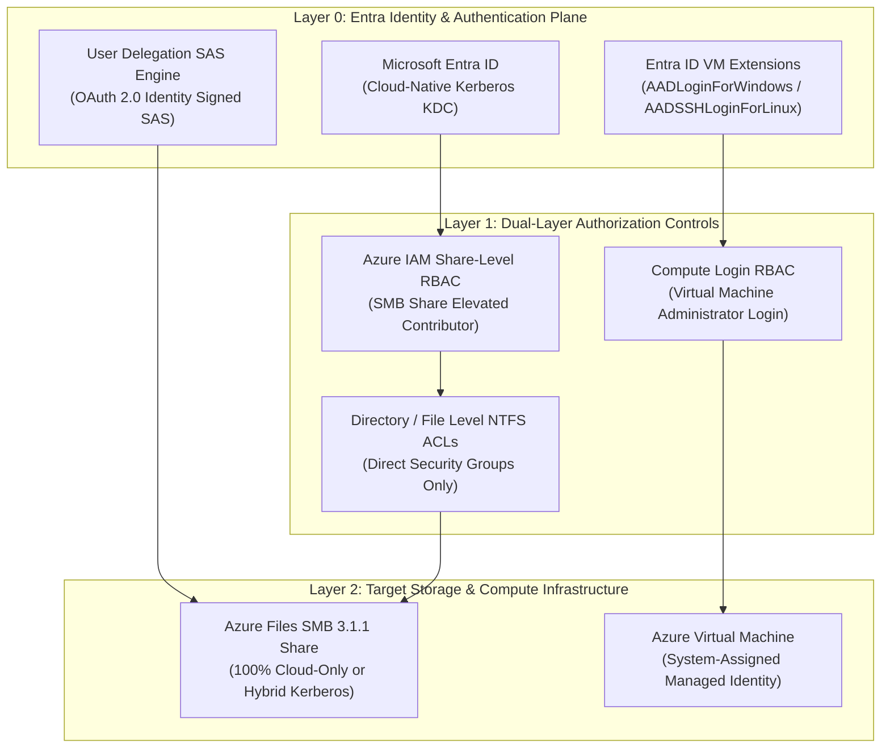
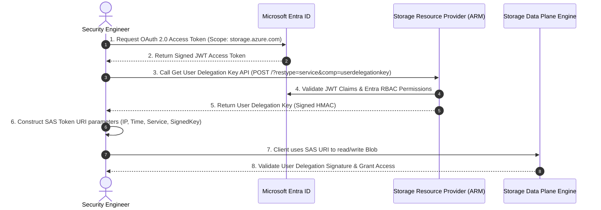
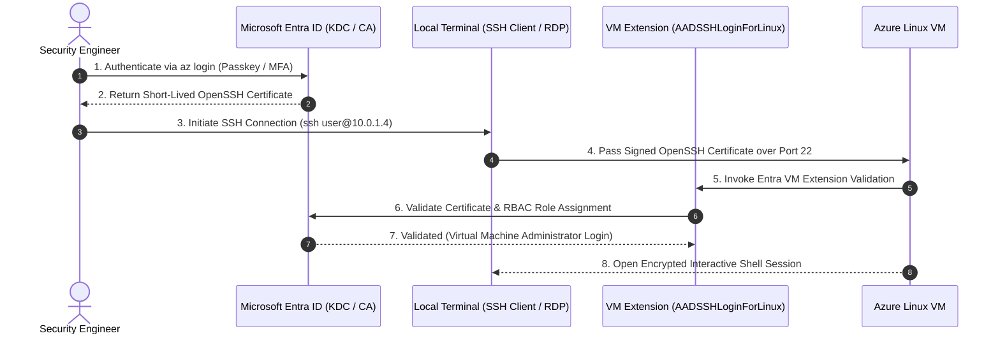

# SC-300 Day 04: Azure Storage Management, RBAC & Introduction to Compute Services

> **Source Video Title:** Azure Storage Management, RBAC & Introduction to Compute Services | Day 4  
> **Source URL:** [https://www.youtube.com/watch?v=QzRXl0l3s5U](https://www.youtube.com/watch?v=QzRXl0l3s5U&list=PL86wiCAX5vmTg8uubUrlHOqXrjXk6p-73&index=4)  
> **Instructor:** Raghuveer  
> **Refactored & Expanded By:** Senior Principal Engineer & Distinguished Technical Fellow (ex-FAANG / MANGOS)  
> **Target Certification Track:** Microsoft Certified: Identity and Access Administrator Associate (SC-300) | Bridge to Cybersecurity Architect (SC-100), SC-200 & Cloud and AI Security Engineer Associate (SC-500 - Successor to AZ-500)  
> **Technical Currency:** Updated as of **August 2026**

---

## Executive Summary & Curriculum Blueprint

Welcome to **Day 04** of the Microsoft Entra ID Security Masterclass.

In enterprise cloud security architecture, data governance extends beyond Blob storage into **Azure Files SMB shares** and **Azure Compute Virtual Machines**. Modern Zero Trust architectures require replacing static credentials (SSH keys, local admin passwords, static SAS keys) with **Microsoft Entra ID Kerberos**, **User Delegation SAS tokens**, and **Entra ID Virtual Machine Authentication extensions**.

This document transforms the raw Day 04 lecture transcript into an **executive engineering reference manual**. We break down Azure Files SMB Kerberos authentication, User Delegation SAS mechanics, automated Storage Lifecycle Management, Azure Compute VM architecture, and Entra ID VM login from first principles.



---

## Module 1: Advanced Storage Access Tokens — User Delegation SAS vs. Account SAS

### 1.1 The Shared Access Signature (SAS) Architectural Spectrum

A Shared Access Signature (SAS) is a signed URI that grants delegated, time-bound access to Azure Storage resources without exposing the storage account key.

```
┌─────────────────────────────────────────────────────────────────────────┐
│                       TYPES OF SHARED ACCESS SIGNATURES                 │
├─────────────────┬─────────────────────────┬─────────────────────────────┤
│ SAS Type        │ Signing Credentials     │ Entra ID Integration        │
├─────────────────┼─────────────────────────┼─────────────────────────────┤
│ **Account SAS** │ Storage Account Key     │ NO (Bypasses Entra ID)      │
│ **Service SAS** │ Storage Account Key     │ NO (Bypasses Entra ID)      │
│ **User Delegation**│ **Entra ID OAuth 2.0**│ **YES (Enforces Entra RBAC)**│
└─────────────────┴─────────────────────────┴─────────────────────────────┘
```

> [!CAUTION]
> **Distinguished Fellow Security Warning:**  
> Legacy Account SAS and Service SAS tokens are signed using the **master Storage Account Key**. If a developer generates an Account SAS token, it remains valid until expiry **even if the user's Entra ID account is disabled or deleted**. 
> 
> In contrast, a **User Delegation SAS** is signed using a **User Delegation Key** obtained via a Microsoft Entra ID token. If the user's Entra account is revoked, or if `allowSharedKeyAccess` is set to `false`, Account SAS tokens fail while **User Delegation SAS tokens remain fully secure and operational**.

---

### 1.2 User Delegation SAS Mechanics Under the Hood



#### User Delegation SAS Parameters Breakdown:
- `skoid`: Signed Key Object ID (Entra ID User/Group GUID).
- `sktid`: Signed Key Tenant ID (Entra ID Tenant GUID).
- `skt`: Signed Key Start Time (UTC timestamp).
- `ske`: Signed Key Expiry Time (UTC timestamp).
- `sks`: Signed Key Service (`b` for Blob).
- `sip`: Allowed IP Address Range (e.g., `198.51.100.45/32` or corporate NAT egress).
- `spr`: Allowed Protocols (`https` only enforced).

---

## Module 2: Azure Files & Cloud-Native Entra ID Kerberos SMB Authentication

### 2.1 The Evolution of Azure Files Identity Authentication

Legacy Azure Files deployments required on-premises Active Directory Domain Services (AD DS) or Active Directory Lightweight Domain Services (AD LDS) to authenticate SMB file shares over Kerberos.

As of **August 2026**, **Microsoft Entra Kerberos** natively issues Kerberos tickets for **cloud-only identities**, completely eliminating the requirement for on-premises Domain Controllers.

```
LEGACY ON-PREM HYBRID SMB PATTERN:
Client VM ──► On-Prem DC (Kerberos Ticket) ──► VPN ──► Azure Files SMB Share
              (Requires physical/VPN link to Domain Controller)

MODERN CLOUD-NATIVE ENTRA KERBEROS PATTERN:
Cloud Client ──► Entra ID KDC (OAuth to Kerberos Ticket) ──► Azure Files SMB Share
                 (100% Cloud-Only / Direct HTTPS to Entra ID)
```

---

### 2.2 Dual-Layer Access Control Model (Share-Level RBAC + NTFS ACLs)

Accessing an Azure Files SMB share requires evaluating permissions across **two independent authorization layers**. Both layers must evaluate to **ALLOW**.

```
┌─────────────────────────────────────────────────────────────────────────┐
│                 DUAL-LAYER ACCESS AUTHORIZATION ENGINE                  │
├─────────────────────────────────────────────────────────────────────────┤
│ LAYER 1: Share-Level Access Control (Azure IAM RBAC)                    │
│ Controls access to the file share container.                            │
│ Roles:                                                                  │
│ • Storage File Data SMB Share Reader (Read-only)                        │
│ • Storage File Data SMB Share Contributor (Read/Write/Delete)           │
│ • Storage File Data SMB Share Elevated Contributor (Modify NTFS ACLs)   │
├─────────────────────────────────────────────────────────────────────────┤
│ LAYER 2: Directory & File-Level Access Control (NTFS ACLs)              │
│ Controls granular file/folder permissions inside the share.            │
│ Enforced via Windows File Explorer Security Tab or icacls tool.         │
└─────────────────────────────────────────────────────────────────────────┘
```

> [!IMPORTANT]
> **NTFS ACL Group Enforcement Rule:**  
> When configuring Directory/File-level NTFS ACLs for Azure Files Kerberos, permissions MUST be assigned to **direct Security Groups** in Entra ID. 
> 
> **Limitations:**  
> 1. Microsoft 365 Groups and Distribution Groups are **NOT supported** in Kerberos tickets.  
> 2. **Nested Security Groups are NOT expanded** by Azure Files Kerberos; permissions must be granted to the explicit group containing the user object.

---

## Module 3: Storage Lifecycle Automation & Cost Optimization

Enterprises generate terabytes of application logs, backup images, and audit telemetry. Maintaining all data in the **Hot Tier** leads to unnecessary cloud spend.

### 3.1 Automated Lifecycle Management Engine

Azure Storage Lifecycle Management evaluates automated rules daily against blob metadata (last modified date, last accessed date, creation date).

```mermaid
graph LR
    Ingest([Blob Ingested]) -->|Day 0: Hot Tier| HotData[Active Workload Data]
    HotData -->|Rule: Last Modified > 30 Days| CoolTier[Cool Tier<br/>30-Day Min Retention]
    CoolTier -->|Rule: Last Modified > 90 Days| ColdTier[Cold Tier<br/>90-Day Min Retention]
    ColdTier -->|Rule: Last Modified > 180 Days| ArchiveTier[Archive Tier<br/>Offline / 180-Day Min]
    ArchiveTier -->|Rule: Creation Time > 365 Days| DeleteAction[Automated Permanent Purge]
```



#### Lifecycle Rule JSON Specification:
```json
{
  "rules": [
    {
      "enabled": true,
      "name": "AutoTierAndPurgeLogs",
      "type": "Lifecycle",
      "definition": {
        "actions": {
          "baseBlob": {
            "tierToCool": { "daysAfterModificationGreaterThan": 30 },
            "tierToCold": { "daysAfterModificationGreaterThan": 90 },
            "tierToArchive": { "daysAfterModificationGreaterThan": 180 },
            "delete": { "daysAfterCreationGreaterThan": 365 }
          }
        },
        "filters": {
          "blobTypes": [ "blockBlob" ],
          "prefixMatch": [ "logs/prod/", "telemetry/" ]
        }
      }
    }
  ]
}
```

---

## Module 4: Azure Compute Architecture & Entra ID VM Authentication

### 4.1 Anatomy of an Azure Virtual Machine

An Azure Virtual Machine is a composite compute resource composed of separate, decoupled Azure Resource Manager (ARM) resources.

```
┌─────────────────────────────────────────────────────────────────────────┐
│                   AZURE VIRTUAL MACHINE BUILDING BLOCKS                 │
├─────────────────────────────────────────────────────────────────────────┤
│ 1. Virtual Machine Compute Blade (vCPU, RAM, Series SKU e.g., D4sv5)    │
│ 2. Network Interface Card (NIC) (Binds Private IP from VNet Subnet)     │
│ 3. Managed Disks (OS Disk: Premium SSD / Data Disks: Ultra SSD)        │
│ 4. Managed Identity (System-Assigned or User-Assigned GUID)            │
│ 5. Extensions (AADLoginForWindows / AADSSHLoginForLinux)               │
└─────────────────────────────────────────────────────────────────────────┘
```

---

### 4.2 Logging into Azure VMs via Microsoft Entra ID

Legacy VM administration relied on local administrator credentials (`\Administrator` or `root`) or static SSH key pairs. This created severe operational risks: SSH key sprawl, lack of centralized access revocation when employees left, and bypass of Multi-Factor Authentication (MFA).



---

### 4.3 Built-in Entra RBAC Roles for Virtual Machine Login

Access to sign into an Azure VM via Entra ID requires explicit RBAC assignments at VM, Resource Group, or Subscription scope:

| Built-In Role Name | Access Level Granted | Operational Scope |
| :--- | :--- | :--- |
| **`Virtual Machine Administrator Login`** | Local Administrator / `sudo` root rights. | Privileged Systems Administration |
| **`Virtual Machine User Login`** | Standard User rights (Non-elevated). | Standard Workload Operation |

> [!CAUTION]
> **Management Role vs. Login Role Separation:**  
> Assigning the **`Virtual Machine Contributor`** role grants management permissions to restart, resize, or delete the VM in ARM, but **does NOT grant permission to log in** via SSH/RDP. You must explicitly assign **`Virtual Machine Administrator Login`** or **`Virtual Machine User Login`**.

---

## Module 5: Hands-On Verification & Principal Fellow Lab Guide

### 5.1 Lab 4.1: Generating a User Delegation SAS Token via Azure CLI

#### Execution Script:
```azcli
# Step 1: Login to Azure CLI using Entra ID Security Admin Credentials
az login

# Step 2: Request User Delegation Key from Storage Resource Provider
end=$(date -u -d "30 minutes" '+%Y-%m-%dT%H:%MZ')

# Step 3: Generate User Delegation SAS Token bound to specific Egress IP
sas_token=$(az storage blob generate-sas \
  --account-name stcorppayrollprod2026 \
  --container-name hr-data \
  --name payroll-q3.csv \
  --permissions r \
  --expiry $end \
  --ip 198.51.100.45 \
  --https-only \
  --auth-mode login \
  --as-user \
  --output tsv)

# Step 4: Construct and Output Secure URI
echo "Secure SAS URI: https://stcorppayrollprod2026.blob.core.windows.net/hr-data/payroll-q3.csv?$sas_token"
```

#### Line-by-Line Technical Breakdown:
1. `az login`: Obtains an OAuth 2.0 token authorizing Graph and Storage ARM calls.
2. `--auth-mode login --as-user`: Forces Azure CLI to request a **User Delegation Key** using your Entra ID identity rather than reading the master Storage Account Key.
3. `--permissions r`: Grants read-only access.
4. `--ip 198.51.100.45 --https-only`: Restricts token execution strictly to HTTPS calls originating from corporate NAT egress IP `198.51.100.45`.

---

### 5.2 Lab 4.2: Deploying a Linux VM with Entra ID Login & Managed Identity

#### Execution Script:
```azcli
# Step 1: Provision Linux Virtual Machine with System-Assigned Managed Identity
az vm create \
  --resource-group rg-corp-network-prod \
  --name vm-app-sec-01 \
  --image Ubuntu2204 \
  --admin-username azureuser \
  --generate-ssh-keys \
  --vnet-name vnet-corp-prod-01 \
  --subnet snet-web \
  --assign-identity

# Step 2: Install Entra ID SSH Login Extension
az vm extension set \
  --resource-group rg-corp-network-prod \
  --vm-name vm-app-sec-01 \
  --name AADSSHLoginForLinux \
  --publisher Microsoft.Azure.ActiveDirectory

# Step 3: Assign Entra RBAC VM Administrator Login Role to User
az role assignment create \
  --assignee "keveen@kwin.onmicrosoft.com" \
  --role "Virtual Machine Administrator Login" \
  --scope "/subscriptions/{subscription-id}/resourceGroups/rg-corp-network-prod/providers/Microsoft.Compute/virtualMachines/vm-app-sec-01"
```

#### Line-by-Line Technical Breakdown:
1. `az vm create ... --assign-identity`: Provisions an Ubuntu 22.04 VM inside `snet-web` and automatically registers a System-Assigned Managed Identity principal in Entra ID.
2. `az vm extension set --name AADSSHLoginForLinux`: Injects the OpenSSH Entra ID authentication extension into the guest OS.
3. `az role assignment create --role "Virtual Machine Administrator Login"`: Binds administrative login rights to `keveen@kwin.onmicrosoft.com` at VM scope.

---

## Module 6: Executive Knowledge Check & First-Principles Exam Readiness

### 6.1 The "What, Why, How, Where, When" Core Matrix

| Topic | What is it? | Why does it exist? | How does it work under the hood? | Where & When to use it? |
| :--- | :--- | :--- | :--- | :--- |
| **User Delegation SAS** | OAuth 2.0 signed storage access token. | Eliminates static master account key exposure in code. | Signed via short-lived User Delegation Key fetched from Entra ID. | Required for delegating temporary blob access to third parties. |
| **Entra Kerberos SMB** | Cloud-native Kerberos authentication for Azure Files. | Removes on-prem Domain Controller dependency for SMB shares. | Entra ID acts as KDC issuing Kerberos tickets directly to cloud devices. | Deploy for cloud-only SMB file shares accessed by remote workers. |
| **Lifecycle Policies** | Automated Blob tiering and purge rules. | Minimizes cloud storage costs automatically. | Azure Storage background workers evaluate metadata daily against JSON rules. | Apply to all log, backup, and telemetry containers. |
| **Entra VM Login** | OpenSSH / RDP authentication via Entra ID. | Centralizes access control, revokes access upon offboarding, enforces MFA. | Guest OS extension validates short-lived OpenSSH certificates against Entra RBAC. | Mandatory baseline for all Azure Windows and Linux IaaS VMs. |

---

### 6.2 Distinguished Fellow Architectural Scenarios

#### Scenario 1: The Account SAS Security Breach Audit
* **Question:** An enterprise developer generates an Account SAS token to grant a contractor access to a storage container for 90 days. 30 days later, the contractor is terminated and their Entra ID account is disabled. Can the contractor still access the storage container using the SAS token?
* **Answer:** **YES.** Account SAS tokens are signed using the master Storage Account Key and do **NOT** evaluate Entra ID user status upon invocation.
* **Remediation:** Revoke the Storage Account Master Keys (`az storage account keys renew`) or re-architect the solution to use **User Delegation SAS** or direct **Entra ID RBAC**.

#### Scenario 2: The Denied SMB Share Access Fault
* **Question:** An engineer assigns a user the `Storage File Data SMB Share Contributor` RBAC role on an Azure File Share. However, when the user mounts the share over SMB, Windows returns `Access Denied` when creating a new directory. What step was missed?
* **Answer:** Azure Files enforces dual-layer security. While Share-Level RBAC was granted, **Directory/File-Level NTFS ACLs** were left at default restrict settings or denied.
* **Remediation:** Log into the file share as an Elevated Contributor (`Storage File Data SMB Share Elevated Contributor`) and update the NTFS ACL permissions via Windows File Explorer Security Tab or `icacls`.

---

## Conclusion & Next Steps

Day 04 has established advanced storage access controls (User Delegation SAS, Entra Kerberos SMB file shares), lifecycle automation, compute VM architecture, and Entra ID VM login extensions.

### Preparation for Day 05:
In **Day 05**, we advance to **Azure Compute Services, Virtual Machine Deployment & Network Configuration**, exploring VM Scale Sets (VMSS), load balancing integration, custom script extensions, and automated scaling mechanics.

> *"Centralize credentials, eliminate static keys, and enforce identity at the kernel extension layer."*