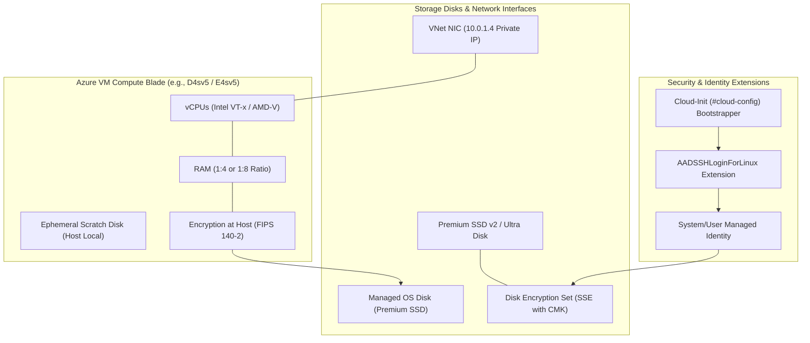
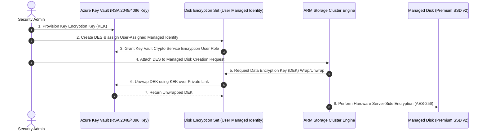
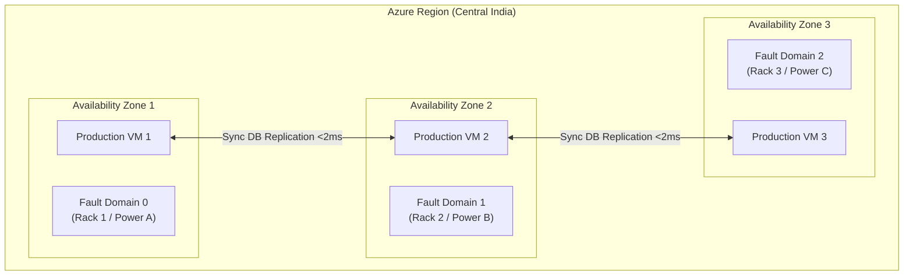
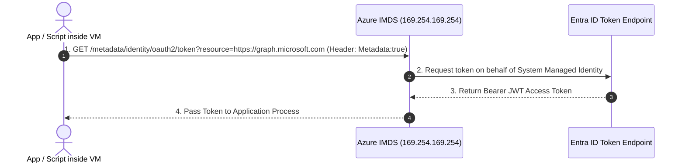

# SC-300 Day 05: Azure Compute Services, Virtual Machine Deployment & Network Configuration

> **Source Video Title:** Azure Compute Services, Virtual Machine Deployment & Network Configuration | Day 5  
> **Source URL:** [https://www.youtube.com/watch?v=pwRReih6sZc](https://www.youtube.com/watch?v=pwRReih6sZc&list=PL86wiCAX5vmTg8uubUrlHOqXrjXk6p-73&index=5)  
> **Instructor:** Raghuveer  
> **Refactored & Expanded By:** Senior Principal Engineer & Distinguished Technical Fellow (ex-FAANG / MANGOS)  
> **Target Certification Track:** Microsoft Certified: Identity and Access Administrator Associate (SC-300) | Bridge to Cybersecurity Architect (SC-100), SC-200 & Cloud and AI Security Engineer Associate (SC-500 - Successor to AZ-500)  
> **Technical Currency:** Updated as of **August 2026**

---

## Executive Summary & Curriculum Blueprint

Welcome to **Day 05** of the Microsoft Entra ID Security Masterclass.

In enterprise cloud security engineering, compute instances (Virtual Machines, Container Instances, and Virtual Machine Scale Sets) serve as the primary execution engine for business applications. Securing compute requires mastering hardware family sizing, storage disk encryption paradigms, high-availability zone boundaries, automated Cloud-Init bootstrapping, and **Microsoft Entra ID Managed Identity & Extension-based Authentication**.

This document transforms the raw Day 05 lecture transcript into an **executive engineering reference manual**. We analyze VM SKU families, Managed Disk encryption choices (including the **ADE Retirement Announcement for Sept 2028**), Availability Sets vs. Availability Zones, Proximity Placement Groups, Cloud-Init automation, and Entra ID VM login extensions from first principles.



---

## Module 1: Compute Architecture & VM Family Taxonomy

### 1.1 Compute SKU Families & vCPU-to-RAM Ratios

Selecting the optimal VM SKU family requires matching the workload's hardware utilization profile (CPU-bound, Memory-bound, Storage IOPS-bound, or AI/GPU-bound).

```
┌─────────────────────────────────────────────────────────────────────────┐
│                    AZURE COMPUTE VM FAMILY TAXONOMY                     │
├─────────────────┬───────────────────┬───────────────────────────────────┤
│ Family Series   │ vCPU:RAM Ratio    │ Primary Enterprise Workload       │
├─────────────────┼───────────────────┼───────────────────────────────────┤
│ **B-Series**    │ Burstable Ratio   │ Web Dev/Test, Low-Traffic Apps    │
│ **D-Series**    │ **1 : 4** (General)│ Enterprise Apps, IIS, Microservices│
│ **E-Series**    │ **1 : 8** (Memory) │ In-Memory DBs, SAP HANA, SQL Server│
│ **F-Series**    │ **1 : 2** (Compute)│ High Performance Compute, Analytics│
│ **M-Series**    │ Up to 12 TB RAM   │ Massive SAP HANA Enterprise OLAP  │
│ **N-Series**    │ GPU Accelerated   │ Generative AI, LLMs, Computer Vision│
└─────────────────┴───────────────────┴───────────────────────────────────┘
```

#### First Principles Breakdown:
- **General Purpose (Dsv5):** Provides a balanced vCPU-to-RAM ratio ($1\text{ vCPU} : 4\text{ GB RAM}$). Ideal for web servers, small-to-medium databases, and build agents.
- **Memory Optimized (Esv5):** Provides a high vCPU-to-RAM ratio ($1\text{ vCPU} : 8\text{ GB RAM}$). Prevents memory starvation in memory-intensive databases (e.g., SAP HANA, Redis, Microsoft SQL Server).
- **Ephemeral OS Disks:** Replaces persistent remote OS storage with host-local storage (using local SSD or temporary disk space). Ephemeral OS disks provide **zero storage cost**, **sub-millisecond read/write latency**, and **instant re-imaging**—making them the ideal choice for stateless microservices and auto-scaling node pools.

---

## Module 2: Managed Disks & Encryption Paradigm Shift

### 2.1 Managed Disk Performance Tiers

```
┌─────────────────────────────────────────────────────────────────────────┐
│                    MANAGED DISK PERFORMANCE MATRIX                      │
├─────────────────┬─────────────────┬──────────────────┬──────────────────┤
│ Disk Type       │ Max IOPS        │ Max Throughput   │ Typical Target   │
├─────────────────┼─────────────────┼──────────────────┼──────────────────┤
│ Standard HDD    │ 2,000 IOPS      │ 500 MB/s         │ Cold Backups     │
│ Standard SSD    │ 6,000 IOPS      │ 750 MB/s         │ Dev/Test VMs     │
│ Premium SSD v1  │ 20,000 IOPS     │ 900 MB/s         │ Production OS    │
│ **Premium SSD v2**│ **80,000 IOPS** │ **1,200 MB/s**   │ Production Data  │
│ **Ultra Disk**  │ **160,000 IOPS**│ **4,000 MB/s**   │ High-IOPS DBs    │
└─────────────────┴─────────────────┴──────────────────┴──────────────────┘
```

*Note: Premium SSD v2 allows independent configuration of Capacity, IOPS, and Throughput without upgrading disk size tiers.*

---

### 2.2 The 2026 Encryption Paradigm Shift: ADE Retirement & SSE + CMK

> [!WARNING]
> **CRITICAL ARCHITECTURAL UPDATE (ADE Retirement Notification):**  
> **Azure Disk Encryption (ADE)**—which relied on guest OS BitLocker (Windows) or dm-crypt (Linux)—is officially scheduled for **RETIREMENT on September 15, 2028**. 
> 
> Microsoft's official guidance for all current and future deployments mandates transitioning to **Server-Side Encryption (SSE) with Customer-Managed Keys (CMK)** or **Encryption at Host**.

```
LEGACY DEPRECATED ENCRYPTION (Retiring Sept 2028):
[ Guest OS Kernel ] ──► BitLocker / dm-crypt ──► Azure Key Vault (ADE Extension)
                        (High OS CPU overhead, fragile boot drivers)

MODERN ENTERPRISE ENCRYPTION STANDARD (Zero Trust 2026):
[ VM Host / Storage Cluster ] ──► SSE with CMK (Disk Encryption Set + Managed Identity)
                              ──► Encryption at Host (End-to-End FIPS 140-2)
```



---

## Module 3: Compute High Availability & Resilience Engine

### 3.1 Availability Sets vs. Availability Zones

```
┌─────────────────────────────────────────────────────────────────────────┐
│                      COMPUTE RESILIENCE ARCHITECTURE                    │
├───────────────────────────────┬─────────────────────────────────────────┤
│ Availability Sets             │ Availability Zones                      │
├───────────────────────────────┼─────────────────────────────────────────┤
│ • Protects against rack/host  │ • Protects against entire data center   │
│   hardware failures.          │   facility outages.                     │
│ • SLA: 99.95%                 │ • SLA: 99.99%                           │
│ • Uses Fault Domains (FDs) &  │ • Deploys across physically separate    │
│   Update Domains (UDs).       │   AZ facilities with independent power. │
└───────────────────────────────┴─────────────────────────────────────────┘
```



1. **Fault Domains (FDs):** Physical racks sharing a common power source and network switch. Azure spreads VMs across 2–3 FDs to prevent single power supply failure outages.
2. **Update Domains (UDs):** Logical groups of hosts rebooted during Microsoft platform maintenance. Azure ensures only 1 UD is updated at any given time.
3. **Availability Zones (AZs):** Physically separate data centers within a region, providing a **99.99% uptime SLA**.

---

### 3.2 Proximity Placement Groups (PPGs)

For high-performance workloads (e.g., SAP HANA, financial trading systems, HPC microservices) where inter-VM latency must remain **under 1 millisecond**, deploying across separate Availability Zones introduces unwanted network transit latency.

```
PROXIMITY PLACEMENT GROUP (PPG):
Physical Data Center Hall ──► [ Rack Blade 1 ] ──► VM Web
                             [ Rack Blade 2 ] ──► VM App  <-- (Sub-millisecond Latency)
                             [ Rack Blade 3 ] ──► VM DB
```

- **Proximity Placement Group (PPG):** An ARM logical grouping constraint that forces Azure to co-locate all member VMs within the **same physical server hall/rack cluster**, achieving sub-millisecond network latency.

---

## Module 4: Automating Provisioning & Entra ID Security Extensions

### 4.1 Automated Bootstrapping via Cloud-Init

Cloud-Init is the industry-standard multi-distribution method for cross-platform Linux VM customization on first boot.

#### `#cloud-config` Script Example:
```yaml
#cloud-config
package_upgrade: true
packages:
  - nginx
  - curl
  - jq
runcmd:
  - systemctl enable nginx
  - systemctl start nginx
  - echo "<h1>Provisioned via Azure Cloud-Init & Entra ID Security</h1>" > /var/www/html/index.html
```

---

### 4.2 The Instance Metadata Service (IMDS) Under the Hood

Every Azure VM has direct access to the non-routable link-local endpoint **`http://169.254.169.254/metadata/instance`**.



> [!CAUTION]
> **IMDS Header Enforcement:**  
> All HTTP requests to `169.254.169.254` MUST include the header `Metadata: true`. This prevents Server-Side Request Forgery (SSRF) vulnerabilities where an attacker tricks a web app into fetching IMDS metadata via un-headered GET requests.

---

## Module 5: Hands-On Verification & Principal Fellow Lab Guide

### 5.1 Lab 5.1: Deploying an Entra ID Secured Linux VM with Cloud-Init via Azure CLI

#### Execution Script:
```azcli
# Step 1: Create Cloud-Init Configuration File locally
cat << 'EOF' > cloud-init.txt
#cloud-config
package_upgrade: true
packages:
  - nginx
runcmd:
  - systemctl enable nginx
  - systemctl start nginx
EOF

# Step 2: Deploy Linux VM in Availability Zone 1 with System-Assigned Identity & Cloud-Init
az vm create \
  --resource-group rg-corp-network-prod \
  --name vm-web-prod-01 \
  --image Ubuntu2204 \
  --zone 1 \
  --size Standard_D2s_v5 \
  --admin-username azureuser \
  --generate-ssh-keys \
  --custom-data cloud-init.txt \
  --assign-identity \
  --vnet-name vnet-corp-prod-01 \
  --subnet snet-web

# Step 3: Enable Entra ID OpenSSH Extension
az vm extension set \
  --resource-group rg-corp-network-prod \
  --vm-name vm-web-prod-01 \
  --name AADSSHLoginForLinux \
  --publisher Microsoft.Azure.ActiveDirectory

# Step 4: Assign Entra RBAC VM Administrator Login Role
az role assignment create \
  --assignee "keveen@kwin.onmicrosoft.com" \
  --role "Virtual Machine Administrator Login" \
  --scope "/subscriptions/{subscription-id}/resourceGroups/rg-corp-network-prod/providers/Microsoft.Compute/virtualMachines/vm-web-prod-01"
```

#### Line-by-Line Technical Breakdown:
1. `cat << 'EOF' > cloud-init.txt`: Writes a local `#cloud-config` payload to automate Nginx web server installation upon first boot.
2. `az vm create ... --zone 1`: Provisions a `Standard_D2s_v5` compute instance explicitly pinned to Availability Zone 1 for a 99.99% uptime SLA.
3. `--assign-identity`: Registers a System-Assigned Managed Identity in Microsoft Entra ID.
4. `az vm extension set --name AADSSHLoginForLinux`: Injects the Entra ID SSH certificate validation engine into the VM guest OS.
5. `az role assignment create --role "Virtual Machine Administrator Login"`: Grants administrative SSH login rights to your Entra UPN at resource scope.

---

### 5.2 Lab 5.2: Provisioning Disk Encryption Set (SSE with CMK) via Azure CLI

#### Execution Script:
```azcli
# Step 1: Create Disk Encryption Set (DES)
az disk-encryption-set create \
  --resource-group rg-corp-network-prod \
  --name des-prod-01 \
  --key-url "https://kv-corp-keys.vault.azure.net/keys/key-disk-encrypt/v1" \
  --source-vault "/subscriptions/{sub-id}/resourceGroups/rg-corp-network-prod/providers/Microsoft.KeyVault/vaults/kv-corp-keys" \
  --encryption-type EncryptionAtRestWithCustomerKey

# Step 2: Obtain DES System Identity Principal ID
des_principal=$(az disk-encryption-set show --name des-prod-01 --resource-group rg-corp-network-prod --query identity.principalId --output tsv)

# Step 3: Grant Key Vault Crypto Role to DES Identity
az keyvault set-policy \
  --name kv-corp-keys \
  --object-id $des_principal \
  --key-permissions get unwrapKey wrapKey
```

---

## Module 6: Executive Knowledge Check & First-Principles Exam Readiness

### 6.1 The "What, Why, How, Where, When" Core Matrix

| Topic | What is it? | Why does it exist? | How does it work under the hood? | Where & When to use it? |
| :--- | :--- | :--- | :--- | :--- |
| **Ephemeral OS Disk** | Non-persistent OS disk hosted on local VM SSD. | Provides zero storage cost and sub-millisecond read/write latency. | OS VHD is written directly to the physical server blade's local SSD. | Use for stateless web apps, auto-scaling node pools, and dev/test VMs. |
| **ADE Retirement (2028)** | End of support for Azure Disk Encryption on Sept 15, 2028. | Guest OS BitLocker creates driver fragility and performance overhead. | Shift to Server-Side Encryption (SSE) with Customer-Managed Keys (CMK). | Migrate all existing ADE deployments to SSE with CMK or Host Encryption. |
| **Availability Zones** | Physically separate data centers in an Azure region. | Protects workloads against full facility outages ($99.99\%$ SLA). | Multi-facility synchronous replication connected over low-latency fibers ($<2\text{ms}$). | Deploy all production enterprise VM workloads across AZ 1, 2, and 3. |
| **Proximity Placement Group** | Logical grouping constraint forcing rack co-location. | Minimizes inter-VM network latency to $<1\text{ ms}$. | ARM scheduler places all member VMs in the same physical server hall. | Required for SAP HANA multi-tier clusters and high-frequency trading engines. |
| **IMDS (`169.254.169.254`)** | Non-routable link-local VM metadata endpoint. | Issues OAuth tokens to Managed Identities and exposes VM metadata. | Internal hypervisor host intercepts link-local HTTP requests containing `Metadata: true`. | Used by apps inside VMs to fetch Entra tokens without storing credentials. |

---

### 6.2 Distinguished Fellow Architectural Scenarios

#### Scenario 1: The Azure Disk Encryption Deprecation Trap
* **Question:** A security architect submits a design proposal for a financial client specifying Azure Disk Encryption (ADE) with BitLocker for 500 new IaaS Virtual Machines. As a Distinguished Technical Fellow, what is your feedback?
* **Answer:** **REJECT THE PROPOSAL.** Microsoft has officially announced the **Retirement of Azure Disk Encryption (ADE) on September 15, 2028**. Designing a new system around ADE creates immediate technical debt and mandatory re-engineering.
* **Remediation:** Update the architecture to use **Server-Side Encryption (SSE) with Customer-Managed Keys (CMK)** managed via **Disk Encryption Sets (DES)** or **Encryption at Host**.

#### Scenario 2: The Failed Entra VM Login Mystery
* **Question:** A developer assigns a user the `Virtual Machine Contributor` role on a Linux VM and installs the `AADSSHLoginForLinux` extension. When the user attempts to log in via `az ssh vm`, the connection returns `Permission Denied (publickey)`. What went wrong?
* **Answer:** `Virtual Machine Contributor` is an ARM **management plane** role (permitting VM restarts and resizing), but does **NOT** grant data plane login rights.
* **Remediation:** Assign the user the built-in role **`Virtual Machine Administrator Login`** (for root `sudo` access) or **`Virtual Machine User Login`** (for standard user access).

---

## Conclusion & Next Steps

Day 05 has established compute VM taxonomy, managed disk encryption standards (ADE 2028 retirement), high-availability zone boundaries, Cloud-Init automation, IMDS mechanics, and Entra ID VM login extensions.

### Preparation for Day 06:
In **Day 06**, we transition to **Azure Monitoring & Security Best Practices for Compliance & Threat Detection**, covering Log Analytics workspaces, Azure Monitor Agent (AMA), KQL query fundamentals, and Sentinel SIEM/Defender XDR identity integration.

> *"Decouple management from access, encrypt at the host hardware level, and automate identity via Managed Identities."*