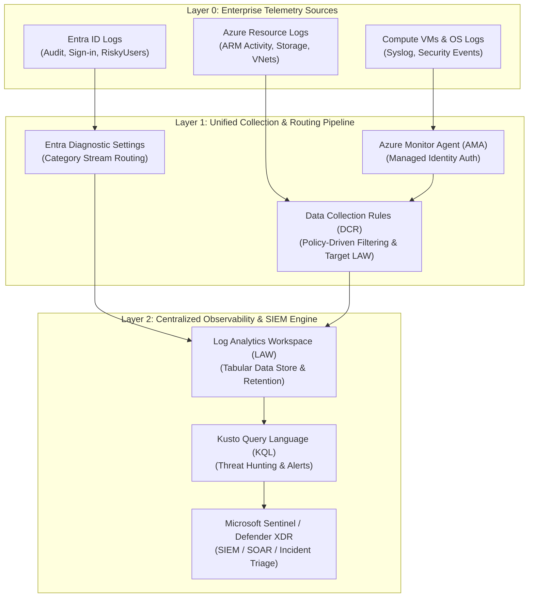
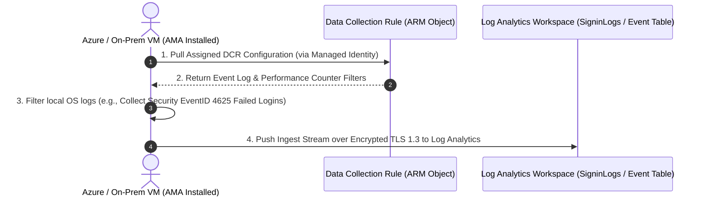
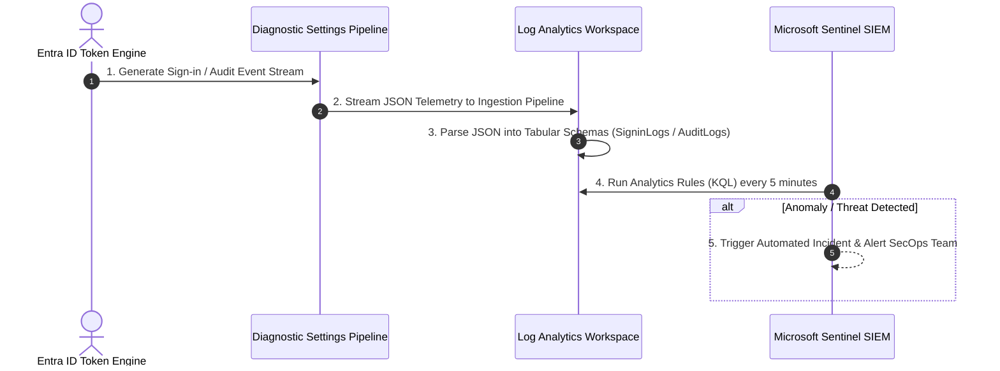

# SC-300 Day 06: Azure Monitoring & Security: Best Practices for Compliance & Threat Detection

> **Source Video Title:** Azure Monitoring & Security: Best Practices for Compliance & Threat Detection | Day 6  
> **Source URL:** [https://www.youtube.com/watch?v=pktSWCPScDw](https://www.youtube.com/watch?v=pktSWCPScDw&list=PL86wiCAX5vmTg8uubUrlHOqXrjXk6p-73&index=6)  
> **Instructor:** Raghuveer  
> **Refactored & Expanded By:** Senior Principal Engineer & Distinguished Technical Fellow (ex-FAANG / MANGOS)  
> **Target Certification Track:** Microsoft Certified: Identity and Access Administrator Associate (SC-300) | Bridge to Cybersecurity Architect (SC-100), SC-200 & Cloud and AI Security Engineer Associate (SC-500 - Successor to AZ-500)  
> **Technical Currency:** Updated as of **August 2026**

---

## Executive Summary & Curriculum Blueprint

Welcome to **Day 06** of the Microsoft Entra ID Security Masterclass.

In enterprise cloud security engineering, **Observability and Telemetry Analysis** form the backbone of threat detection, regulatory compliance, and incident response. Securing an enterprise tenant requires streaming infrastructure metrics, audit trails, and Entra ID sign-in events into a centralized **Log Analytics Workspace (LAW)** using **Azure Monitor Agent (AMA)** and **Data Collection Rules (DCRs)**, while leveraging **Kusto Query Language (KQL)** for proactive threat hunting.

This document transforms the raw Day 06 lecture transcript into an **executive engineering reference manual**. We break down the three monitoring pillars (Infrastructure, Application, Security), the **legacy MMA agent shutdown mechanics**, Data Collection Rules (DCRs), KQL query syntax, Entra ID diagnostic log streaming, and Microsoft Defender for Cloud Secure Score optimization from first principles.



---

## Module 1: The Three Pillars of Cloud Observability

### 1.1 Observability Taxonomy Matrix

Enterprise monitoring is partitioned into three distinct operational domains:

```
┌─────────────────────────────────────────────────────────────────────────┐
│                    THE THREE PILLARS OF OBSERVABILITY                   │
├─────────────────┬───────────────────┬───────────────────────────────────┤
│ Monitoring Pillar│ Primary Metric    │ Key Native Azure Service          │
├─────────────────┼───────────────────┼───────────────────────────────────┤
│ **Infrastructure**│ vCPU, Memory, Disk│ Azure Monitor, Network Watcher,   │
│                 │ IOPS, Network VNet│ Traffic Analytics                 │
├─────────────────┼───────────────────┼───────────────────────────────────┤
│ **Application** │ APM Traces, Latency│ Azure Application Insights,       │
│                 │ Exceptions, HTTP  │ App Service Diagnostics           │
├─────────────────┼───────────────────┼───────────────────────────────────┤
│ **Security**    │ Identity Sign-ins,│ Microsoft Sentinel, Defender XDR, │
│                 │ Audit Logs, Risk  │ Entra ID Protection, KQL Engine   │
└─────────────────┴───────────────────┴───────────────────────────────────┘
```

---

### 1.2 The 2026 Agent Paradigm Shift: Legacy MMA Shutdown & AMA Dominance

> [!WARNING]
> **CRITICAL PLATFORM MIGRATION NOTICE:**  
> The legacy **Log Analytics Agent (Microsoft Monitoring Agent / MMA / OMS)** was officially retired on **August 31, 2024**, and all legacy cloud ingestion services were permanently shut down. 
> 
> All production telemetry collection MUST be handled by **Azure Monitor Agent (AMA)** configured via **Data Collection Rules (DCRs)**.

```
LEGACY RETIRED AGENT PATTERN (Cloud Ingestion Disabled):
VM Guest OS ──► Log Analytics Agent (MMA / OMS) ──► Direct Workspace ID / Primary Key
                (Unmanaged static workspace keys, legacy monolithic agent)

MODERN AZURE MONITOR AGENT PATTERN (Zero Trust 2026):
VM Guest OS ──► Azure Monitor Agent (AMA) ──► Data Collection Rule (DCR) ──► Log Analytics Workspace
                (Authenticated via Managed Identity, granular policy filtering)
```

---

## Module 2: Data Collection Rules (DCRs) & Unified Ingestion Architecture

### 2.1 What is a Data Collection Rule (DCR)?

A **Data Collection Rule (DCR)** is an Azure Resource Manager (ARM) object that defines **what** data should be collected from workloads, **how** that data should be transformed or filtered, and **where** (destinations) that data should be sent.

```
┌─────────────────────────────────────────────────────────────────────────┐
│                     DATA COLLECTION RULE (DCR) ANATOMY                  │
├─────────────────────────────────────────────────────────────────────────┤
│ 1. Data Sources  : Windows Event Logs (Security/System), Syslog, Perf    │
│ 2. Transformations: KQL-based inline filtering (e.g., where EventID != 4624)│
│ 3. Destinations  : Log Analytics Workspace (LAW), Event Hubs, Storage    │
└─────────────────────────────────────────────────────────────────────────┘
```



#### Key Advantages of DCRs over Legacy MMA:
1. **Multi-Homing Capabilities:** A single VM running AMA can stream different log categories to multiple Log Analytics Workspaces (e.g., Security logs to SOC LAW, Performance logs to DevOps LAW).
2. **KQL-Based Data Transformation at Ingestion:** Filter out noisy debug events at the ingestion pipeline before data hits the workspace, reducing Log Analytics ingestion costs by up to **40%**.
3. **Managed Identity Authentication:** Replaces hardcoded Workspace IDs and Shared Primary Keys with Entra ID Managed Identities.

---

## Module 3: Kusto Query Language (KQL) for Security Engineers

Kusto Query Language (KQL) is a read-only, high-performance data processing language used to query Log Analytics Workspaces, Microsoft Sentinel, and Defender XDR.

### 3.1 Basic KQL Query Pipeline Mechanics

KQL queries follow a sequential tabular pipe model (`table | operator1 | operator2`).

```
[ Table Name ] ──► | where (Filter) ──► | summarize (Aggregate) ──► | project (Select Columns)
```

```kql
// KQL Example: Detect Failed Sign-in Spikes in Entra ID
SigninLogs
| where TimeGenerated >= ago(24h)
| where ResultType != 0 // ResultType 0 indicates Success; Non-zero indicates failure
| summarize FailedCount = count() by UserPrincipalName, IPAddress, ResultDescription
| where FailedCount > 10
| project UserPrincipalName, IPAddress, FailedCount, ResultDescription
| sort by FailedCount desc
```

---

### 3.2 Key Core KQL Operators Matrix

| Operator | Architectural Purpose | Example KQL Syntax |
| :--- | :--- | :--- |
| **`where`** | Filters tabular dataset based on boolean predicate. | `\| where TimeGenerated >= ago(7d) and ResultType == 50126` |
| **`summarize`** | Aggregates rows by group-by columns. | `\| summarize LoginAttempts = count() by UserPrincipalName` |
| **`project`** | Selects specific columns to display in output. | `\| project TimeGenerated, UserPrincipalName, IPAddress, AppDisplayName` |
| **`extend`** | Creates a calculated dynamic column. | `\| extend RiskScore = iff(RiskLevelAggregated == "high", 100, 10)` |
| **`join`** | Merges two tables based on a matching key column. | `SigninLogs \| join kind=inner (AuditLogs) on $left.CorrelationId == $right.CorrelationId` |
| **`render`** | Generates visual charts (barchart, timechart, piechart).| `\| render timechart` |

---

## Module 4: Entra ID Diagnostic Settings & Threat Detection Integration

### 4.1 Streaming Entra ID Telemetry to Log Analytics

Microsoft Entra ID generates audit and sign-in telemetry that must be forwarded to a Log Analytics Workspace for retention, compliance auditing, and Sentinel SIEM threat hunting.

```
┌─────────────────────────────────────────────────────────────────────────┐
│                   ENTRA ID DIAGNOSTIC LOG CATEGORIES                    │
├─────────────────────────────────────────────────────────────────────────┤
│ • AuditLogs                  : Administrative role changes, user CRUD   │
│ • SignInLogs                 : Interactive user authentications         │
│ • NonInteractiveUserSignInLogs: Service-to-service background user tokens│
│ • ServicePrincipalSignInLogs : Application / Service Principal tokens   │
│ • ManagedIdentitySignInLogs  : Azure Workload Managed Identity tokens   │
│ • RiskyUsers                 : Real-time ML user risk score changes     │
│ • UserRiskEvents             : Specific threat detection triggers       │
└─────────────────────────────────────────────────────────────────────────┘
```



---

## Module 5: Security Posture Assessment & Defender for Cloud

### 5.1 Microsoft Defender for Cloud & Secure Score

**Secure Score** is a gamified security posture metric provided by Microsoft Defender for Cloud (and Entra Identity Secure Score). It measures an organization’s security posture against Microsoft Zero Trust security baselines.

```
┌─────────────────────────────────────────────────────────────────────────┐
│                     SECURE SCORE OPTIMIZATION ENGINE                    │
├─────────────────────────────────────────────────────────────────────────┤
│ Current Score: 68% (340 / 500 Points)                                   │
├─────────────────────────────────────────────────────────────────────────┤
│ High Impact Recommendations:                                            │
│ • Enable MFA for all administrative roles           (+10% Score Gain)   │
│ • Restrict Storage Account Public Network Access     (+8% Score Gain)    │
│ • Migrate Virtual Machines to Azure Monitor Agent  (+5% Score Gain)    │
└─────────────────────────────────────────────────────────────────────────┘
```

#### Governance Control Options:
- **Exemptions:** Waive a specific recommendation for a resource group due to documented business constraints (requires justification and expiration date).
- **Grace Periods:** Define temporary compliance windows for newly provisioned resources before affecting the overall Secure Score calculation.

---

## Module 6: Hands-On Verification & Principal Fellow Lab Guide

### 6.1 Lab 6.1: Provisioning Log Analytics Workspace & Data Collection Rule (DCR) via Azure CLI

#### Execution Script:
```azcli
# Step 1: Create a Log Analytics Workspace
az monitor log-analytics workspace create \
  --resource-group rg-corp-network-prod \
  --workspace-name law-corp-secops-prod \
  --location centralindia \
  --retention-time 90

# Step 2: Retrieve Workspace Resource ID
law_id=$(az monitor log-analytics workspace show \
  --resource-group rg-corp-network-prod \
  --workspace-name law-corp-secops-prod \
  --query id \
  --output tsv)

# Step 3: Create a Data Collection Rule (DCR) for Windows/Linux System Logs
az monitor data-collection rule create \
  --resource-group rg-corp-network-prod \
  --name dcr-secops-vms \
  --location centralindia \
  --kind Linux \
  --log-analytics "[{resource-id:'$law_id',name:'law-destination'}]" \
  --syslog "[{facilityNames:['auth','authpriv'],logLevels:['Warning','Error','Critical'],name:'syslog-stream'}]"
```

#### Line-by-Line Technical Breakdown:
1. `az monitor log-analytics workspace create ... --retention-time 90`: Provisions a Log Analytics Workspace with a 90-day active data retention policy.
2. `law_id=$(...)`: Fetches the fully qualified ARM resource ID of the Log Analytics Workspace.
3. `az monitor data-collection rule create ...`: Instantiates a DCR specifying target Syslog facilities (`auth`, `authpriv`) and log levels, directing stream output to `law-destination`.

---

### 6.2 Lab 6.2: Streaming Entra ID Diagnostic Logs to Log Analytics via Azure CLI

#### Execution Script:
```azcli
# Step 1: Obtain Log Analytics Workspace ID
law_id=$(az monitor log-analytics workspace show \
  --resource-group rg-corp-network-prod \
  --workspace-name law-corp-secops-prod \
  --query id \
  --output tsv)

# Step 2: Configure Entra ID Tenant Diagnostic Settings to Stream Signin & Audit Logs
az monitor diagnostic-settings create \
  --name diag-entra-to-law \
  --resource "/providers/Microsoft.aadiam" \
  --workspace $law_id \
  --logs '[
    {"category": "AuditLogs", "enabled": true},
    {"category": "SignInLogs", "enabled": true},
    {"category": "NonInteractiveUserSignInLogs", "enabled": true},
    {"category": "ServicePrincipalSignInLogs", "enabled": true},
    {"category": "RiskyUsers", "enabled": true}
  ]'
```

---

## Module 7: Executive Knowledge Check & First-Principles Exam Readiness

### 7.1 The "What, Why, How, Where, When" Core Matrix

| Topic | What is it? | Why does it exist? | How does it work under the hood? | Where & When to use it? |
| :--- | :--- | :--- | :--- | :--- |
| **Log Analytics (LAW)** | Tabular log data repository in Azure Monitor. | Centralizes logging for threat hunting, compliance, and auditing. | Stores data in optimized columnar tables queried via Kusto Engine. | Required central hub for all Azure subscriptions and Entra tenants. |
| **Azure Monitor Agent (AMA)** | Next-gen unified telemetry collection agent. | Replaces retired legacy MMA agent with managed identity security. | Operates as a VM extension fetching DCR rules to stream filtered logs. | Mandatory installation on all Azure VMs and hybrid Azure Arc servers. |
| **Data Collection Rule (DCR)** | ARM rule defining log sources, filters, and destinations. | Reduces log ingestion costs and enables multi-homing. | Ingestion engine applies KQL transformations before writing to LAW. | Bind to all VMs via Policy to control security event collection. |
| **Entra Diagnostic Settings** | Export pipeline for Entra ID tenant logs. | Enables long-term retention and SIEM threat detection. | Entra logging engine streams JSON events to LAW REST endpoints. | Mandated for all enterprise Entra tenants (stream Audit & Sign-in logs). |
| **Secure Score** | Gamified security posture score in Defender for Cloud. | Measures alignment with Zero Trust security baselines. | Evaluates tenant resource configurations against policy benchmarks. | Monitor weekly; prioritize high-impact security recommendations. |

---

### 7.2 Distinguished Fellow Architectural Scenarios

#### Scenario 1: The Discontinued Legacy Agent Emergency
* **Question:** A security engineer reports that security event logs from 200 Linux VMs stopped appearing in the Log Analytics Workspace. Investigation reveals the VMs are running the legacy Log Analytics Agent (MMA / OMS). What caused the outage?
* **Answer:** Microsoft officially retired the legacy Log Analytics Agent (MMA) on **August 31, 2024**, and permanently shut down cloud ingestion endpoints. Legacy agents can no longer upload data to Azure.
* **Remediation:** Deploy the **Azure Monitor Agent (AMA)** extension across all 200 VMs via Azure Policy and attach a **Data Collection Rule (DCR)** targeting the Log Analytics Workspace.

#### Scenario 2: The High Log Analytics Ingestion Cost Breach
* **Question:** An enterprise customer receives a \$15,000 monthly bill for Log Analytics ingestion. Inspection shows millions of debug-level Windows Event logs (`EventID 4624` successful logins) flooding the workspace. How do you reduce costs without losing critical security events?
* **Answer:** The Data Collection Rule (DCR) is collecting all events without filtration.
* **Remediation:** Update the DCR using an inline KQL transformation (`source | where EventID != 4624` or collect only `EventID 4625` failed logins), filtering out noise at the ingestion pipeline before it is billed.

---

## Conclusion & Next Steps

Day 06 has established cloud observability pillars, the mandatory AMA/DCR agent architecture, KQL query mechanics, Entra ID diagnostic log streaming, and Secure Score optimization.

### Preparation for Day 07:
In **Day 07**, we advance to **Mastering Microsoft Entra ID Identity Security & Access Management**, beginning our deep dive into core Entra tenant configuration, custom domains, Administrative Units (AUs), and user/group life cycles.

> *"Observability is useless without structure. Filter at the ingestion pipeline, stream Entra logs to Log Analytics, and hunt threats via KQL."*