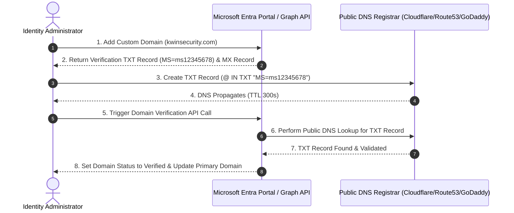
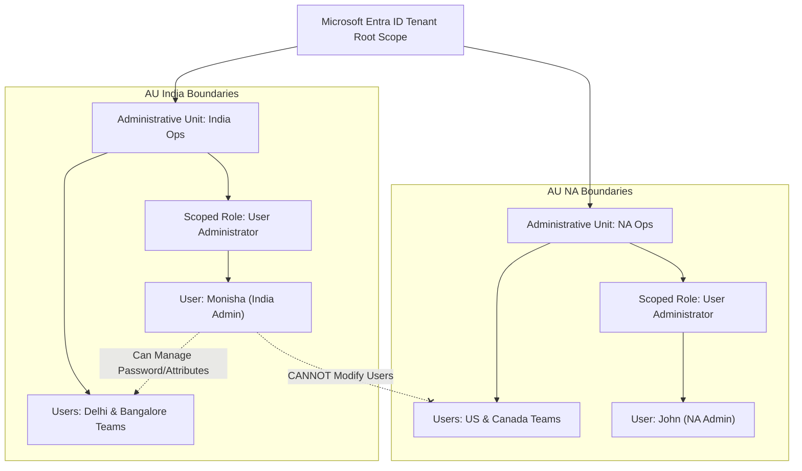

# SC-300 Day 07: Mastering Microsoft Entra ID: Identity Security & Access Management

> **Source Video Title:** Mastering Microsoft Entra ID: Identity Security & Access Management | Day 7  
> **Source URL:** [https://www.youtube.com/watch?v=_haoau13jJg](https://www.youtube.com/watch?v=_haoau13jJg&list=PL86wiCAX5vmTg8uubUrlHOqXrjXk6p-73&index=7)  
> **Instructor:** Raghuveer  
> **Refactored & Expanded By:** Senior Principal Engineer & Distinguished Technical Fellow (ex-FAANG / MANGOS)  
> **Target Certification Track:** Microsoft Certified: Identity and Access Administrator Associate (SC-300) | Bridge to Cybersecurity Architect (SC-100), SC-200 & Cloud and AI Security Engineer Associate (SC-500 - Successor to AZ-500)  
> **Technical Currency:** Updated as of **August 2026**

---

## Executive Summary & Curriculum Blueprint

Welcome to **Day 07** of the Microsoft Entra ID Security Masterclass.

In enterprise identity engineering, **Microsoft Entra ID** serves as the authoritative cloud identity and access management control plane. Securing a modern enterprise requires mastering the **AAA Framework (Authentication, Authorization, Auditing)**, **Entra ID Licensing Tiers (Free vs. P1 vs. P2 vs. Entra ID Governance & Entra Suite)**, **Custom Domain Verification (DNS TXT/MX records)**, **Administrative Units (AUs)** for scoped RBAC delegation, and **User/Workload Identity Taxonomy**.

This document transforms the raw Day 07 lecture transcript into an **executive engineering reference manual**. We break down the SC-300 exam domain architecture, Entra ID SKU feature boundaries (including the **2026 Entra Suite & M365 E7 updates**), CSA Cloud Control Matrix (CCM v4) alignment, custom domain verification mechanics, Administrative Units, and automated provisioning scripts from first principles.

```mermaid
flowchart TD
    subgraph AAA_Framework ["Layer 0: AAA Identity & Access Control Plane"]
        AuthN["Authentication (AuthN)<br/>(Who are you? - FIDO2 / Passkeys)"]
        AuthZ["Authorization (AuthZ)<br/>(What can you do? - RBAC / CA)"]
        Audit["Auditing (Audit)<br/>(What did you do? - SigninLogs)"]
    end

    subgraph Licensing_Tiers ["Layer 1: Entra ID Feature Capability Tiers"]
        FreeTier["Entra ID Free<br/>(Security Defaults, 50k Objects)"]
        P1Tier["Entra ID P1<br/>(Conditional Access, SSPR, Dynamic Groups)"]
        P2Tier["Entra ID P2<br/>(Identity Protection, PIM, Access Reviews)"]
        GovTier["Entra ID Governance / Suite<br/>(Lifecycle Workflows, Entitlement Mgmt)"]
    end

    subgraph Administration_Boundary ["Layer 2: Directory Partitioning & Delegation"]
        TenantRoot["Tenant Root (/)<br/>(Global Administrator Scope)"]
        AdminUnits["Administrative Units (AUs)<br/>(Scoped Regional/OU Delegation)"]
        CustomDomains["Custom Domains<br/>(kwinsecurity.com - DNS TXT/MX)"]
    end

    AuthN --> AuthZ
    AuthZ --> Audit
    FreeTier --> P1Tier
    P1Tier --> P2Tier
    P2Tier --> GovTier
    TenantRoot --> AdminUnits
    AdminUnits --> CustomDomains
```



---

## Module 1: The AAA Framework & CSA Cloud Control Matrix (CCM v4)

### 1.1 The AAA Framework Breakdown

Identity management rests on three non-negotiable architectural pillars:

```
┌─────────────────────────────────────────────────────────────────────────┐
│                    THE AAA IDENTITY CONTROL FRAMEWORK                   │
├─────────────────┬───────────────────┬───────────────────────────────────┤
│ AAA Pillar      │ Core Question     │ Entra ID Primary Enforcement Mechanism│
├─────────────────┼───────────────────┼───────────────────────────────────┤
│ **Authentication**│ *Who are you?*    │ Passwordless FIDO2 Passkeys,      │
│ **(AuthN)**     │                   │ Microsoft Authenticator, Certificate│
├─────────────────┼───────────────────┼───────────────────────────────────┤
│ **Authorization** │ *What can you do?*│ Microsoft Entra RBAC Roles,       │
│ **(AuthZ)**     │                   │ Conditional Access Engine, PIM    │
├─────────────────┼───────────────────┼───────────────────────────────────┤
│ **Auditing**    │ *What did you do?*│ Entra ID AuditLogs & SigninLogs,  │
│ **(Audit)**     │                   │ Log Analytics, Sentinel SIEM      │
└─────────────────┴───────────────────┴───────────────────────────────────┘
```

---

### 1.2 Alignment with CSA Cloud Control Matrix (CCM v4)

The **Cloud Security Alliance (CSA) Cloud Control Matrix (CCM v4)** provides an industry-standard cybersecurity control framework across 18 domains. Entra ID directly maps to the **IAM (Identity & Access Management)** domain.

#### Enterprise Control Principles:
1. **Least Privilege Access (IAM-01):** Granting users only the minimum permissions required to perform their specific job role (e.g., assigning *User Administrator* rather than *Global Administrator*).
2. **Separation of Duties (SoD) (IAM-03):** Ensuring critical administrative tasks (e.g., creating a user vs. assigning a privileged role) require distinct identities or approval workflows via **Privileged Identity Management (PIM)**.
3. **User Identity Lifecycle (IAM-02):** Automated onboarding, role changes, and offboarding (Joiner, Mover, Leaver lifecycle workflows) to prevent orphan account accumulation.

---

## Module 2: Entra ID Licensing Architecture (2026 Edition)

### 2.1 Feature Capability Matrix by License Tier

```
┌─────────────────────────────────────────────────────────────────────────┐
│              ENTRA ID LICENSING FEATURE COMPARISON (2026)               │
├────────────────────────────────┬──────┬──────┬──────┬───────────────────┤
│ Feature Capability             │ Free │ P1   │ P2   │ Entra Governance  │
├────────────────────────────────┼──────┼──────┼──────┼───────────────────┤
│ Security Defaults / Basic Auth │ YES  │ YES  │ YES  │ YES               │
│ Self-Service Password Reset    │ Cloud│ SSPR+│ SSPR+│ SSPR+ Writeback   │
│ **Conditional Access Policies**│ NO   │ YES  │ YES  │ YES               │
│ **Dynamic User & Group Rules** │ NO   │ YES  │ YES  │ YES               │
│ Hybrid Sync (Connect / Cloud)  │ YES  │ YES  │ YES  │ YES               │
│ **Identity Protection (Risk)** │ NO   │ NO   │ YES  │ YES               │
│ **Privileged Identity (PIM)**  │ NO   │ NO   │ YES  │ YES               │
│ **Lifecycle Workflows (JML)**  │ NO   │ NO   │ Lim. │ FULL              │
│ **Entitlement Mgmt (Packages)**│ NO   │ NO   │ YES  │ FULL              │
└────────────────────────────────┴──────┴──────┴──────┴───────────────────┘
```

*Note: In 2026, Microsoft introduced the **Microsoft Entra Suite** (included in **Microsoft 365 E7**), which unifies Entra ID P2, Entra ID Governance, Entra Private Access, and Entra Internet Access into a single license bundle.*

> [!IMPORTANT]
> **The "One Person, One License" Rule:**  
> Microsoft's official 2026 licensing specification mandates that a single human user requires only **one base user license** (P1 or P2), even if they maintain multiple cloud identities or guest accounts across secondary Microsoft Entra tenants in the same cloud instance.

---

## Module 3: Custom Domain Names & Directory Architecture

### 3.1 Custom Domain Verification Mechanics

Every new Microsoft Entra ID tenant is initially assigned a default domain in the format `tenantname.onmicrosoft.com`. For enterprise production use, custom corporate domains (e.g., `kwinsecurity.com`) must be federated and verified.



#### DNS Verification Rules:
- **TXT Record (Recommended):** `Host: @`, `Value: MS=msXXXXXX`, `TTL: 3600`.
- **MX Record (Alternative):** Used if the DNS provider does not support TXT records. `Host: @`, `Value: MSmsXXXXXX.store.core.windows.net`, `Priority: 10`.

---

## Module 4: Administrative Units (AUs) & Scoped RBAC Delegation

### 4.1 What is an Administrative Unit (AU)?

An **Administrative Unit (AU)** is an Entra ID resource container used to partition users, groups, or devices into logical administrative boundaries (e.g., regional offices, business divisions, or specific departments).

```
┌─────────────────────────────────────────────────────────────────────────┐
│                 ADMINISTRATIVE UNIT (AU) DELEGATION MODEL               │
├─────────────────────────────────────────────────────────────────────────┤
│ TENANT ROOT SCOPE (Global Administrator)                                │
│ ├── AU: India Operations                                                │
│ │   ├── Users: User-India-01, User-India-02                             │
│ │   └── Scoped Administrator: India Helpdesk Admin                      │
│ └── AU: North America Operations                                        │
│     ├── Users: User-NA-01, User-NA-02                                   │
│     └── Scoped Administrator: NA Helpdesk Admin                         │
└─────────────────────────────────────────────────────────────────────────┘
```



> [!TIP]
> **Dynamic Administrative Units:**  
> Administrative Units support **Dynamic Membership Rules** based on user attributes (e.g., `user.department -eq "Sales"` or `user.country -eq "India"`), automatically populating member objects without manual admin intervention.

---

## Module 5: Hands-On Verification & Principal Fellow Lab Guide

### 5.1 Lab 7.1: Provisioning Microsoft Entra ID P2 Trial & Verifying Custom Domain via PowerShell

#### Execution Script:
```powershell
# Step 1: Connect to Microsoft Graph API with Domain & Directory Administration Scopes
Connect-MgGraph -Scopes "Domain.ReadWrite.All", "Directory.AccessAsUser.All"

# Step 2: Add Custom Domain Name to Entra Tenant
New-MgDomain -Id "kwinsecurity.com"

# Step 3: Retrieve Required DNS Verification Records
Get-MgDomainVerificationDnsRecord -DomainId "kwinsecurity.com" | Format-Table Id, Label, RecordType, Text

# Step 4: Verify Domain Status (Execute after adding TXT record to Public DNS)
Confirm-MgDomain -DomainId "kwinsecurity.com"

# Step 5: Set Custom Domain as Primary Tenant Domain
Update-MgDomain -DomainId "kwinsecurity.com" -IsDefault:$true
```

#### Line-by-Line Technical Breakdown:
1. `Connect-MgGraph -Scopes "Domain.ReadWrite.All"`: Authenticates to Graph API with explicit delegated rights to manage DNS domain objects.
2. `New-MgDomain`: Registers `kwinsecurity.com` in unverified state inside the Entra ID directory.
3. `Get-MgDomainVerificationDnsRecord`: Outputs the exact `MS=msXXXXXX` verification token required for your DNS registrar.
4. `Confirm-MgDomain`: Triggers Entra ID background worker to query public DNS root servers to validate the TXT record.
5. `Update-MgDomain -IsDefault:$true`: Sets the newly verified domain as the default suffix for all new user principal names (UPNs).

---

### 5.2 Lab 7.2: Creating an Administrative Unit & Delegating Scoped User Administrator Role

#### Execution Script:
```azcli
# Step 1: Create Administrative Unit for India Regional Operations
au_id=$(az rest --method POST \
  --uri "https://graph.microsoft.com/v1.0/administrativeUnits" \
  --body '{"displayName":"AU-India-Ops","description":"Scoped AU for India regional operations"}' \
  --query id --output tsv)

# Step 2: Add Target User to Administrative Unit
az rest --method POST \
  --uri "https://graph.microsoft.com/v1.0/administrativeUnits/$au_id/members/\$ref" \
  --body "{\"@odata.id\":\"https://graph.microsoft.com/v1.0/users/user-delhi-01@kwinsecurity.com\"}"

# Step 3: Assign Scoped User Administrator Role to Local Admin within the AU
user_admin_role_id="fe930b6c-7e77-4727-91de-0c7f74b23bcf" # User Administrator Role Definition ID
az rest --method POST \
  --uri "https://graph.microsoft.com/v1.0/roleManagement/directory/roleAssignments" \
  --body "{
    \"principalId\": \"admin-monisha-id\",
    \"roleDefinitionId\": \"$user_admin_role_id\",
    \"directoryScopeId\": \"/administrativeUnits/$au_id\"
  }"
```

---

## Module 6: Executive Knowledge Check & First-Principles Exam Readiness

### 6.1 The "What, Why, How, Where, When" Core Matrix

| Topic | What is it? | Why does it exist? | How does it work under the hood? | Where & When to use it? |
| :--- | :--- | :--- | :--- | :--- |
| **Entra ID P2 License** | Top-tier individual Entra identity license. | Unlocks Identity Protection risk detection and PIM. | Enables real-time machine learning risk evaluation on sign-in streams. | Mandatory for privileged admins, security operations, and PIM users. |
| **Custom Domain** | Federated corporate domain suffix (e.g. `@kwinsecurity.com`). | Replaces default `.onmicrosoft.com` UPNs for branding & SSO. | Verified via public DNS TXT record lookup (`MS=msXXXXXX`). | Configure immediately upon tenant creation. |
| **Administrative Unit (AU)** | Directory container for scoped RBAC delegation. | Enforces Least Privilege and prevents global admin sprawl. | Limits RBAC role permissions strictly to member objects within the AU. | Use in multi-region or divisional enterprises to delegate local helpdesk rights. |
| **CSA CCM v4 IAM** | Industry cybersecurity framework for Identity. | Provides standardized compliance benchmarks. | Maps 18 security domains to cloud technical controls. | Use during security audits to align Entra configurations with CIS/NIST. |
| **Workload Identity** | Identity assigned to non-human resources (Apps, Managed Identities). | Eliminates hardcoded app secrets in code. | Uses OAuth 2.0 client credentials or federated OIDC assertion tokens. | Mandatory baseline for all applications interacting with Graph/Azure APIs. |

---

### 6.2 Distinguished Fellow Architectural Scenarios

#### Scenario 1: The Global Admin Sprawl Security Risk
* **Question:** A multi-national corporation with offices in London, Tokyo, and Mumbai has 25 Global Administrators because regional helpdesk managers need permission to reset user passwords in their respective offices. As a Technical Fellow, how do you remediate this risk?
* **Answer:** Assigning *Global Administrator* for password resets violates Least Privilege and creates severe security risk.
* **Remediation:** Create 3 **Administrative Units (AUs)** (`AU-London`, `AU-Tokyo`, `AU-Mumbai`), populate users into their respective AUs, and assign regional helpdesk staff the **User Administrator** role **scoped strictly to their regional AU**. Revoke all 25 Global Administrator roles.

#### Scenario 2: The Unverified Domain Custom Sign-In Failure
* **Question:** An admin attempts to change a user's UPN from `user@contoso.onmicrosoft.com` to `user@mycompany.com`, but the Entra portal throws an error: `Domain mycompany.com is unverified`. What is the resolution?
* **Answer:** Entra ID will not allow user assignment to a custom domain until ownership of the domain namespace is cryptographically validated.
* **Remediation:** Generate an `MS=msXXXXXX` verification token, create a TXT record at the public DNS registrar for `mycompany.com`, and run `Confirm-MgDomain` to complete verification.

---

## Conclusion & Next Steps

Day 07 has established the AAA framework, Entra ID licensing tiers (P1 vs P2 vs Entra Suite), custom domain verification mechanics, Administrative Units, and scoped RBAC delegation.

### Preparation for Day 08:
In **Day 08**, we advance to **Microsoft Entra ID User & Group Management, Dynamic Membership & Identity Lifecycle Workflows**, exploring dynamic expression rules, group-based licensing automation, and automated Joiner-Mover-Leaver (JML) provisioning.

> *"Enforce Least Privilege at the boundary, scope roles using Administrative Units, and never grant Global Admin where an AU assignment suffices."*