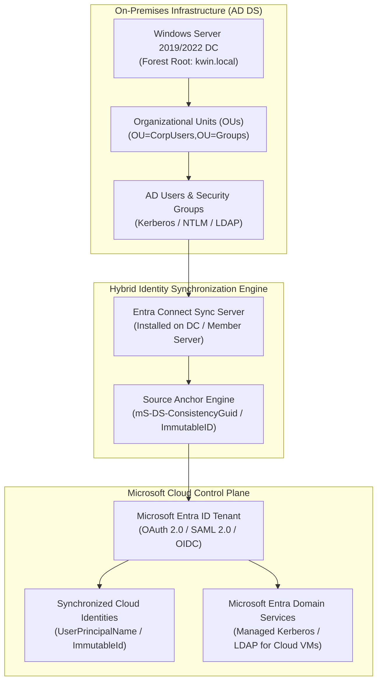
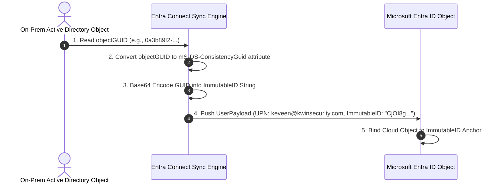

# SC-300 Day 08: Active Directory vs. Microsoft Entra ID: Hybrid Identity & Synchronization

> **Source Video Title:** Active Directory vs. Microsoft Entra ID: Hybrid Identity & Synchronization | Day 8  
> **Source URL:** [https://www.youtube.com/watch?v=8_mtzCYQF9A](https://www.youtube.com/watch?v=8_mtzCYQF9A&list=PL86wiCAX5vmTg8uubUrlHOqXrjXk6p-73&index=8)  
> **Instructor:** Raghuveer  
> **Refactored & Expanded By:** Senior Principal Engineer & Distinguished Technical Fellow (ex-FAANG / MANGOS)  
> **Target Certification Track:** Microsoft Certified: Identity and Access Administrator Associate (SC-300) | Bridge to Cybersecurity Architect (SC-100), SC-200 & Cloud and AI Security Engineer Associate (SC-500 - Successor to AZ-500)  
> **Technical Currency:** Updated as of **August 2026**

---

## Executive Summary & Curriculum Blueprint

Welcome to **Day 08** of the Microsoft Entra ID Security Masterclass.

In enterprise identity engineering, **Hybrid Identity** bridges legacy on-premises Active Directory infrastructure with cloud-native Microsoft Entra ID. Modern enterprises must master the three-way identity taxonomy (**AD DS vs. Microsoft Entra ID vs. Microsoft Entra Domain Services**), **Entra Product Taxonomy (Entra Suite 2026)**, **Active Directory Forest Promotion**, **Organizational Unit (OU) structuring**, and **Entra Connect Sync Engine prerequisites**.

This document transforms the raw Day 08 lecture transcript into an **executive engineering reference manual**. We break down the structural differences between Kerberos/LDAP and OAuth/SAML, the mandatory credentials required for synchronization (Enterprise Admin on-prem + Hybrid Identity Administrator in cloud), immutable ID anchors (`mS-DS-ConsistencyGuid`), and step-by-step domain controller deployment from first principles.



---

## Module 1: The Identity Triad — AD DS vs. Microsoft Entra ID vs. Entra DS

### 1.1 Comprehensive Architectural Comparison Matrix

Enterprise security architects must distinguish between the three core Microsoft identity solutions:

```
┌─────────────────────────────────────────────────────────────────────────┐
│                 MICROSOFT IDENTITY TRIAD COMPARISON (2026)              │
├──────────────────┬───────────────────┬───────────────────┬──────────────┤
│ Feature Attribute│ Active Directory  │ Microsoft Entra ID│ Entra Domain │
│                  │ (AD DS)           │ (Cloud IDaaS)     │ Services (DS)│
├──────────────────┼───────────────────┼───────────────────┼──────────────┤
│ **Habitat**      │ On-Prem / IaaS VM │ 100% Cloud Native │ Managed VNet │
│ **Management**   │ Self-Managed DCs  │ Fully Managed SaaS│ Managed DCs  │
│ **Structure**    │ Hierarchical OUs  │ Flat Directory    │ Flat + OUs   │
│ **Protocols**    │ Kerberos, NTLM,   │ OAuth 2.0, SAML,  │ Kerberos,    │
│                  │ LDAP, SMB, DNS    │ OpenID Connect    │ NTLM, LDAP   │
│ **Policy Engine**│ Group Policy (GPO)│ Intune MDM, CA    │ Scoped GPOs  │
│ **Target Use**   │ Legacy On-Prem    │ M365, SaaS Apps,  │ Cloud Legacy │
│                  │ Workloads         │ Entra Suite       │ Lift-and-Shift│
└──────────────────┴───────────────────┴───────────────────┴──────────────┘
```

#### First Principles Breakdown:
- **Active Directory Domain Services (AD DS):** Designed for perimeter-bound corporate networks. Uses Kerberos tickets and LDAP queries over RPC/SMB. Relies on forest trusts and domain controllers.
- **Microsoft Entra ID:** Designed for perimeter-less Zero Trust environments. Uses REST APIs (Microsoft Graph) and JSON Web Tokens (JWT). Eliminates physical domain controllers in favor of cloud identity providers (IdP).
- **Microsoft Entra Domain Services (Entra DS):** A managed PaaS service in Azure that provisions two managed domain controllers in a target VNet, exposing Kerberos, NTLM, and LDAP for legacy workloads migrated to Azure without requiring on-prem VPN links or self-managed DCs.

---

## Module 2: The Microsoft Entra Product Taxonomy (2026 Edition)

In 2026, Microsoft consolidated its identity and security offerings under the **Microsoft Entra Suite** brand umbrella:

```
┌─────────────────────────────────────────────────────────────────────────┐
│                 MICROSOFT ENTRA PRODUCT TAXONOMY (2026)                 │
├─────────────────────────────────────────────────────────────────────────┤
│ 1. Microsoft Entra ID              : Core Cloud Identity & Access       │
│ 2. Microsoft Entra ID Governance   : Lifecycle Workflows & Access Pkgs  │
│ 3. Microsoft Entra External ID     : B2B Collaboration & B2C Apps       │
│ 4. Microsoft Entra Verified ID     : Decentralized Verifiable Creds     │
│ 5. Microsoft Entra Permissions Mgmt: CIEM (Cloud Infrastructure Entitle)│
│ 6. Microsoft Entra Private Access  : SSE Zero Trust Private App Access  │
│ 7. Microsoft Entra Internet Access : SSE Secure Web Gateway / DLP       │
└─────────────────────────────────────────────────────────────────────────┘
```

---

## Module 3: Hybrid Synchronization Prerequisites & Identity Mechanics

### 3.1 Privileged Credential Requirements

To establish a hybrid identity bridge using Microsoft Entra Connect Sync, an engineer must possess high-privilege credentials across **both** environment boundaries:

```
┌─────────────────────────────────────────────────────────────────────────┐
│                   REQUIRED SYNCHRONIZATION CREDENTIALS                  │
├───────────────────────────────────┬─────────────────────────────────────┤
│ On-Premises Active Directory      │ Microsoft Entra ID Cloud            │
├───────────────────────────────────┼─────────────────────────────────────┤
│ **Enterprise Admin** or           │ **Hybrid Identity Administrator**   │
│ **Domain Admin** (Forest Root)    │ or **Global Administrator**         │
└───────────────────────────────────┴─────────────────────────────────────┘
```

> [!CAUTION]
> **Privileged Account Security Principle:**  
> The on-premises Enterprise Admin credentials used during Entra Connect installation are consumed **only once** to create the service account `MSOL_xxxxxxxxxxxx` in AD DS. After setup, the Entra Connect Sync service operates using this dedicated, least-privileged service account.

---

### 3.2 Source Anchor & ImmutableID Mechanics

When an object is synchronized from AD DS to Entra ID, the sync engine must uniquely anchor the on-prem object to its corresponding cloud object.



- **Source Anchor Attribute:** **`mS-DS-ConsistencyGuid`** (Standard in modern deployments). Replaces the legacy `objectGUID` to allow cross-forest user migrations without breaking cloud identity bindings.
- **ImmutableID:** The Base64-encoded string representation of `mS-DS-ConsistencyGuid` stored on the cloud user object in Entra ID.

---

## Module 4: Hands-On Verification & Principal Fellow Lab Guide

### 4.1 Lab 8.1: Deploying & Promoting a Windows Server 2019 Domain Controller via Azure CLI & PowerShell

#### Execution Script:
```azcli
# Step 1: Create Resource Group & VNet for On-Premises Simulation
az group create --name rg-onprem-dc-prod --location centralindia

az network vnet create \
  --resource-group rg-onprem-dc-prod \
  --name vnet-onprem-prod \
  --address-prefix 10.100.0.0/16 \
  --subnet-name snet-dc \
  --subnet-prefix 10.100.1.0/24

# Step 2: Deploy Windows Server 2019 Datacenter VM
az vm create \
  --resource-group rg-onprem-dc-prod \
  --name vm-dc-prod-01 \
  --image Win2019Datacenter \
  --size Standard_D2s_v5 \
  --admin-username localadmin \
  --admin-password "P@ssw0rd2026!!Key" \
  --vnet-name vnet-onprem-prod \
  --subnet snet-dc
```

#### PowerShell Script (Executed inside VM to Promote to Domain Controller):
```powershell
# Step 3: Install Active Directory Domain Services Role
Install-WindowsFeature -Name AD-Domain-Services -IncludeManagementTools

# Step 4: Promote Server to Forest Root Domain (kwin.local)
$SecurePassword = ConvertTo-SecureString "SafeModeP@ssw0rd2026!" -AsPlainText -Force
Install-ADDSForest `
  -DomainName "kwin.local" `
  -DomainNetbiosName "KWIN" `
  -SafeModeAdministratorPassword $SecurePassword `
  -InstallDns:$true `
  -Force:$true
```

---

### 4.2 Lab 8.2: Structuring Organizational Units (OUs), Groups & Users via PowerShell

#### Execution Script:
```powershell
# Step 1: Create Organizational Units for Synchronization
New-ADOrganizationalUnit -Name "CorpUsers" -Path "DC=kwin,DC=local"
New-ADOrganizationalUnit -Name "CorpGroups" -Path "DC=kwin,DC=local"

# Step 2: Create Global Security Groups inside CorpGroups OU
New-ADGroup -Name "EntraOps" -GroupScope Global -GroupCategory Security -Path "OU=CorpGroups,DC=kwin,DC=local"
New-ADGroup -Name "SyncAdmins" -GroupScope Global -GroupCategory Security -Path "OU=CorpGroups,DC=kwin,DC=local"

# Step 3: Create Test Sync User inside CorpUsers OU
$SecureUserPass = ConvertTo-SecureString "UserP@ssw0rd2026!" -AsPlainText -Force
New-ADUser `
  -Name "Rahul Sharma" `
  -GivenName "Rahul" `
  -SurName "Sharma" `
  -UserPrincipalName "rahul.sharma@kwin.local" `
  -SamAccountName "rsharma" `
  -Path "OU=CorpUsers,DC=kwin,DC=local" `
  -AccountPassword $SecureUserPass `
  -Enabled $true

# Step 4: Add User to Security Group
Add-ADGroupMember -Identity "EntraOps" -Members "rsharma"
```

#### Line-by-Line Technical Breakdown:
1. `New-ADOrganizationalUnit -Name "CorpUsers"`: Establishes a dedicated OU boundary allowing selective OU filtering during Entra Connect setup.
2. `New-ADGroup -GroupScope Global`: Creates global security groups suitable for cross-domain permissions and cloud sync mapping.
3. `New-ADUser -UserPrincipalName "rahul.sharma@kwin.local"`: Provisions an active user account ready for ImmutableID generation and Entra ID synchronization.

---

## Module 5: Executive Knowledge Check & First-Principles Exam Readiness

### 5.1 The "What, Why, How, Where, When" Core Matrix

| Topic | What is it? | Why does it exist? | How does it work under the hood? | Where & When to use it? |
| :--- | :--- | :--- | :--- | :--- |
| **AD DS** | On-prem hierarchical directory service. | Manages local Kerberos/NTLM auth and GPOs. | Uses X.500 directory standards and LDAP queries over RPC. | Required for on-prem Windows networks and legacy LOB apps. |
| **Entra ID** | Cloud-native identity & access platform. | Secures cloud apps, M365, and Zero Trust access. | RESTful Graph API issuing OAuth 2.0 / SAML 2.0 JWT tokens. | Core identity provider for all cloud workloads and SaaS apps. |
| **Entra DS** | Managed PaaS domain controllers in Azure. | Provides Kerberos/LDAP for cloud VMs without on-prem DCs. | Microsoft manages 2 DCs in dedicated VNet subnet. | Use when migrating legacy apps to Azure that require domain join. |
| **Source Anchor** | Immutable attribute linking AD object to Entra ID. | Prevents duplicate user creation during sync cycles. | Converts `mS-DS-ConsistencyGuid` to Base64 `ImmutableID`. | Crucial configuration parameter during Entra Connect setup. |
| **Enterprise Admin** | Top-tier on-prem AD forest privilege. | Authorizes Entra Connect to create sync service account. | Grants full control over configuration partition in AD DS. | Required only during initial Entra Connect installation. |

---

### 5.2 Distinguished Fellow Architectural Scenarios

#### Scenario 1: The Duplicate Account Sync Conflict
* **Question:** An organization provisions a cloud user `rahul@contoso.com` manually in Entra ID. Later, they enable Entra Connect Sync to sync on-prem user `rahul@contoso.com`. Instead of merging the accounts, Entra Connect throws a `AttributeValueMustBeUnique` sync error. Why?
* **Answer:** Soft matching (matching on `UserPrincipalName`/`ProxyAddresses`) failed or was disabled, and the cloud user object lacked a matching `ImmutableID` bound to the on-prem user's `mS-DS-ConsistencyGuid`.
* **Remediation:** Calculate the Base64 ImmutableID from the on-prem user's GUID and stamp it manually onto the cloud user via `Set-MgUser -UserId "rahul@contoso.com" -OnPremisesImmutableId "CjOI8g..."` to force hard-matching.

#### Scenario 2: Legacy App Migration without DC Overhead
* **Question:** A enterprise wants to migrate a legacy Linux application to Azure VMs that requires LDAP authentication and Kerberos tickets. The CIO mandates that no physical domain controller VMs should be managed in Azure, and no S2S VPN link to on-prem is allowed. What is the solution?
* **Answer:** Deploy **Microsoft Entra Domain Services (Entra DS)** in the target Azure VNet.
* **Remediation:** Enable Entra DS, select the target VNet, and allow managed synchronization from Entra ID. The legacy Linux VMs can domain-join and authenticate via Kerberos/LDAP directly without managing DCs or VPN tunnels.

---

## Conclusion & Next Steps

Day 08 has established the identity triad (AD DS vs Entra ID vs Entra DS), hybrid synchronization prerequisites, source anchor mechanics, and step-by-step domain controller deployment.

### Preparation for Day 09:
In **Day 09**, we advance to **Hybrid Identity Synchronization: Microsoft Entra Connect Setup & Authentication Methods**, diving into Pass-Through Authentication (PTA), Password Hash Sync (PHS), Federation (ADFS), and Cloud Sync.

> *"Hybrid identity is a bridge, not a permanent destination. Anchor identities via ConsistencyGuid and secure both sides of the sync pipe."*