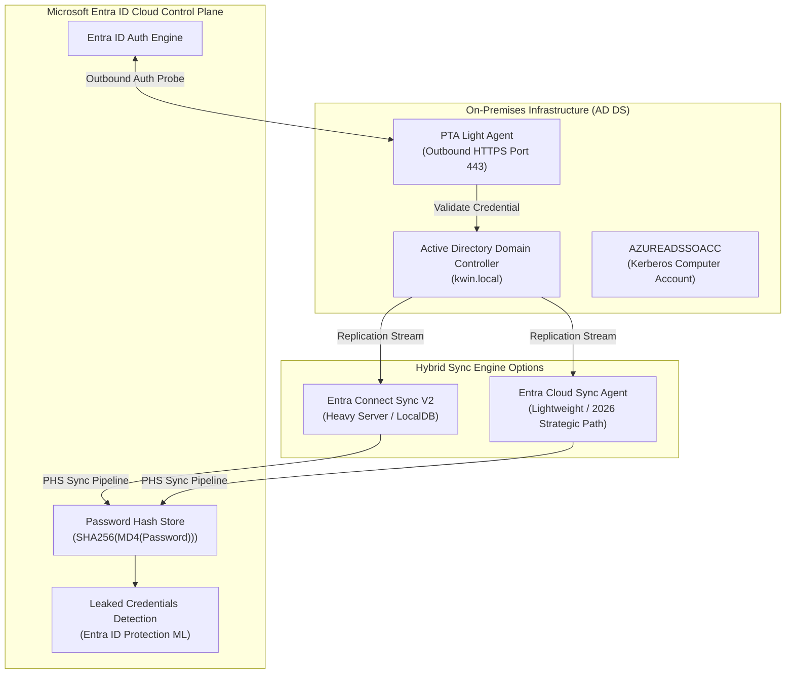
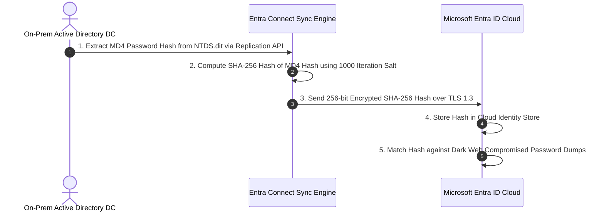
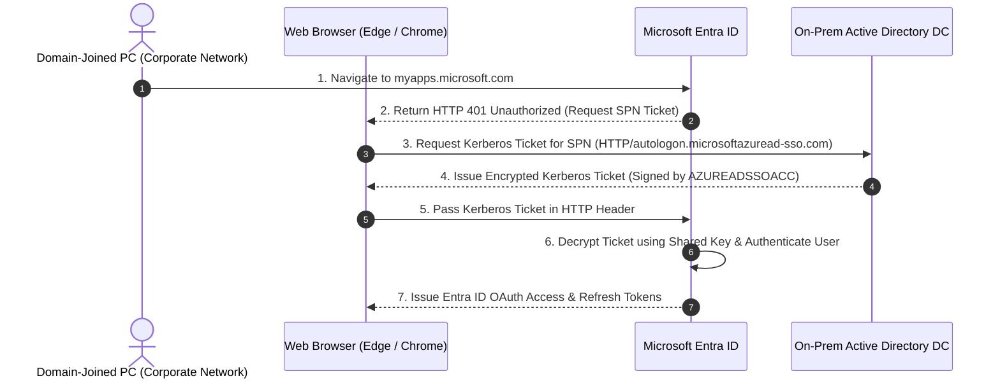

# SC-300 Day 09: Hybrid Identity Synchronization: Microsoft Entra Connect Setup & Authentication Methods

> **Source Video Title:** Hybrid Identity Synchronization: Microsoft Entra Connect Setup & Authentication Methods | Day 9  
> **Source URL:** [https://www.youtube.com/watch?v=k1zgsxPMTfY](https://www.youtube.com/watch?v=k1zgsxPMTfY&list=PL86wiCAX5vmTg8uubUrlHOqXrjXk6p-73&index=9)  
> **Instructor:** Raghuveer  
> **Refactored & Expanded By:** Senior Principal Engineer & Distinguished Technical Fellow (ex-FAANG / MANGOS)  
> **Target Certification Track:** Microsoft Certified: Identity and Access Administrator Associate (SC-300) | Bridge to Cybersecurity Architect (SC-100), SC-200 & Cloud and AI Security Engineer Associate (SC-500 - Successor to AZ-500)  
> **Technical Currency:** Updated as of **August 2026**

---

## Executive Summary & Curriculum Blueprint

Welcome to **Day 09** of the Microsoft Entra ID Security Masterclass.

In enterprise hybrid identity engineering, **Authentication Method Selection** and **Directory Filtering Design** determine your organization's security posture, fault tolerance, and cloud migration velocity. Security architects must understand the technical trade-offs between **Password Hash Synchronization (PHS)**, **Pass-Through Authentication (PTA)**, and legacy **Active Directory Federation Services (AD FS)**, as well as the **2026 Strategic Transition from Entra Connect Sync to Entra Cloud Sync**.

This document transforms the raw Day 09 lecture transcript into an **executive engineering reference manual**. We break down the cryptographic mechanics of PHS (`SHA256` of `MD4`), PTA outbound agent loops over Port 443, Seamless SSO Kerberos ticket issuance (`AZUREADSSOACC`), OU-based directory filtering, and Staging Mode disaster recovery configurations from first principles.



---

## Module 1: The Three Hybrid Authentication Models

### 1.1 Architectural Comparison Matrix

Selecting a hybrid authentication method dictates whether cloud authentication can function independently during an on-premises data center outage.

```
┌─────────────────────────────────────────────────────────────────────────┐
│               HYBRID AUTHENTICATION MODELS COMPARISON (2026)            │
├─────────────────┬───────────────────┬───────────────────┬───────────────┤
│ Architectural   │ Password Hash     │ Pass-Through Auth │ AD FS         │
│ Attribute       │ Sync (PHS)        │ (PTA)             │ Federation    │
├─────────────────┼───────────────────┼───────────────────┼───────────────┤
│ **Primary Use** │ **Default / Rec.**│ High Security Reg.│ Legacy SAML / │
│                 │ **(99% Standard)**│ (No Cloud Hash)   │ On-Prem SmartCard│
├─────────────────┼───────────────────┼───────────────────┼───────────────┤
│ **Cloud Uptime**│ **100% Independent│ Depends on On-Prem│ Depends on    │
│ **Resilience**  │ (DC Outage Safe)**│ WAN / PTA Agents  │ AD FS Infrastructure│
├─────────────────┼───────────────────┼───────────────────┼───────────────┤
│ **Password In   │ NO (Hash of Hash  │ NO (Never Leaves  │ NO (Validates │
│  Cloud Store?** │ `SHA256(MD4)`)    │ On-Prem Boundary) │ On-Prem AD FS)│
├─────────────────┼───────────────────┼───────────────────┼───────────────┤
│ **Leaked Cred.**│ **YES** (Native   │ NO (Requires PHS  │ NO (Requires  │
│  Detection**    │ Entra ML Scan)    │ Dual Enablement)  │ PHS Enablement)│
├─────────────────┼───────────────────┼───────────────────┼───────────────┤
│ **On-Prem Infra │ Zero (Pure Cloud) │ Low (2+ PTA       │ High (AD FS   │
│  Footprint**    │                   │ Light Agents)     │ Farms + WAP)  │
└─────────────────┴───────────────────┴───────────────────┴───────────────┘
```

---

### 1.2 Cryptographic Mechanics of Password Hash Sync (PHS)

> [!IMPORTANT]
> **First Principles Security Clarification:**  
> Password Hash Synchronization (PHS) does **NOT** synchronize plaintext passwords, nor does it synchronize raw NTLM/MD4 password hashes to the cloud.



#### PHS Security Guarantees:
1. **Irreversible One-Way Hash:** The cloud stores `SHA-256(MD4(Password))`. Even if an attacker compromises the cloud hash store, they **cannot reverse-engineer** the plaintext password or the NTLM hash.
2. **Leaked Credentials Protection:** Microsoft Entra ID Protection scans dark web password dumps, hashes the exposed passwords using the same algorithm, and automatically flags compromised accounts.

---

### 1.3 Pass-Through Authentication (PTA) & Outbound Agent Loop

For organizations with strict compliance mandates prohibiting any form of password hash storage in the cloud, **Pass-Through Authentication (PTA)** validates passwords in real time directly against on-premises Domain Controllers.

```
┌─────────────────────────────────────────────────────────────────────────┐
│                  PASS-THROUGH AUTHENTICATION (PTA) LOOP                 │
├─────────────────────────────────────────────────────────────────────────┤
│ 1. User enters credentials at login.microsoftonline.com                 │
│ 2. Entra ID places authentication request in cloud Service Bus queue    │
│ 3. On-Prem PTA Agent polls queue via OUTBOUND HTTPS (Port 443)           │
│ 4. PTA Agent calls Win32 LogonUser API against local Domain Controller  │
│ 5. Domain Controller returns Success / Failure                          │
│ 6. PTA Agent posts encrypted result back to cloud queue                 │
└─────────────────────────────────────────────────────────────────────────┘
```

*Note: PTA requires installing at least **2 to 3 PTA Light Agents** across separate member servers to prevent single-point-of-failure authentication outages.*

---

## Module 2: Seamless Single Sign-On (Seamless SSO) & Kerberos Mechanics

### 2.1 How Seamless SSO Works

Seamless SSO automatically signs in corporate users when they are on domain-joined machines connected to the corporate network.



- **`AZUREADSSOACC` Computer Account:** Entra Connect creates a computer account named `AZUREADSSOACC` in on-premises AD DS. The Kerberos decryption key is shared between on-prem AD DS and Microsoft Entra ID.

> [!CAUTION]
> **Kerberos Key Rollover Security Warning:**  
> To prevent Kerberos ticket forgery (Golden Ticket attacks), security administrators MUST perform a **Kerberos Key Rollover** on the `AZUREADSSOACC` computer account at least every 30 days using the `Update-AzureADSSOAccKC` PowerShell cmdlet.

---

## Module 3: Entra Connect Directory Filtering Options

### 3.1 Filtering Hierarchy Matrix

To maintain directory hygiene and prevent syncing unnecessary test accounts, service accounts, or administrative objects, Entra Connect supports three filtering layers:

```
┌─────────────────────────────────────────────────────────────────────────┐
│                    ENTRA CONNECT FILTERING OPTIONS                      │
├──────────────────┬───────────────────┬──────────────────────────────────┤
│ Filtering Type   │ Production Ready? │ Recommended Use Case             │
├──────────────────┼───────────────────┼──────────────────────────────────┤
│ **Domain-Based** │ YES               │ Exclude legacy/unneeded domains  │
│ **OU-Based**     │ **YES (Best Pr.)**│ Sync specific OUs (e.g. CorpUsers)│
│ **Group-Based**  │ **NO (Staging Only)**│ **Initial POC / Staging Test ONLY**│
└──────────────────┴───────────────────┴──────────────────────────────────┘
```

> [!WARNING]
> **Group-Based Filtering Production Hazard:**  
> Group-based filtering is designed **exclusively for small-scale pilot testing**. Applying group-based filtering in production causes severe performance degradation on the sync engine and breaks nested group membership logic. Production deployments MUST use **OU-Based Filtering**.

---

## Module 4: 2026 Strategic Evolution — Entra Connect Sync vs. Entra Cloud Sync

In April 2026, Microsoft officially announced **Entra Cloud Sync** as the primary strategic direction for hybrid identity synchronization.

```
┌─────────────────────────────────────────────────────────────────────────┐
│             ENTRA CONNECT SYNC vs. ENTRA CLOUD SYNC (2026)              │
├───────────────────────────────┬─────────────────────────────────────────┤
│ Entra Connect Sync (Legacy)   │ Entra Cloud Sync (Strategic Path)       │
├───────────────────────────────┼─────────────────────────────────────────┤
│ • Heavy Windows Server setup  │ • Lightweight cloud-managed agents      │
│ • SQL Server LocalDB required │ • Zero SQL Server footprint             │
│ • Single Active / Staging Mode│ • Built-in Multi-Agent High Availability│
│ • Complex custom sync rules   │ • Managed via Entra Admin Center        │
│ • Support deprecated < v2.5.79│ • Primary migration target in 2026      │
└───────────────────────────────┴─────────────────────────────────────────┘
```

---

## Module 5: Hands-On Verification & Principal Fellow Lab Guide

### 5.1 Lab 9.1: Configuring Entra Connect Sync V2 with OU-Based Filtering & PHS via PowerShell

#### Execution Script:
```powershell
# Step 1: Import Entra Sync Execution Module on DC Server
Import-Module "C:\Program Files\Microsoft Azure AD Sync\Bin\ADSync\ADSync.psd1"

# Step 2: Inspect Current Sync Scheduler Status
Get-ADSyncScheduler

# Step 3: Trigger Full Delta Synchronization Cycle
Start-ADSyncSyncCycle -PolicyType Delta

# Step 4: Verify Password Hash Sync (PHS) Status for Target User
Get-ADSyncConnectorRunStatus
```

---

### 5.2 Lab 9.2: Performing Kerberos Key Rollover for Seamless SSO (`AZUREADSSOACC`)

#### Execution Script:
```powershell
# Step 1: Navigate to AzureADSSO Module Directory
Set-Location "C:\Program Files\Microsoft Azure Active Directory Connect"

# Step 2: Import AzureADSSO Module & Connect with Entra Global Admin Credentials
Import-Module .\AzureADSSO.psd1
$creds = Get-Credential
New-AzureADSSOAuthenticationContext -Credentials $creds

# Step 3: Execute Kerberos Key Rollover on AZUREADSSOACC Account in AD DS
Update-AzureADSSOAccKC -UserCredentials $creds
```

#### Line-by-Line Technical Breakdown:
1. `Import-Module .\AzureADSSO.psd1`: Loads the specialized PowerShell module managing Seamless SSO Kerberos computer accounts.
2. `New-AzureADSSOAuthenticationContext`: Authenticates to Microsoft Entra Graph API to coordinate cloud key updates.
3. `Update-AzureADSSOAccKC`: Re-keys the `AZUREADSSOACC` computer account password in AD DS and securely synchronizes the new Kerberos decryption key to Microsoft Entra ID.

---

## Module 6: Executive Knowledge Check & First-Principles Exam Readiness

### 6.1 The "What, Why, How, Where, When" Core Matrix

| Topic | What is it? | Why does it exist? | How does it work under the hood? | Where & When to use it? |
| :--- | :--- | :--- | :--- | :--- |
| **Password Hash Sync** | Synchronizes `SHA256(MD4)` password hashes to Entra. | Enables 100% cloud auth uptime during on-prem DC outages. | Sync engine extracts MD4 hash, applies salt, hashes 1000x, sends to cloud. | Primary recommended auth method for 99% of enterprises. |
| **Pass-Through Auth** | Validates passwords live against on-prem DCs. | Prevents password hash storage in the cloud for compliance. | Outbound PTA Light Agents poll cloud queue over HTTPS (Port 443). | Deploy when strict regulatory policies prohibit cloud hash sync. |
| **Seamless SSO** | Auto-login for domain PCs on corporate network. | Eliminates prompt fatigue without complex AD FS infrastructure. | Browser requests Kerberos ticket for SPN signed by `AZUREADSSOACC`. | Deploy alongside PHS or PTA on internal corporate networks. |
| **OU-Based Filtering** | Restricting sync scope to specific Active Directory OUs. | Prevents syncing unneeded, test, or admin service accounts. | Sync engine evaluates AD distinguished name path before importing objects. | Mandatory standard for all production Entra Connect deployments. |
| **Entra Cloud Sync** | Next-gen agent-based hybrid sync engine. | Replaces heavy Entra Connect server footprint. | Lightweight agents run on servers; configuration managed in Entra Portal. | Primary migration target for hybrid identity in 2026. |

---

### 6.2 Distinguished Fellow Architectural Scenarios

#### Scenario 1: The On-Premises Data Center WAN Outage
* **Question:** A major storm severs the primary fiber links to an enterprise's on-premises data center. All domain controllers are unreachable from the internet. Can corporate employees still log into Microsoft 365, Teams, and cloud SaaS applications?
* **Answer:** **DEPENDS ON THE AUTHENTICATION MODEL.**
  - If the enterprise deployed **Password Hash Synchronization (PHS)**: **YES.** Cloud authentication functions with 100% uptime because password hashes reside in Entra ID.
  - If the enterprise deployed **Pass-Through Authentication (PTA)** or **AD FS**: **NO.** Auth requests fail because cloud agents cannot reach on-premises DCs.
* **Remediation:** Standardize on **PHS** as primary authentication (or enable PHS as emergency fallback for PTA).

#### Scenario 2: Golden Ticket Vulnerability on Seamless SSO
* **Question:** A security analyst detects an unauthorized Kerberos ticket forgery attack on the internal network. Investigation shows the `AZUREADSSOACC` computer account password has not been rotated in 3 years. What is the immediate remediation?
* **Answer:** Static Kerberos keys on `AZUREADSSOACC` expose the tenant to Golden Ticket attacks.
* **Remediation:** Execute `Update-AzureADSSOAccKC` immediately to invalidate forged Kerberos tickets and establish a 30-day automated rollover schedule.

---

## Conclusion & Next Steps

Day 09 has established hybrid authentication models (PHS vs PTA vs AD FS), Seamless SSO Kerberos mechanics, OU-based filtering, and the 2026 strategic migration to Entra Cloud Sync.

### Preparation for Day 10:
In **Day 10**, we advance to **User & Group Management in Microsoft Entra ID: License Assignment, Custom Roles & MFA**, exploring group-based license automation, custom directory roles, dynamic group rules, and Multi-Factor Authentication enforcement.

> *"Prioritize cloud resilience with Password Hash Sync, filter at the OU boundary, and rotate Kerberos SSO keys monthly."*