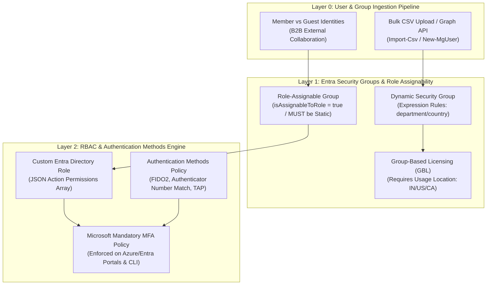
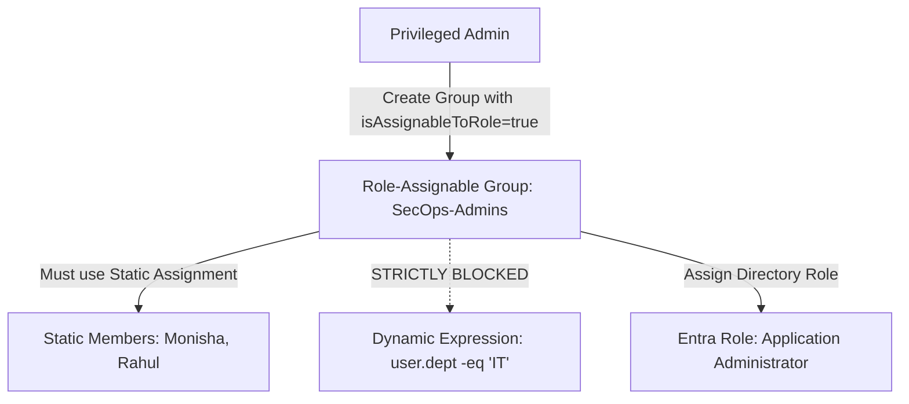

# SC-300 Day 10: User & Group Management in Microsoft Entra ID: License Assignment, Custom Roles & MFA

> **Source Video Title:** User & Group Management in Microsoft Entra ID: License Assignment, Custom Roles & MFA | Day 10  
> **Source URL:** [https://www.youtube.com/watch?v=UaciYGzOEGA](https://www.youtube.com/watch?v=UaciYGzOEGA&list=PL86wiCAX5vmTg8uubUrlHOqXrjXk6p-73&index=10)  
> **Instructor:** Raghuveer  
> **Refactored & Expanded By:** Senior Principal Engineer & Distinguished Technical Fellow (ex-FAANG / MANGOS)  
> **Target Certification Track:** Microsoft Certified: Identity and Access Administrator Associate (SC-300) | Bridge to Cybersecurity Architect (SC-100), SC-200 & Cloud and AI Security Engineer Associate (SC-500 - Successor to AZ-500)  
> **Technical Currency:** Updated as of **August 2026**

---

## Executive Summary & Curriculum Blueprint

Welcome to **Day 10** of the Microsoft Entra ID Security Masterclass.

In enterprise identity engineering, **User and Group Governance** forms the primary operational foundation for access control and compliance. Security administrators must master **Bulk Operations via Microsoft Graph PowerShell**, **Dynamic Group Membership Expressions**, **Group-Based Licensing (GBL)**, **Role-Assignable Groups (`isAssignableToRole = true`)**, **Custom Directory Roles**, and **Microsoft Mandatory MFA Enforcement across Admin Portals and CLI/API Tools**.

This document transforms the raw Day 10 lecture transcript into an **executive engineering reference manual**. We break down group type taxonomy, the security constraints prohibiting dynamic membership on role-assignable groups, usage location prerequisites for GBL, JSON custom role creation, B2B external collaboration settings, and the **2026 Mandatory MFA Platform Policy** from first principles.



---

## Module 1: Entra ID Group Taxonomy & Role-Assignable Groups

### 1.1 Group Types & Membership Rules Matrix

Microsoft Entra ID supports distinct group classifications and membership engines:

```
┌─────────────────────────────────────────────────────────────────────────┐
│                    ENTRA ID GROUP TAXONOMY MATRIX                       │
├─────────────────┬───────────────────┬───────────────────────────────────┤
│ Group Type      │ Primary Purpose   │ Supported Membership Types        │
├─────────────────┼───────────────────┼───────────────────────────────────┤
│ **Security**    │ Access control,   │ Assigned (Static), Dynamic User,  │
│                 │ RBAC, Licensing   │ Dynamic Device                    │
├─────────────────┼───────────────────┼───────────────────────────────────┤
│ **Microsoft 365**│ M365 Collaboration│ Assigned (Static), Dynamic User   │
│                 │ (Teams, Shared)   │                                   │
└─────────────────┴───────────────────┴───────────────────────────────────┘
```

---

### 1.2 The Security Architecture of Role-Assignable Groups

> [!CAUTION]
> **CRITICAL SECURITY DESIGN CONSTRAINT:**  
> A **Role-Assignable Group** (`isAssignableToRole = true`) is a security group specifically authorized to receive Entra ID Directory Roles (e.g., *Application Administrator* or *Helpdesk Administrator*).
> 
> **Microsoft Security Rule:**  
> 1. Role-Assignable Groups MUST have **Assigned (Static)** membership. Dynamic User or Dynamic Device rules are **STRICTLY PROHIBITED**.
> 2. `isAssignableToRole` can **ONLY be set during group creation**; it cannot be flipped on an existing standard group.
> 3. Only *Global Administrators* or *Privileged Role Administrators* can manage membership of Role-Assignable Groups.



---

## Module 2: Group-Based Licensing (GBL) Automation

### 2.1 Group-Based Licensing Mechanics

Assigning licenses directly to individual user objects creates administrative overhead, orphaned licenses, and compliance drift. **Group-Based Licensing (GBL)** delegates license management to group membership.

```
┌─────────────────────────────────────────────────────────────────────────┐
│                    GROUP-BASED LICENSING (GBL) FLOW                     │
├─────────────────────────────────────────────────────────────────────────┤
│ 1. Administrator assigns License SKU (e.g., Entra ID P2) to Group     │
│ 2. User added to Group ──► Automatically Inherits Entra ID P2 License   │
│ 3. User removed from Group ──► Automatically Revokes Entra ID P2 License │
└─────────────────────────────────────────────────────────────────────────┘
```

#### Mandatory Usage Location Rule:
To assign a license to a user (individually or via GBL), the user object **MUST have the `UsageLocation` attribute set** (two-letter ISO country code, e.g., `IN`, `US`, `CA`). Microsoft uses this property to enforce regional telecommunication and data privacy regulations.

```powershell
# PowerShell Example: Update Usage Location for License Assignment
Update-MgUser -UserId "user@kwinsecurity.com" -UsageLocation "IN"
```

---

## Module 3: Custom Directory Roles (Entra ID Custom RBAC)

While built-in roles (*Global Administrator*, *User Administrator*, *Helpdesk Administrator*) cover general administrative needs, the Principle of Least Privilege requires **Custom Directory Roles** for granular tasks.

### 3.1 Custom Role Definition Anatomy

A Custom Role consists of a JSON definition containing a permissions array of fine-grained Graph resource actions.

#### JSON Role Definition Example:
```json
{
  "displayName": "App Registration Manager",
  "description": "Can create app registrations and update secrets without full Application Admin rights",
  "rolePermissions": [
    {
      "allowedResourceActions": [
        "microsoft.directory/applications/create",
        "microsoft.directory/applications/credentials/update",
        "microsoft.directory/applications/basic/update"
      ]
    }
  ],
  "isEnabled": true
}
```

---

## Module 4: Authentication Methods Policy & Mandatory MFA (2026 Platform Rule)

### 4.1 Modern Authentication Methods Policy Migration

Microsoft has deprecated legacy per-user MFA and SSPR management portals. All authentication methods are now governed under the centralized **Authentication Methods Policy**.

```
┌─────────────────────────────────────────────────────────────────────────┐
│                  ENTRA ID AUTHENTICATION METHODS MATRIX                 │
├─────────────────┬───────────────────┬───────────────────────────────────┤
│ Auth Method     │ Security Tier     │ Phishing Resistance Status        │
├─────────────────┼───────────────────┼───────────────────────────────────┤
│ **FIDO2 Passkey**│ **Top Security**  │ **100% Phishing Resistant**       │
│ **Cert-Based (CBA)**│ **Top Security**│ **100% Phishing Resistant**       │
│ **Ms Authenticator**│ High Security   │ Number Matching Enforced (High)   │
│ **SMS / Voice** │ Low Security      │ Vulnerable to SIM-Swapping (Avoid)│
└─────────────────┴───────────────────┴───────────────────────────────────┘
```

---

### 4.2 The 2026 Mandatory MFA Platform Rule

> [!WARNING]
> **MANDATORY ENFORCEMENT NOTICE:**  
> Microsoft mandates Multi-Factor Authentication (MFA) for ALL sign-ins to management interfaces:
> 1. **Phase 1 (Active):** 100% mandatory MFA for Azure Portal, Entra Admin Center, and Intune Admin Center.
> 2. **Phase 2 (Active):** Mandatory MFA for Azure CLI, Azure PowerShell, Terraform/Bicep IaC tools, and Azure SDK write operations.
> 
> **Service Account Impact:** Automated scripts using user credentials (ROPC/interactive login) fail under Phase 2. All automated scripts MUST migrate to **Managed Identities** or **Workload Identity Federated Credentials**.

---

## Module 5: Hands-On Verification & Principal Fellow Lab Guide

### 5.1 Lab 10.1: Bulk User Creation & Dynamic Security Group Provisioning via PowerShell

#### Execution Script:
```powershell
# Step 1: Connect to Microsoft Graph API with User & Group ReadWrite Scopes
Connect-MgGraph -Scopes "User.ReadWrite.All", "Group.ReadWrite.All"

# Step 2: Bulk Create Users from CSV Template
$Users = Import-Csv -Path "C:\IT\scratch\UsersBulkUploadTemplate.csv"

foreach ($User in $Users) {
  $PasswordProfile = @{
    Password = $User.InitialPassword
    ForceChangePasswordNextSignIn = $true
  }
  
  New-MgUser `
    -DisplayName $User.DisplayName `
    -UserPrincipalName $User.UserPrincipalName `
    -MailNickname $User.MailNickname `
    -UsageLocation $User.UsageLocation `
    -AccountEnabled:$true `
    -PasswordProfile $PasswordProfile
}

# Step 3: Create Dynamic Security Group for India Sales Team
$DynamicRule = '(user.department -eq "Sales") and (user.country -eq "India")'

New-MgGroup `
  -DisplayName "Sec-Dynamic-Sales-India" `
  -MailEnabled:$false `
  -SecurityEnabled:$true `
  -GroupTypes @("DynamicMembership") `
  -MembershipRule $DynamicRule `
  -MembershipRuleProcessingState "On"
```

---

### 5.2 Lab 10.2: Provisioning Role-Assignable Group & Assigning Custom Directory Role

#### Execution Script:
```azcli
# Step 1: Create Role-Assignable Security Group (MUST use Static Assigned Membership)
group_id=$(az rest --method POST \
  --uri "https://graph.microsoft.com/v1.0/groups" \
  --body '{
    "displayName": "SecGroup-AppAdmins-RoleAssignable",
    "mailEnabled": false,
    "mailNickname": "appadmins",
    "securityEnabled": true,
    "isAssignableToRole": true
  }' \
  --query id --output tsv)

# Step 2: Create Custom Directory Role Definition for Application Secret Managers
role_id=$(az rest --method POST \
  --uri "https://graph.microsoft.com/v1.0/roleManagement/directory/roleDefinitions" \
  --body '{
    "displayName": "Custom App Secret Manager",
    "description": "Allows updating app secrets without Global Admin rights",
    "rolePermissions": [{
      "allowedResourceActions": [
        "microsoft.directory/applications/credentials/update"
      ]
    }],
    "isEnabled": true
  }' \
  --query id --output tsv)

# Step 3: Assign Custom Role to Role-Assignable Group at Tenant Scope
az rest --method POST \
  --uri "https://graph.microsoft.com/v1.0/roleManagement/directory/roleAssignments" \
  --body "{
    \"principalId\": \"$group_id\",
    \"roleDefinitionId\": \"$role_id\",
    \"directoryScopeId\": \"/\"
  }"
```

---

## Module 6: Executive Knowledge Check & First-Principles Exam Readiness

### 6.1 The "What, Why, How, Where, When" Core Matrix

| Topic | What is it? | Why does it exist? | How does it work under the hood? | Where & When to use it? |
| :--- | :--- | :--- | :--- | :--- |
| **Role-Assignable Group** | Security group with `isAssignableToRole=true`. | Allows delegating Entra roles to groups safely. | Enforces static membership to prevent dynamic rule privilege escalation. | Mandatory container for assigning directory roles to teams. |
| **Group-Based Licensing** | Automated license assignment via group membership. | Eliminates manual per-user license management. | License engine evaluates group membership changes & assigns SKUs. | Mandated baseline for assigning P1, P2, and M365 licenses. |
| **Usage Location** | ISO country code property on user objects. | Ensures compliance with regional data privacy laws. | Checked by licensing engine prior to issuing license SKU. | Set on all user creation scripts before applying licenses. |
| **Custom Directory Role** | User-defined Entra RBAC role. | Enforces Least Privilege for tasks missing in built-in roles. | Defined via JSON array of Graph resource permissions actions. | Create when standard roles grant excessive permissions. |
| **Mandatory MFA Policy** | Microsoft platform rule requiring MFA on admin portals & CLI. | Blocks 99.2% of credential compromise attacks. | Conditional Access / platform gate intercepts portal & CLI write calls. | Enforced across 100% of Azure/Entra tenants in 2026. |

---

### 6.2 Distinguished Fellow Architectural Scenarios

#### Scenario 1: The Failed Group License Assignment Mystery
* **Question:** A security admin adds 50 new users to the `GBL-EntraID-P2` license group. While 45 users inherit the Entra ID P2 license, 5 users report licensing errors in the portal: `License assignment failed`. What property was missing on those 5 user accounts?
* **Answer:** **`UsageLocation`** was not specified on the 5 user objects.
* **Remediation:** Update the user objects with valid two-letter ISO country codes (`Update-MgUser -UserId "user@kwinsecurity.com" -UsageLocation "IN"`). The licensing engine will automatically resolve the error and assign the P2 license.

#### Scenario 2: The Privileged Escalation Security Exploit Attempt
* **Question:** A rogue helpdesk admin attempts to create a Dynamic Security Group with the rule `user.department -eq "IT"` and enable `isAssignableToRole = true`, intending to auto-grant the Global Administrator role to all IT employees. Will Entra ID allow this configuration?
* **Answer:** **NO.** Microsoft Entra ID explicitly blocks dynamic membership rules on Role-Assignable Groups (`isAssignableToRole = true`).
* **Remediation:** Role-assignable groups must use **Assigned (Static)** membership, requiring explicit authorization by a Global Administrator or Privileged Role Administrator.

---

## Conclusion & Next Steps

Day 10 has established group taxonomy, role-assignable groups security constraints, Group-Based Licensing, custom directory roles, and Microsoft's mandatory MFA platform enforcement.

### Preparation for Day 11:
In **Day 11**, we advance to **Modern Authentication, SSPR & Conditional Access in Microsoft Entra ID Identity Security**, exploring Conditional Access policy architecture, trusted locations, device compliance gates, and Self-Service Password Reset (SSPR) writeback.

> *"Restrict dynamic rules on privileged role groups, automate licensing via GBL, and enforce phishing-resistant MFA across all administrative entry points."*