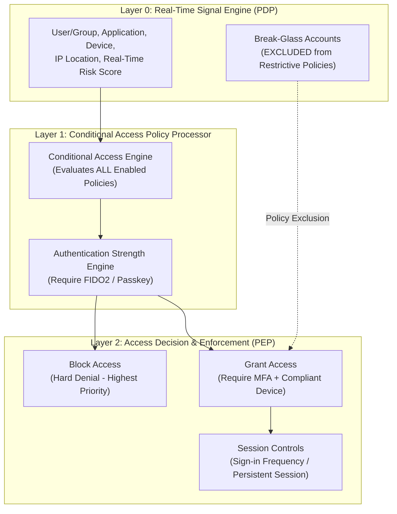
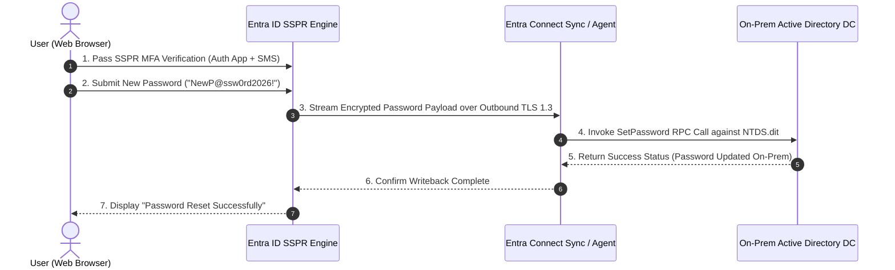

# SC-300 Day 11: Modern Authentication, SSPR & Conditional Access in Microsoft Entra ID

> **Source Video Title:** Modern Authentication, SSPR & Conditional Access in Microsoft Entra ID | Identity Security | Day 11  
> **Source URL:** [https://www.youtube.com/watch?v=SgioFYrNjp4](https://www.youtube.com/watch?v=SgioFYrNjp4&list=PL86wiCAX5vmTg8uubUrlHOqXrjXk6p-73&index=11)  
> **Instructor:** Raghuveer  
> **Refactored & Expanded By:** Senior Principal Engineer & Distinguished Technical Fellow (ex-FAANG / MANGOS)  
> **Target Certification Track:** Microsoft Certified: Identity and Access Administrator Associate (SC-300) | Bridge to Cybersecurity Architect (SC-100), SC-200 & Cloud and AI Security Engineer Associate (SC-500 - Successor to AZ-500)  
> **Technical Currency:** Updated as of **August 2026**

---

## Executive Summary & Curriculum Blueprint

Welcome to **Day 11** of the Microsoft Entra ID Security Masterclass.

In enterprise cloud security architecture, **Conditional Access (CA)** serves as the primary Zero Trust **Policy Decision Point (PDP)**. Securing access to corporate applications requires enforcing modern authentication, configuring **Self-Service Password Reset (SSPR) with Password Writeback**, defining **Named Locations (IP/Country)**, mandating **Phishing-Resistant Authentication Strengths (FIDO2 Passkeys)**, and establishing resilient **Emergency Access (Break-Glass) Account Controls**.

This document transforms the raw Day 11 lecture transcript into an **executive engineering reference manual**. We break down the Zero Trust CA evaluation equation, SSPR password writeback mechanics over TLS 1.3, Named Location geo-fencing, Authentication Strengths, and the **2026 Break-Glass Resilience Framework** from first principles.



---

## Module 1: Self-Service Password Reset (SSPR) & Password Writeback

### 1.1 SSPR Architecture & Hybrid Password Writeback

Self-Service Password Reset (SSPR) empowers users to reset forgotten passwords without calling the IT helpdesk. In hybrid environments, password changes must write back to on-premises Active Directory in real time.

```
┌─────────────────────────────────────────────────────────────────────────┐
│                 HYBRID SSPR PASSWORD WRITEBACK FLOW                     │
├─────────────────────────────────────────────────────────────────────────┤
│ 1. User authenticates & resets password at aka.ms/sspr                  │
│ 2. Entra ID encrypts new password with Tenant Secret Key                │
│ 3. Entra ID pushes encrypted payload over TLS 1.3 to Entra Connect Sync │
│ 4. Entra Connect Sync calls Win32 SetPassword API against local DC      │
│ 5. On-prem DC updates NTDS.dit & resets user pwdLastSet attribute       │
└─────────────────────────────────────────────────────────────────────────┘
```



> [!IMPORTANT]
> **SSPR Rollout Best Practice:**  
> Never set SSPR enablement directly to **All** during initial rollout. Configure SSPR scope to **Selected**, targeting a dedicated pilot group (`grp-SSPR-Pilot-Users`), allowing validation of password writeback and MFA registration before tenant-wide deployment.

---

## Module 2: Conditional Access (CA) Engine Architecture

Conditional Access is Microsoft's implementation of the Zero Trust principle: **Never Trust, Always Verify**.

### 2.1 The Conditional Access Evaluation Equation

$$\text{Signals} + \text{Conditions} \longrightarrow \text{Policy Decision Point (PDP)} \longrightarrow \text{Enforcement Action (PEP)}$$

```
┌─────────────────────────────────────────────────────────────────────────┐
│               CONDITIONAL ACCESS EVALUATION ENGINE MATRIX               │
├─────────────────┬───────────────────┬───────────────────────────────────┤
│ Evaluation Layer│ Input Signals     │ Supported Architectural Options   │
├─────────────────┼───────────────────┼───────────────────────────────────┤
│ **Assignments** │ Users & Groups    │ All Users, Specific Groups,       │
│                 │                   │ **EXCLUDE: Break-Glass Accounts** │
│                 │ Target Resources  │ All Cloud Apps, Azure Management  │
├─────────────────┼───────────────────┼───────────────────────────────────┤
│ **Conditions**  │ User / Sign-in Risk│ Low, Medium, High Risk (P2 ML)    │
│                 │ Location          │ Named Locations (Trusted IP / Geo)│
│                 │ Device Platform   │ Windows, macOS, iOS, Android, Linux│
│                 │ Client App        │ Browser, Modern Auth, Legacy Auth │
├─────────────────┼───────────────────┼───────────────────────────────────┤
│ **Access Controls**│ Grant           │ Block, Require MFA, Require FIDO2,│
│                 │                   │ Require Compliant Device (Intune) │
│                 │ Session           │ Sign-in Frequency, Persistent Session│
└─────────────────┴───────────────────┴───────────────────────────────────┘
```

---

### 2.2 Named Locations (IP & Geographic Geo-Fencing)

Named Locations define trusted corporate network boundaries or blacklisted geographic regions.

```
┌─────────────────────────────────────────────────────────────────────────┐
│                     NAMED LOCATION CLASSIFICATIONS                      │
├─────────────────┬───────────────────┬───────────────────────────────────┤
│ Location Type   │ Definition        │ Enterprise Use Case               │
├─────────────────┼───────────────────┼───────────────────────────────────┤
│ **IP Ranges**   │ CIDR Notation     │ Trusted Corporate NAT Egress      │
│                 │ (e.g., 198.51.100.0/24)│ (Mark as Trusted Location)  │
├─────────────────┼───────────────────┼───────────────────────────────────┤
│ **Countries**   │ ISO Country Code  │ Geo-fencing / Blacklisting        │
│                 │ (e.g., RU, CN, IR)│ (Require MFA or Block Access)     │
└─────────────────┴───────────────────┴───────────────────────────────────┘
```

---

## Module 3: Authentication Strengths & Phishing-Resistant CA

Legacy MFA (SMS, Voice, push notifications without number matching) remains vulnerable to SIM-swapping, adversary-in-the-middle (AiTM) phishing, and MFA fatigue attacks.

### 3.1 Authentication Strength Tiers

```
┌─────────────────────────────────────────────────────────────────────────┐
│                 ENTRA ID AUTHENTICATION STRENGTH TIERS                  │
├─────────────────┬───────────────────┬───────────────────────────────────┤
│ Strength Tier   │ Allowed Methods   │ Resistance Level                  │
├─────────────────┼───────────────────┼───────────────────────────────────┤
│ **Multifactor** │ SMS, Voice, Auth  │ Standard MFA                      │
│                 │ App, FIDO2, TAP   │ (Vulnerable to AiTM Phishing)     │
├─────────────────┼───────────────────┼───────────────────────────────────┤
│ **Passwordless**│ FIDO2, Passkey,   │ High Security                     │
│                 │ Phone Sign-in, TAP│ (No Password Entered)              │
├─────────────────┼───────────────────┼───────────────────────────────────┤
│ **Phishing-**   │ **FIDO2 Passkey,**│ **100% Phishing-Resistant**       │
│ **Resistant**   │ **Cert-Based (CBA)**│ **(Mandatory for Admins)**        │
└─────────────────┴───────────────────┴───────────────────────────────────┘
```

---

## Module 4: The 2026 Emergency Access (Break-Glass) Resilience Framework

> [!CAUTION]
> **CRITICAL ENTERPRISE RESILIENCE REQUIREMENT:**  
> Misconfigured Conditional Access policies or federated identity outages can lock ALL administrators out of the tenant. Every enterprise MUST maintain **Emergency Access (Break-Glass) Accounts**.

```
┌─────────────────────────────────────────────────────────────────────────┐
│             2026 BREAK-GLASS ACCOUNT ARCHITECTURAL MATRIX               │
├─────────────────┬───────────────────────────────────────────────────────┤
│ Parameter       │ Mandated Standard Configuration                       │
├─────────────────┼───────────────────────────────────────────────────────┤
│ **Quantity**    │ Maintain exactly **2 Accounts**                       │
│ **Domain**      │ **Cloud-Only** (`*.onmicrosoft.com` suffix)           │
│                 │ (NEVER federate or sync from on-prem AD DS!)          │
│ **Role**        │ Permanent **Global Administrator** (Do NOT use PIM!) │
│ **Auth Method** │ **FIDO2 Security Key** (Stored in physical safe)      │
│ **CA Policy**   │ **EXCLUDE from ALL restrictive Conditional Access!**  │
│ **Monitoring**  │ **Sentinel Alert** triggered on ANY sign-in activity  │
└─────────────────┴───────────────────────────────────────────────────────┘
```

---

## Module 5: Hands-On Verification & Principal Fellow Lab Guide

### 5.1 Lab 11.1: Configuring Self-Service Password Reset (SSPR) & Password Writeback via PowerShell

#### Execution Script:
```powershell
# Step 1: Connect to Microsoft Graph API with Directory & Policy Administration Scopes
Connect-MgGraph -Scopes "Policy.ReadWrite.Authorization", "Directory.ReadWrite.All"

# Step 2: Retrieve Target Pilot Group ID for SSPR Scope
$Group = Get-MgGroup -Filter "displayName eq 'grp-SSPR-Pilot-Users'"

# Step 3: Enable SSPR for Selected Pilot Group
Update-MgPolicyAuthorizationPolicy -AllowedToUseSSPR:$true

# Step 4: Verify Password Writeback Status in Directory Sync
Get-MgDirectoryOnPremiseSynchronization | Format-List Id, Features
```

---

### 5.2 Lab 11.2: Deploying Zero Trust Conditional Access Policy via Azure CLI

#### Execution Script:
```azcli
# Step 1: Create Named Location for Corporate Egress NAT IPs
loc_id=$(az rest --method POST \
  --uri "https://graph.microsoft.com/v1.0/identity/conditionalAccess/namedLocations" \
  --body '{
    "@odata.type": "#microsoft.graph.ipNamedLocation",
    "displayName": "Corp-HQ-Trusted-Egress",
    "isTrusted": true,
    "ipRanges": [{"cidrAddress": "198.51.100.0/24"}]
  }' \
  --query id --output tsv)

# Step 2: Provision Zero Trust CA Policy (Require Phishing-Resistant MFA for Azure Management)
az rest --method POST \
  --uri "https://graph.microsoft.com/v1.0/identity/conditionalAccess/policies" \
  --body "{
    \"displayName\": \"CA001-ZeroTrust-AzureManagement-PhishingResistantMFA\",
    \"state\": \"enabled\",
    \"conditions\": {
      \"users\": {
        \"includeUsers\": [\"All\"],
        \"excludeUsers\": [\"bg-admin-01@kwin.onmicrosoft.com\", \"bg-admin-02@kwin.onmicrosoft.com\"]
      },
      \"applications\": {
        \"includeApplications\": [\"797f3446-a000-441d-b3c6-77f4d78e920d\"]
      }
    },
    \"grantControls\": {
      \"operator\": \"OR\",
      \"authenticationStrength\": {
        \"id\": \"00000000-0000-0000-0000-000000000004\"
      }
    }
  }"
```

#### Line-by-Line Technical Breakdown:
1. `az rest ... ipNamedLocation`: Registers corporate egress CIDR `198.51.100.0/24` as a trusted named location.
2. `includeApplications: ["797f3446-a000-441d-b3c6-77f4d78e920d"]`: Targets Azure Resource Manager (ARM) Management API.
3. `excludeUsers: ["bg-admin-01...", "bg-admin-02..."]`: Excludes Break-Glass emergency accounts to prevent lockouts.
4. `authenticationStrength: "...-000000000004"`: Enforces **Phishing-Resistant MFA** (FIDO2 Passkeys / CBA).

---

## Module 6: Executive Knowledge Check & First-Principles Exam Readiness

### 6.1 The "What, Why, How, Where, When" Core Matrix

| Topic | What is it? | Why does it exist? | How does it work under the hood? | Where & When to use it? |
| :--- | :--- | :--- | :--- | :--- |
| **SSPR Writeback** | Real-time cloud-to-on-prem password sync. | Allows users to reset passwords without calling helpdesk. | Entra Connect Sync writes password payload over TLS 1.3 to AD DS `NTDS.dit`. | Mandatory for all hybrid identity environments. |
| **Conditional Access** | Zero Trust Policy Decision Point (PDP). | Enforces access controls based on real-time risk & signals. | Evaluates ALL enabled policies against incoming OAuth sign-in tokens. | Required for securing M365, Azure Portal, and SaaS applications. |
| **Named Location** | IP range or geographic country definition. | Allows geo-fencing and corporate network trust rules. | Evaluates incoming client IP address against CIDR or BGP location data. | Mark corporate egress IPs as trusted; block high-risk countries. |
| **Auth Strength** | Policy defining specific allowed MFA methods. | Enforces phishing-resistant authentication for admins. | CA engine validates that the issued token claims match FIDO2/CBA types. | Mandate Phishing-Resistant MFA for all administrative access. |
| **Break-Glass Account** | Emergency administrative account. | Prevents complete tenant lockout during policy or IdP outages. | Cloud-only `*.onmicrosoft.com` Global Admin account excluded from CA. | Maintain 2 accounts; store FIDO2 key in physical safe. |

---

### 6.2 Distinguished Fellow Architectural Scenarios

#### Scenario 1: The Total Tenant Lockout Crisis
* **Question:** A security admin enables a new Conditional Access policy requiring Intune Compliant Devices for *All Users* and *All Cloud Apps*. The next morning, no administrator can log into the Azure Portal or Entra Admin Center because admin laptops are not enrolled in Intune. How do you recover access?
* **Answer:** Log in using an **Emergency Access (Break-Glass) Account** (`bg-admin-01@kwin.onmicrosoft.com`).
* **Remediation:** Because Break-Glass accounts were explicitly excluded from the Conditional Access policy, the emergency administrator logs into the Entra Admin Center, disables the faulty policy, and restores access.

#### Scenario 2: Adversary-in-the-Middle (AiTM) Phishing Bypass
* **Question:** An attacker deploys an Evilginx AiTM proxy server and tricks an executive into approving a push notification on the Microsoft Authenticator app. The attacker steals the session cookie and gains access. How do you prevent this attack vector?
* **Answer:** Standard push notifications are susceptible to AiTM proxy session interception.
* **Remediation:** Create a Conditional Access policy enforcing **Phishing-Resistant Authentication Strength** (requiring **FIDO2 Passkeys** or **Certificate-Based Authentication**). FIDO2 binds origin domain binding to the token, rendering AiTM proxies useless.

---

## Conclusion & Next Steps

Day 11 has established Modern Authentication, SSPR with Password Writeback, Conditional Access policy architecture, Named Locations, Authentication Strengths, and Break-Glass account governance.

### Preparation for Day 12:
In **Day 12**, we advance to **Identity Governance & External Authentication in Microsoft Entra ID: Secure Access Control**, exploring Entra External ID, B2B guest collaboration policies, cross-tenant access settings, and Access Packages.

> *"Always verify signals, enforce phishing-resistant MFA at the boundary, and protect break-glass accounts at all costs."*