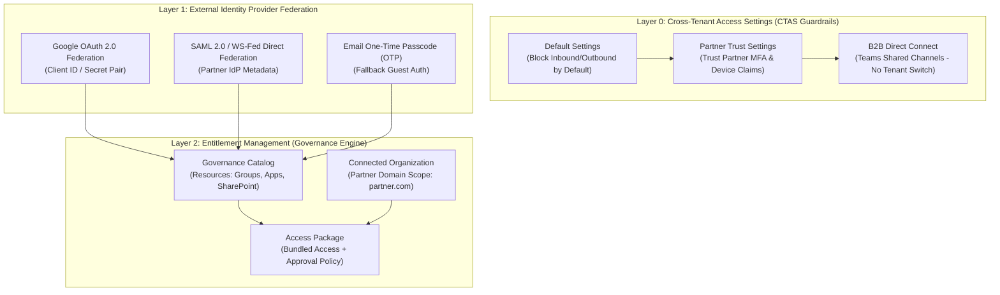
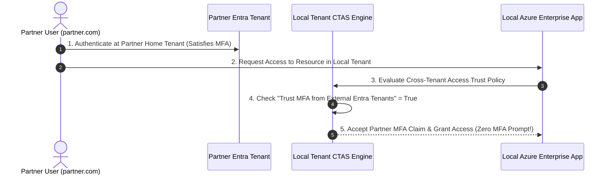
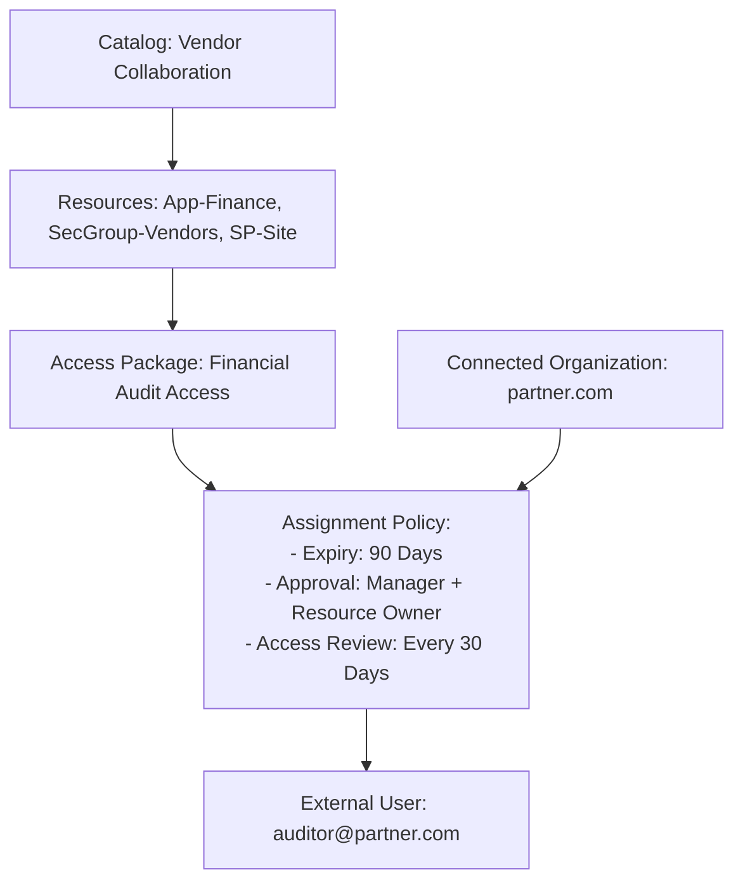

# SC-300 Day 12: Identity Governance & External Authentication in Microsoft Entra ID

> **Source Video Title:** Identity Governance & External Authentication in Microsoft Entra ID | Secure Access Control | Day 12  
> **Source URL:** [https://www.youtube.com/watch?v=Fj2OyIPc48s](https://www.youtube.com/watch?v=Fj2OyIPc48s&list=PL86wiCAX5vmTg8uubUrlHOqXrjXk6p-73&index=12)  
> **Instructor:** Raghuveer  
> **Refactored & Expanded By:** Senior Principal Engineer & Distinguished Technical Fellow (ex-FAANG / MANGOS)  
> **Target Certification Track:** Microsoft Certified: Identity and Access Administrator Associate (SC-300) | Bridge to Cybersecurity Architect (SC-100), SC-200 & Cloud and AI Security Engineer Associate (SC-500 - Successor to AZ-500)  
> **Technical Currency:** Updated as of **August 2026**

---

## Executive Summary & Curriculum Blueprint

Welcome to **Day 12** of the Microsoft Entra ID Security Masterclass.

In enterprise identity engineering, **External Identity Federation & Entitlement Governance** establish secure collaboration boundaries with external partners, vendors, and contractors. Security architects must master **Microsoft Entra External ID (B2B Collaboration & B2B Direct Connect)**, **Cross-Tenant Access Settings (CTAS)**, **Google/SAML Direct Federation**, and **Entitlement Management (Catalogs & Access Packages)** to automate access lifecycles without incurring security drift or administrative overhead.

This document transforms the raw Day 12 lecture transcript into an **executive engineering reference manual**. We break down Cross-Tenant Access Settings trust claims, Google OAuth 2.0 federation setup, B2B Direct Connect for Teams Shared Channels, Entitlement Management Access Package policies, and automated external user onboarding from first principles.



---

## Module 1: Microsoft Entra External ID & B2B Collaboration Architecture

### 1.1 External Identity Collaboration Models

```
┌─────────────────────────────────────────────────────────────────────────┐
│              ENTRA EXTERNAL ID COLLABORATION MODELS MATRIX              │
├─────────────────┬───────────────────┬───────────────────────────────────┤
│ Model Type      │ User Object Type  │ User Experience                   │
├─────────────────┼───────────────────┼───────────────────────────────────┤
│ **B2B**         │ Guest User Object │ User added to directory (`#EXT#`);│
│ **Collaboration**│ (`userType: Guest`)│ Must switch tenants to access apps│
├─────────────────┼───────────────────┼───────────────────────────────────┤
│ **B2B Direct**  │ **No Guest Object**│ Collaborates natively in home     │
│ **Connect**     │ (Real-time Trust) │ tenant (Teams Shared Channels)    │
└─────────────────┴───────────────────┴───────────────────────────────────┘
```

---

### 1.2 External Identity Provider (IdP) Federation Hierarchy

When an external user logs into your tenant, Microsoft Entra External ID evaluates identity providers in a strict hierarchical order:

```
[ Incoming Guest Login Request ] ──► 1. Direct Federation (SAML / WS-Fed)
                                 ──► 2. Google OAuth 2.0 Federation
                                 ──► 3. Native Entra ID / M365 Identity
                                 ──► 4. Email One-Time Passcode (OTP)
```

#### Google OAuth 2.0 Federation Setup Prerequisites:
1. Create a Google Cloud Developer Project.
2. Configure the OAuth Consent Screen (Authorized Domain: `microsoftonline.com`).
3. Generate an **OAuth 2.0 Client ID** and **Client Secret**.
4. Input Client ID / Secret into Entra Admin Center under **External Identities > All Identity Providers > Google**.

---

## Module 2: Cross-Tenant Access Settings (CTAS)

### 2.1 The CTAS Security Framework

Cross-Tenant Access Settings define **inbound** and **outbound** trust parameters between your Microsoft Entra ID tenant and external Microsoft Entra organizations.

```
┌─────────────────────────────────────────────────────────────────────────┐
│               CROSS-TENANT ACCESS SETTINGS (CTAS) MATRIX                │
├─────────────────┬───────────────────┬───────────────────────────────────┤
│ Policy Boundary │ Setting Scope     │ Architectural Function            │
├─────────────────┼───────────────────┼───────────────────────────────────┤
│ **Inbound Access**│ Users & Groups,   │ Controls which external users/apps│
│                 │ Applications      │ can access your local resources.  │
├─────────────────┼───────────────────┼───────────────────────────────────┤
│ **Outbound**    │ Users & Groups,   │ Controls which internal users/apps│
│ **Access**      │ Applications      │ can access external partner tenants│
├─────────────────┼───────────────────┼───────────────────────────────────┤
│ **Trust**       │ MFA, Compliant    │ **Trusts partner tenant MFA/Device**│
│ **Settings**    │ Devices, Hybrid   │ (Eliminates double MFA prompts!)  │
└─────────────────┴───────────────────┴───────────────────────────────────┘
```



---

## Module 3: Entitlement Management & Access Packages

While Cross-Tenant Access Settings establish the **guardrails**, **Entitlement Management** serves as the **governance engine** to automate the access lifecycle.

### 3.1 Anatomy of Entitlement Management

```
┌─────────────────────────────────────────────────────────────────────────┐
│                   ENTITLEMENT MANAGEMENT BUILDING BLOCKS                │
├─────────────────────────────────────────────────────────────────────────┤
│ 1. Catalog               : Logical container of resources (Groups, Apps,│
│                            SharePoint Online Sites).                    │
│ 2. Access Package        : Bundled package of specific resource roles   │
│                            with an assignment policy.                   │
│ 3. Policy                : Defines WHO can request (Internal/External), │
│                            APPROVAL workflows, and EXPIRATION rules.    │
│ 4. Connected Organization: External partner domain (e.g. partner.com)   │
│                            authorized to request access packages.       │
└─────────────────────────────────────────────────────────────────────────┘
```



> [!IMPORTANT]
> **2026 Direct External Assignment Feature Update:**  
> Admins can assign an Access Package directly to an external user via their email address (`auditor@partner.com`) **before** they exist in the directory. Entra ID automatically sends a B2B invitation, provisions the guest user object, and applies lifecycle expiration rules.

---

## Module 4: Hands-On Verification & Principal Fellow Lab Guide

### 4.1 Lab 12.1: Configuring Google OAuth 2.0 Federation via Azure CLI

#### Execution Script:
```azcli
# Step 1: Configure Google Identity Provider in Microsoft Entra ID
az rest --method POST \
  --uri "https://graph.microsoft.com/v1.0/identity/identityProviders" \
  --body '{
    "@odata.type": "#microsoft.graph.socialIdentityProvider",
    "displayName": "Google",
    "identityProviderType": "Google",
    "clientId": "123456789012-abcdefghijklmnopqrstuvwxyz.apps.googleusercontent.com",
    "clientSecret": "GOCSPX-SecretValue2026Example"
  }'
```

---

### 4.2 Lab 12.2: Provisioning Entitlement Management Catalog & Access Package via PowerShell

#### Execution Script:
```powershell
# Step 1: Connect to Microsoft Graph API with Entitlement Governance Scopes
Connect-MgGraph -Scopes "EntitlementManagement.ReadWrite.All"

# Step 2: Create Entitlement Management Catalog
$CatalogParams = @{
  DisplayName = "Vendor-Operations-Catalog"
  Description = "Catalog for external vendor application access"
  State = "Enabled"
  IsExternallyVisible = $true
}
$Catalog = New-MgEntitlementManagementCatalog @CatalogParams

# Step 3: Create Access Package within the Catalog
$AccessPackageParams = @{
  CatalogId = $Catalog.Id
  DisplayName = "AccessPkg-Vendor-Finance-Audit"
  Description = "Grants 90-day access to Finance App & SharePoint Document Store"
}
$AccessPackage = New-MgEntitlementManagementAccessPackage @AccessPackageParams

# Step 4: Add Connected Organization (partner.com)
$ConnOrgParams = @{
  DisplayName = "Partner-Corp"
  Description = "Trusted Partner Domain"
  IdentitySource = @(
    @{
      "@odata.type" = "#microsoft.graph.domainIdentitySource"
      DomainName = "partner.com"
    }
  )
}
New-MgEntitlementManagementConnectedOrganization @ConnOrgParams
```

---

## Module 5: Executive Knowledge Check & First-Principles Exam Readiness

### 5.1 The "What, Why, How, Where, When" Core Matrix

| Topic | What is it? | Why does it exist? | How does it work under the hood? | Where & When to use it? |
| :--- | :--- | :--- | :--- | :--- |
| **B2B Collaboration** | External guest user access (`userType: Guest`). | Enables cross-organization resource sharing. | Creates `#EXT#` guest user object in host directory. | Use for inviting individual external consultants. |
| **B2B Direct Connect** | Mutual trust for Teams Shared Channels. | Eliminates tenant switching for real-time collaboration. | Direct identity evaluation via Cross-Tenant Access without guest objects. | Use for cross-tenant Microsoft Teams Shared Channels. |
| **CTAS Trust Settings** | Policy trusting partner MFA & device claims. | Eliminates prompt fatigue for partner users. | Host tenant validates MFA claim issued in partner's SAML/OAuth token. | Enable for trusted partner domains in Cross-Tenant Access. |
| **Access Package** | Bundled resource package with assignment policy. | Automates request, approval, and expiration lifecycles. | Entitlement engine provisions group/app access upon approval. | Mandatory tool for managing vendor/contractor access at scale. |
| **Connected Org** | Trusted external partner domain container. | Scopes access packages to specific external organizations. | Maps partner email domains (`@partner.com`) to access package policies. | Configure during vendor onboarding in Entitlement Management. |

---

### 5.2 Distinguished Fellow Architectural Scenarios

#### Scenario 1: The Friction-Heavy Partner MFA Complaint
* **Question:** Employees from a trusted auditing firm (`auditfirm.com`) complain that every time they access your Azure application, they are forced to complete MFA twice: once on their home tenant and once on your host tenant. How do you eliminate double MFA prompts securely?
* **Answer:** Configure **Cross-Tenant Access Settings (CTAS)** trust parameters for `auditfirm.com`.
* **Remediation:** In Entra Admin Center, navigate to **Cross-tenant access settings > Organizational settings > Add auditfirm.com > Inbound access settings > Trust settings**, and check **Trust multi-factor authentication from Microsoft Entra tenants**.

#### Scenario 2: Orphaned Vendor Access Security Breach
* **Question:** A contractor completes a project and leaves the partner company, but their guest account in your tenant retains access to sensitive financial SharePoint sites for 6 months. How do you prevent orphan external access automatically?
* **Answer:** Manual deprovisioning failed because no expiration lifecycle was enforced.
* **Remediation:** Onboard external contractors exclusively using **Entitlement Management Access Packages**. Configure the Access Package policy with a **90-day automatic expiration limit** and mandatory **monthly Access Reviews** requiring the resource owner to re-certify access.

---

## Conclusion & Next Steps

Day 12 has established Entra External ID collaboration models, Cross-Tenant Access Settings, Google OAuth 2.0 federation, and Entitlement Management Access Packages.

### Preparation for Day 13:
In **Day 13**, we advance to **Privileged Identity Management (PIM) in Microsoft Entra ID: Securing Admin Access**, exploring Just-In-Time (JIT) role elevation, eligible vs. active assignments, approval workflows, and PIM for Groups.

> *"Establish guardrails via Cross-Tenant Access, automate governance via Access Packages, and trust partner MFA claims to eliminate friction."*