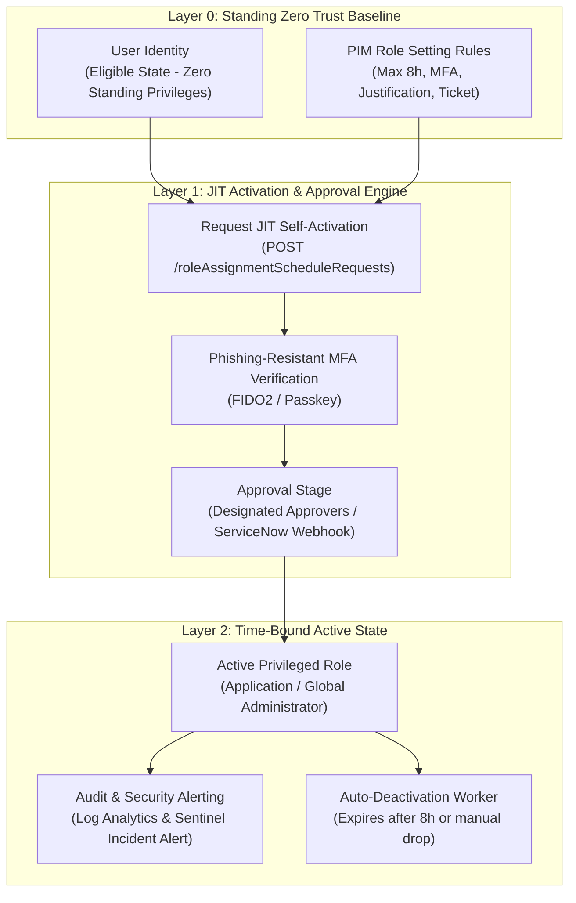
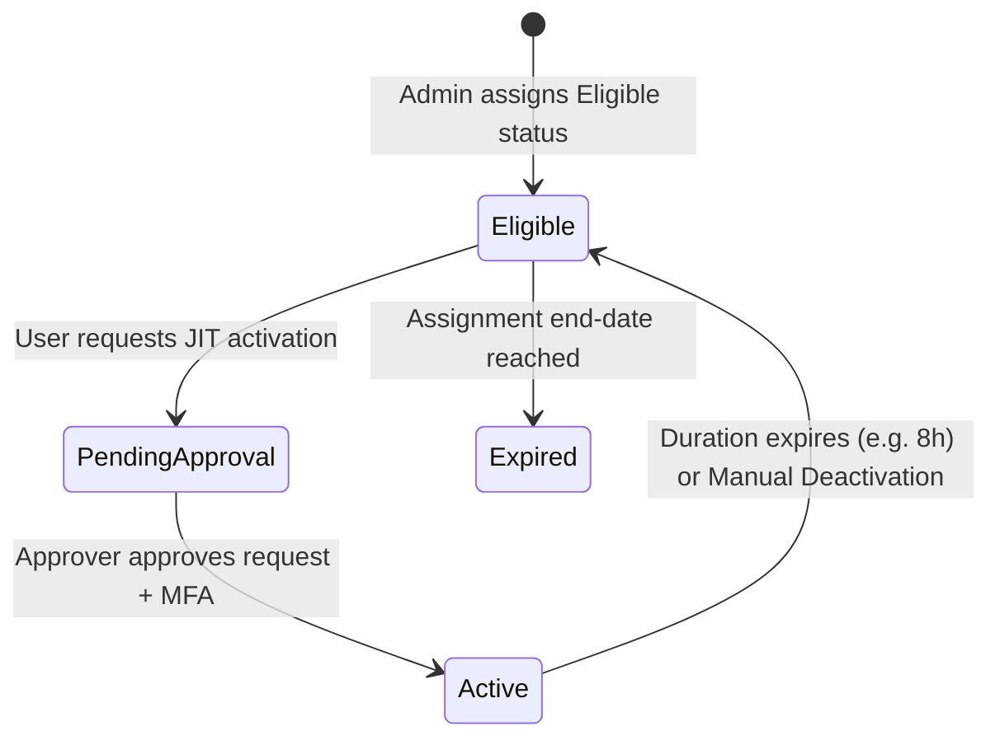

# SC-300 Day 13: Privileged Identity Management (PIM) in Microsoft Entra ID: Securing Admin Access

> **Source Video Title:** Privileged Identity Management (PIM) in Microsoft Entra ID | Securing Admin Access | Day 13  
> **Source URL:** [https://www.youtube.com/watch?v=qoQ10s8RUyU](https://www.youtube.com/watch?v=qoQ10s8RUyU&list=PL86wiCAX5vmTg8uubUrlHOqXrjXk6p-73&index=13)  
> **Instructor:** Raghuveer  
> **Refactored & Expanded By:** Senior Principal Engineer & Distinguished Technical Fellow (ex-FAANG / MANGOS)  
> **Target Certification Track:** Microsoft Certified: Identity and Access Administrator Associate (SC-300) | Bridge to Cybersecurity Architect (SC-100), SC-200 & Cloud and AI Security Engineer Associate (SC-500 - Successor to AZ-500)  
> **Technical Currency:** Updated as of **August 2026**

---

## Executive Summary & Curriculum Blueprint

Welcome to **Day 13** of the Microsoft Entra ID Security Masterclass.

In enterprise cybersecurity engineering, **Privileged Identity Management (PIM)** enforces the Zero Trust principle of **Just-In-Time (JIT) Least Privilege**. Eliminating permanent, standing administrative privileges prevents credential theft from escalating into full tenant compromise. Security architects must master **Eligible vs. Active Role Assignments**, **PIM Role Activation Settings**, **Multi-Stage Approval Workflows**, **PIM for Groups**, and **Graph API v1.0 Iteration 3 Activation Endpoints (with the October 2026 Beta Retirement)**.

This document transforms the raw Day 13 lecture transcript into an **executive engineering reference manual**. We break down JIT activation mechanics, approval workflow loops, PIM for Azure ARM Resources vs. Entra ID Roles, PIM Custom Extensions (ServiceNow integration), and Graph API activation payloads from first principles.



---

## Module 1: Privileged Identity Management (PIM) Fundamentals

### 1.1 Standing Access vs. Just-In-Time (JIT) Access

Standing administrative access is a primary attack vector in enterprise breaches. If an admin account with permanent Global Administrator rights is compromised via phishing or malware, attackers gain immediate control over the entire cloud infrastructure.

```
┌─────────────────────────────────────────────────────────────────────────┐
│                    STANDING ACCESS vs. JIT PIM MODEL                    │
├───────────────────────────────┬─────────────────────────────────────────┤
│ Legacy Standing Access        │ Modern Zero Trust PIM JIT Model         │
├───────────────────────────────┼─────────────────────────────────────────┤
│ • 24/7 Permanent Privileges   │ • **Zero Standing Privileges**          │
│ • Attacker gains full access  │ • Account holds **Eligible** status     │
│   upon credential compromise  │ • Role activated for **2 to 8 hours**   │
│ • No business justification   │ • Mandates **MFA, Ticket # & Approval** │
│ • Difficult to audit intent   │ • Full audit log of activation reason   │
└───────────────────────────────┴─────────────────────────────────────────┘
```

---

### 1.2 Assignment Types & Role Lifecycle

- **Eligible Assignment:** The user is authorized to activate the role when needed. Holds zero active permissions until JIT activation is performed.
- **Active Assignment:** The user currently possesses the active role permissions. Can be configured as *Permanently Active* (discouraged) or *Time-bound Active*.
- **Expired Assignment:** An eligible or active assignment whose designated validity duration has lapsed.



---

## Module 2: PIM Scopes & Privileged Roles Taxonomy

### 2.1 Scope Partitioning Matrix

PIM operates across three distinct resource boundaries:

```
┌─────────────────────────────────────────────────────────────────────────┐
│                       PIM RESOURCE SCOPE MATRIX                         │
├─────────────────┬───────────────────┬───────────────────────────────────┤
│ PIM Scope       │ Target Objects    │ Example Privileged Roles          │
├─────────────────┼───────────────────┼───────────────────────────────────┤
│ **Entra ID**    │ Directory Roles   │ Global Admin, User Admin,         │
│ **Roles**       │ (Tenant-Wide)     │ Privileged Role Admin, Security Admin│
├─────────────────┼───────────────────┼───────────────────────────────────┤
│ **Azure**       │ ARM Infrastructure│ Management Group Owner,           │
│ **Resources**   │ (Subscriptions/RGs)│ Subscription Contributor, VM Owner│
├─────────────────┼───────────────────┼───────────────────────────────────┤
│ **PIM for**     │ Security Groups   │ Assigns group membership via JIT  │
│ **Groups**      │ (`isAssignableToRole`)│ (Unlocks downstream App/RBAC)  │
└─────────────────┴───────────────────┴───────────────────────────────────┘
```

---

## Module 3: Configuring PIM Role Settings & Approval Workflows

### 3.1 Role Activation Rules & Guardrails

PIM policies are configured per role to enforce organizational security baselines:

```
┌─────────────────────────────────────────────────────────────────────────┐
│                    PIM ROLE ACTIVATION CONFIGURATION                    │
├───────────────────────────────────┬─────────────────────────────────────┤
│ Policy Parameter                  │ Enterprise Standard Configuration   │
├───────────────────────────────────┼─────────────────────────────────────┤
│ **Maximum Duration**              │ **8 Hours** (Default shift length)  │
│ **Require MFA on Activation**     │ **YES** (Phishing-Resistant FIDO2)  │
│ **Require Justification**         │ **YES** (Mandatory text entry)      │
│ **Require Ticket Information**    │ **YES** (ServiceNow / Jira Ticket #)│
│ **Require Approval for Activation**│ **YES** for Tier-0 Privileged Roles │
│ **Notification Emails**           │ Email SecOps Team on Activation     │
└───────────────────────────────────┴─────────────────────────────────────┘
```

> [!IMPORTANT]
> **PIM Custom Extensions (2026 Feature Standard):**  
> Organizations can configure **PIM Custom Extensions** using Logic Apps or Azure Functions to trigger webhooks. When an admin requests role activation, PIM calls a REST API endpoint (e.g. ServiceNow API) to verify that the submitted Change Request ticket is valid and approved before granting activation.

---

## Module 4: Graph API v1.0 Iteration 3 JIT Activation Standard

> [!WARNING]
> **API RETIREMENT NOTICE (October 28, 2026):**  
> Microsoft is retiring legacy PIM Iteration 2 Beta API endpoints (`/beta/privilegedAccess/...`) on **October 28, 2026**. All automated scripts and custom tools MUST use **Graph API v1.0 Iteration 3** endpoints (`/v1.0/roleManagement/directory/roleAssignmentScheduleRequests`).

### 4.1 Graph API Activation Payload Specification

To activate an eligible Entra ID directory role programmatically:

```http
POST https://graph.microsoft.com/v1.0/roleManagement/directory/roleAssignmentScheduleRequests
Content-Type: application/json
Authorization: Bearer <OAuth-Token>

{
  "action": "selfActivate",
  "principalId": "00000000-1111-2222-3333-444444444444",
  "roleDefinitionId": "fe930b6c-7e77-4727-91de-0c7f74b23bcf",
  "directoryScopeId": "/",
  "justification": "Executing Change Request CR-98422 in Azure Portal",
  "scheduleInfo": {
    "startDateTime": "2026-08-12T10:00:00Z",
    "expiration": {
      "type": "afterDuration",
      "duration": "PT8H"
    }
  }
}
```

---

## Module 5: Hands-On Verification & Principal Fellow Lab Guide

### 5.1 Lab 13.1: Configuring PIM Role Activation Settings via PowerShell

#### Execution Script:
```powershell
# Step 1: Connect to Microsoft Graph API with Privileged Role Management Scope
Connect-MgGraph -Scopes "RoleManagement.ReadWrite.Directory"

# Step 2: Retrieve Role Definition ID for Application Administrator
$RoleDef = Get-MgRoleManagementDirectoryRoleDefinition -Filter "displayName eq 'Application Administrator'"

# Step 3: Configure PIM Role Policy (Max 4h, Require MFA & Justification)
$RuleMFA = @{
  id = "Authentication_Required"
  ruleIdentifier = "ExpirationRule"
  target = @{
    caller = "EndUser"
    operations = @("Enable")
    level = "Role"
  }
}

# Step 4: Verify Policy Update Status
Get-MgRoleManagementDirectoryRoleSetting -Filter "roleDefinitionId eq '$($RoleDef.Id)'"
```

---

### 5.2 Lab 13.2: Programmatic JIT Activation via Azure CLI

#### Execution Script:
```azcli
# Step 1: Obtain Current User Principal ID and Role Definition ID
user_id=$(az ad signed-in-user show --query id --output tsv)
role_id="fe930b6c-7e77-4727-91de-0c7f74b23bcf" # User Administrator Role ID

# Step 2: Submit JIT Activation Request via Graph API v1.0 Iteration 3 Endpoint
az rest --method POST \
  --uri "https://graph.microsoft.com/v1.0/roleManagement/directory/roleAssignmentScheduleRequests" \
  --body "{
    \"action\": \"selfActivate\",
    \"principalId\": \"$user_id\",
    \"roleDefinitionId\": \"$role_id\",
    \"directoryScopeId\": \"/\",
    \"justification\": \"Activating User Administrator role to process ticket #9842\",
    \"scheduleInfo\": {
      \"startDateTime\": \"2026-08-12T10:00:00Z\",
      \"expiration\": {
        \"type\": \"afterDuration\",
        \"duration\": \"PT4H\"
      }
    }
  }"
```

---

## Module 6: Executive Knowledge Check & First-Principles Exam Readiness

### 6.1 The "What, Why, How, Where, When" Core Matrix

| Topic | What is it? | Why does it exist? | How does it work under the hood? | Where & When to use it? |
| :--- | :--- | :--- | :--- | :--- |
| **PIM JIT Activation** | Time-bound elevation of eligible roles. | Eliminates standing privileged access. | Graph API creates temporary role assignment schedule for specified duration. | Enforce on all Tier-0 administrative roles. |
| **Eligible Assignment** | Pre-authorized entitlement to request role elevation. | Allows users to activate permissions when required without permanent access. | PIM policy engine validates activation request against approval/MFA rules. | Assign to all operational support staff instead of permanent roles. |
| **PIM for Groups** | JIT elevation into a security group. | Enables JIT access to downstream Azure RBAC, Apps, and Intune. | PIM temporary user addition into group object (`isAssignableToRole`). | Use for team-based access to subscriptions or multi-role bundles. |
| **PIM Custom Extension** | Webhook integration between PIM & ITSM tools. | Automates ticket verification (ServiceNow/Jira) before role activation. | PIM engine sends REST payload to logic app webhook prior to granting role. | Deploy in enterprise environments to automate approval workflows. |
| **Graph API Iteration 3** | Current v1.0 PIM API standard. | Replaces retiring beta Iteration 2 APIs (retiring Oct 28, 2026). | Endpoint `/v1.0/roleManagement/directory/roleAssignmentScheduleRequests`. | Mandatory API standard for all custom PIM automation scripts. |

---

### 6.2 Distinguished Fellow Architectural Scenarios

#### Scenario 1: The Compromised Administrator Account Attack
* **Question:** An attacker steals the credentials of a Senior Cloud Engineer via an adversary-in-the-middle phishing attack at 2:00 AM. The engineer is assigned the Global Administrator role. If the enterprise deployed PIM with JIT activation, can the attacker immediately wipe the tenant?
* **Answer:** **NO.**
* **Remediation:** Because the engineer was assigned the role as **Eligible** (not Active), the account holds **zero standing permissions**. When the attacker attempts to perform administrative tasks, access is denied. To elevate, the attacker must complete JIT activation—which requires **Phishing-Resistant MFA**, a valid **ServiceNow Ticket #**, and **Manager Approval**, blocking the attack and alerting SecOps.

#### Scenario 2: Legacy PIM Script Failure Audit
* **Question:** A DevOps team reports that their automated night-shift maintenance script—which calls `https://graph.microsoft.com/beta/privilegedAccess/aadroles/roleAssignmentRequests` to activate roles—stopped working and returns `404 Not Found`. What caused the script failure?
* **Answer:** The script was using legacy PIM Iteration 2 Beta API endpoints, which were retired by Microsoft.
* **Remediation:** Update the script to use **Graph API v1.0 Iteration 3** endpoints (`https://graph.microsoft.com/v1.0/roleManagement/directory/roleAssignmentScheduleRequests`) with action `selfActivate`.

---

## Conclusion & Next Steps

Day 13 has established Privileged Identity Management (PIM) architecture, eligible vs active assignments, role activation guardrails, PIM for Groups, and Graph API v1.0 Iteration 3 activation mechanics.

### Preparation for Day 14:
In **Day 14**, we advance to **Advanced PIM Configuration & Identity Security Monitoring in Microsoft Entra ID**, exploring PIM for Azure ARM Resources, PIM Access Reviews, and alert monitoring integration with Microsoft Sentinel SIEM.

> *"Eliminate standing access, mandate JIT activation with approval workflows, and migrate all automation to Graph API v1.0."*