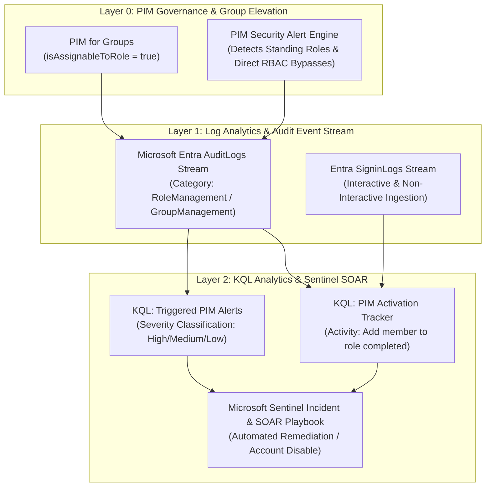

# SC-300 Day 14: Advanced PIM Configuration & Identity Security Monitoring in Microsoft Entra ID

> **Source Video Title:** Advanced PIM Configuration & Identity Security Monitoring in Microsoft Entra ID | Day 14  
> **Source URL:** [https://www.youtube.com/watch?v=Sio5uc26YoU](https://www.youtube.com/watch?v=Sio5uc26YoU&list=PL86wiCAX5vmTg8uubUrlHOqXrjXk6p-73&index=14)  
> **Instructor:** Raghuveer  
> **Refactored & Expanded By:** Senior Principal Engineer & Distinguished Technical Fellow (ex-FAANG / MANGOS)  
> **Target Certification Track:** Microsoft Certified: Identity and Access Administrator Associate (SC-300) | Bridge to Cybersecurity Architect (SC-100), SC-200 & Cloud and AI Security Engineer Associate (SC-500 - Successor to AZ-500)  
> **Technical Currency:** Updated as of **August 2026**

---

## Executive Summary & Curriculum Blueprint

Welcome to **Day 14** of the Microsoft Entra ID Security Masterclass.

In enterprise cybersecurity operations, **Advanced Privileged Identity Management (PIM) & Security Telemetry Monitoring** establish real-time visibility and threat detection across administrative actions. Security architects must master **PIM for Groups (Privileged Access Groups)**, **PIM Security Alerts Engine**, **Entra Audit Log Streaming to Log Analytics**, **Kusto Query Language (KQL) PIM Telemetry Queries**, and **Identity Secure Score Governance**.

This document transforms the raw Day 14 lecture transcript into an **executive engineering reference manual**. We break down PIM for Groups lifecycle rules, PIM security alert triggers (such as direct RBAC assignment bypasses), production KQL queries for Sentinel SIEM, and Identity Secure Score optimization strategies from first principles.



---

## Module 1: Advanced PIM for Groups (Privileged Access Groups)

While PIM directly manages Entra ID directory roles and Azure ARM roles, **PIM for Groups** extends Just-In-Time (JIT) access control to **Security Groups**.

### 1.1 Architectural Advantages of PIM for Groups

```
┌─────────────────────────────────────────────────────────────────────────┐
│                     ADVANTAGES OF PIM FOR GROUPS                        │
├──────────────────────────────────┬──────────────────────────────────────┤
│ Capability                       │ Enterprise Security Advantage        │
├──────────────────────────────────┼──────────────────────────────────────┤
│ **Single Point of Elevation**    │ Admin elevates into ONE group that   │
│                                  │ grants multi-resource access.        │
├──────────────────────────────────┼──────────────────────────────────────┤
│ **Downstream RBAC Delegation**   │ Group is assigned permissions across │
│                                  │ Azure Subscriptions, Apps & M365.    │
├──────────────────────────────────┼──────────────────────────────────────┤
│ **Ownership JIT Elevation**      │ Protects Group Ownership (prevents   │
│                                  │ unauthorized member additions).      │
└──────────────────────────────────┴──────────────────────────────────────┘
```

> [!CAUTION]
> **Group Role-Assignability Constraint:**  
> Groups used with PIM for Groups MUST have **`isAssignableToRole = true`** set at creation time. This restricts group membership modification to *Global Administrators* or *Privileged Role Administrators* and prevents dynamic membership rules.

---

## Module 2: PIM Security Alerts Engine

The PIM Security Alerts engine continuously scans your tenant for policy violations and standing privilege vulnerabilities.

### 2.1 PIM Built-In Security Alert Taxonomy

```
┌─────────────────────────────────────────────────────────────────────────┐
│                    PIM SECURITY ALERT CLASSIFICATION                    │
├───────────────────────────────┬──────────┬──────────────────────────────┤
│ Alert Name                    │ Severity │ Security Threat Context      │
├───────────────────────────────┼──────────┼──────────────────────────────┤
│ **Roles assigned outside**    │ **HIGH** │ Direct RBAC assignment bypass│
│ **of PIM**                    │          │ (Attacker created standing role!)│
├───────────────────────────────┼──────────┼──────────────────────────────┤
│ **Potential stale accounts**  │ Medium   │ Accounts retain eligibility  │
│ **in a privileged role**      │          │ without performing activations│
├───────────────────────────────┼──────────┼──────────────────────────────┤
│ **Roles don't require MFA**   │ Low      │ Role activation missing MFA  │
│ **for activation**            │          │ challenge requirement        │
├───────────────────────────────┼──────────┼──────────────────────────────┤
│ **Too many Global Admins**    │ High     │ Exceeds Microsoft baseline   │
│                               │          │ (Recommended: 2 to 5 max)    │
└───────────────────────────────┴──────────┴──────────────────────────────┘
```

---

## Module 3: KQL Security Telemetry & Sentinel Integration

### 3.1 Production KQL Queries for Entra AuditLogs

#### Query 1: Tracking PIM Role Activations in Real Time
```kql
AuditLogs
| where TimeGenerated > ago(7d)
| where Category == "RoleManagement"
| where ActivityDisplayName == "Add member to role completed (PIM activation)"
| extend Actor = tostring(parse_json(InitiatedBy).user.displayName)
| extend UPN = tostring(parse_json(InitiatedBy).user.userPrincipalName)
| extend IPAddress = tostring(parse_json(InitiatedBy).user.ipAddress)
| extend ActivatedRole = tostring(parse_json(TargetResources)[0].displayName)
| project TimeGenerated, Actor, UPN, ActivatedRole, IPAddress, ActivityDisplayName
| order by TimeGenerated desc
```

#### Query 2: Detecting Direct RBAC Assignments (PIM Bypass Attacks)
```kql
AuditLogs
| where TimeGenerated > ago(30d)
| where Category == "RoleManagement"
| where OperationName == "Add member to role"
| where ActivityDisplayName != "Add member to role completed (PIM activation)"
| extend TargetUser = tostring(parse_json(TargetResources)[0].userPrincipalName)
| extend AdminUser = tostring(parse_json(InitiatedBy).user.userPrincipalName)
| extend AssignedRole = tostring(parse_json(TargetResources)[0].displayName)
| project TimeGenerated, AdminUser, TargetUser, AssignedRole, OperationName
| order by TimeGenerated desc
```

---

## Module 4: Microsoft Entra Identity Secure Score

Identity Secure Score represents your security posture relative to Microsoft recommended baselines.

```
┌─────────────────────────────────────────────────────────────────────────┐
│                 IDENTITY SECURE SCORE GOVERNANCE MATRIX                 │
├───────────────────────────────┬─────────────────────────────────────────┤
│ Target Metric                 │ Enterprise Recommendation Standard      │
├───────────────────────────────┼─────────────────────────────────────────┤
│ **Target Target Score**       │ **90% and above**                       │
│ **Avoid 100% Trap**           │ Striving for 100% causes financial waste│
│                               │ and operational friction overconfidence.│
├───────────────────────────────┼─────────────────────────────────────────┤
│ **Top Remediation Actions**   │ 1. Require MFA for all administrative roles│
│                               │ 2. Turn on PIM for Tier-0 roles         │
│                               │ 3. Eliminate legacy authentication      │
└───────────────────────────────┴─────────────────────────────────────────┘
```

---

## Module 5: Hands-On Verification & Principal Fellow Lab Guide

### 5.1 Lab 14.1: Provisioning PIM for Groups via PowerShell

#### Execution Script:
```powershell
# Step 1: Connect to Microsoft Graph API with Group Management & PIM Scopes
Connect-MgGraph -Scopes "Group.ReadWrite.All", "PrivilegedAccess.ReadWrite.AzureADGroup"

# Step 2: Create Role-Assignable Security Group for Cloud Architecture Team
$Group = New-MgGroup `
  -DisplayName "SecGroup-PIM-CloudArchitects" `
  -MailEnabled:$false `
  -MailNickname "pimcloudarch" `
  -SecurityEnabled:$true `
  -IsAssignableToRole:$true

# Step 3: Enable PIM for Groups Management on the newly created group
az rest --method POST \
  --uri "https://graph.microsoft.com/v1.0/identityGovernance/privilegedAccess/group/eligibilityScheduleRequests" \
  --body "{
    \"action\": \"adminAssign\",
    \"justification\": \"Assigning eligible group ownership for cloud architects\",
    \"roleDefinitionId\": \"owner\",
    \"directoryScopeId\": \"/$($Group.Id)\",
    \"principalId\": \"00000000-1111-2222-3333-444444444444\"
  }"
```

---

### 5.2 Lab 14.2: Writing Custom Log Analytics Sentinel Alert for PIM Bypass

#### Execution Script:
```azcli
# Create Scheduled KQL Query Alert Rule in Log Analytics / Sentinel
az monitor scheduled-query create \
  --name "Alert-PIM-DirectAssignmentBypass" \
  --resource-group "rg-secops-sentinel" \
  --scopes "/subscriptions/00000000-0000-0000-0000-000000000000/resourceGroups/rg-secops-sentinel/providers/Microsoft.OperationalInsights/workspaces/law-secops" \
  --condition "count AuditLogs > 0" \
  --condition-language "kql" \
  --query "AuditLogs | where Category == 'RoleManagement' and OperationName == 'Add member to role' and ActivityDisplayName != 'Add member to role completed (PIM activation)'" \
  --description "Triggers High Severity alert when an admin role is assigned outside PIM"
```

---

## Module 6: Executive Knowledge Check & First-Principles Exam Readiness

### 6.1 The "What, Why, How, Where, When" Core Matrix

| Topic | What is it? | Why does it exist? | How does it work under the hood? | Where & When to use it? |
| :--- | :--- | :--- | :--- | :--- |
| **PIM for Groups** | Time-bound elevation of group membership. | Simplifies multi-resource JIT elevation via single group. | Entra PIM engine adds user object to group for configured duration. | Use for bundling access across subscriptions and SaaS apps. |
| **PIM Security Alerts** | Automated scanner detecting PIM misconfigurations. | Prevents standing access vulnerabilities and bypass attacks. | PIM engine continuously checks assignments against security rules. | Review weekly in Entra Admin Center > Security > PIM > Alerts. |
| **PIM Bypass Detection** | KQL query identifying direct role assignments. | Catches attackers or admins bypassing PIM JIT elevation. | Searches `AuditLogs` for role additions missing `PIM activation` activity. | Deploy as a real-time Sentinel rule alerting SecOps. |
| **Identity Secure Score** | Security posture benchmark metric. | Measures tenant adherence to security best practices. | Calculates score based on enabled features (MFA, PIM, CA). | Strive for 90%+ score in quarterly SecOps reviews. |

---

### 6.2 Distinguished Fellow Architectural Scenarios

#### Scenario 1: The Insider Threat PIM Bypass Attempt
* **Question:** A rogue Global Administrator bypasses PIM and directly assigns the *Privileged Role Administrator* role to a secondary user account without submitting a JIT request. How will the security team detect this breach immediately?
* **Answer:** The **PIM Security Alerts Engine** triggers the High Severity alert: *"Roles are being assigned outside of Privileged Identity Management"*.
* **Remediation:** The Log Analytics scheduled KQL query fires a high-priority incident in **Microsoft Sentinel**, triggering an automated SOAR Logic App playbook to revoke the assignment and disable both accounts.

#### Scenario 2: The 100% Secure Score Enterprise Trap
* **Question:** A CISO insists that the identity team achieve a **100% Identity Secure Score** within 30 days. Why does a Distinguished Technical Fellow advise against striving for a 100% score?
* **Answer:** Striving for 100% incurs excessive financial expenditure, operational rigidity, and false confidence.
* **Remediation:** Establish an enterprise benchmark of **90% and above**. This guarantees that all critical security controls (Phishing-Resistant MFA, PIM for Tier-0 roles, SSPR, Conditional Access) are enforced without disrupting business productivity.

---

## Conclusion & Next Steps

Day 14 has established PIM for Groups, PIM security alerts, production KQL audit queries, and Identity Secure Score governance.

### Preparation for Day 15:
In **Day 15**, we advance to **Entitlement Management & Access Reviews in Microsoft Entra ID Identity Governance**, exploring access package policies, multi-stage approval workflows, and automated self/manager access reviews.

> *"Monitor PIM activations via KQL, audit direct assignment bypasses, and aim for a sustainable 90%+ Identity Secure Score."*