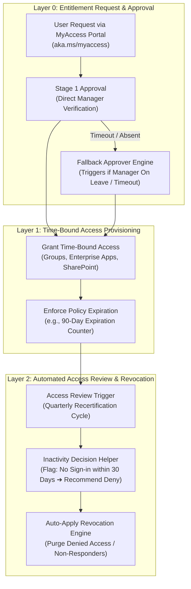
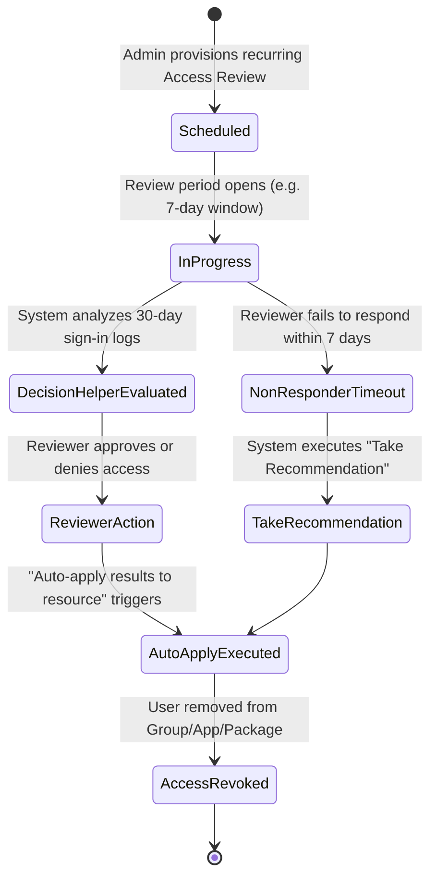

# SC-300 Day 15: Entitlement Management & Access Reviews in Microsoft Entra ID Identity Governance

> **Source Video Title:** Entitlement Management & Access Reviews in Microsoft Entra ID | Identity Governance | Day 15  
> **Source URL:** [https://www.youtube.com/watch?v=OsdHA32WT9g](https://www.youtube.com/watch?v=OsdHA32WT9g&list=PL86wiCAX5vmTg8uubUrlHOqXrjXk6p-73&index=15)  
> **Instructor:** Raghuveer  
> **Refactored & Expanded By:** Senior Principal Engineer & Distinguished Technical Fellow (ex-FAANG / MANGOS)  
> **Target Certification Track:** Microsoft Certified: Identity and Access Administrator Associate (SC-300) | Bridge to Cybersecurity Architect (SC-100), SC-200 & Cloud and AI Security Engineer Associate (SC-500 - Successor to AZ-500)  
> **Technical Currency:** Updated as of **August 2026**

---

## Executive Summary & Curriculum Blueprint

Welcome to **Day 15** of the Microsoft Entra ID Security Masterclass.

In enterprise cloud compliance and identity governance, **Access Reviews & Automated Lifecycle Revocation** eliminate standing entitlement drift. Over time, employees change roles or complete projects while retaining access to sensitive applications, groups, and directory roles ("Privilege Accumulation"). Security architects must master **Access Package Assignment Policies**, **Multi-Stage Approval Workflows with Fallback Approvers**, **Automated Access Reviews**, **Inactivity Decision Helpers (30-Day Sign-in Tracking)**, and **Auto-Apply Revocation**.

This document transforms the raw Day 15 lecture transcript into an **executive engineering reference manual**. We break down entitlement management policy design, access review lifecycle state machines, decision helper recommendation logic, auto-apply revocation mechanics, and Graph API governance workflows from first principles.



---

## Module 1: Architectural Comparison: PIM vs. Entitlement Management

Understanding when to deploy Privileged Identity Management (PIM) versus Entitlement Management is a core architectural requirement for identity engineering:

```
┌─────────────────────────────────────────────────────────────────────────┐
│               PIM vs. ENTITLEMENT MANAGEMENT TAXONOMY                   │
├───────────────────────────────┬─────────────────────────────────────────┤
│ Architectural Dimension       │ Privileged Identity Management (PIM)    │
├───────────────────────────────┼─────────────────────────────────────────┤
│ **Target Workloads**          │ Admin Directory Roles & ARM Resources   │
│ **Elevation Duration**        │ Just-In-Time (JIT) short term (2-8 hrs) │
│ **User Experience**           │ User self-activates when task begins    │
│ **Primary Use Case**          │ Tier-0 Admin Tasks (Global Admin, etc.) │
├───────────────────────────────┼─────────────────────────────────────────┤
│ Architectural Dimension       │ Entitlement Management                  │
├───────────────────────────────┼─────────────────────────────────────────┤
│ **Target Workloads**          │ Bundled Groups, Enterprise Apps & Sites │
│ **Elevation Duration**        │ Time-Bound Business Project (30-90 days)│
│ **User Experience**           │ User requests via MyAccess portal       │
│ **Primary Use Case**          │ External Vendors, Department Onboarding │
└───────────────────────────────┴─────────────────────────────────────────┘
```

---

## Module 2: Multi-Stage Approval Workflows & Fallback Governance

Complex organizational structures require resilient approval workflows to prevent requests from stalling when managers are unavailable.

```
┌─────────────────────────────────────────────────────────────────────────┐
│              APPROVAL WORKFLOW CONFIGURATION PARAMETERS                 │
├───────────────────────────────┬─────────────────────────────────────────┤
│ Approval Stage                │ Enterprise Standard Configuration       │
├───────────────────────────────┼─────────────────────────────────────────┤
│ **Stage 1 Approver**          │ **Direct Manager**                      │
│ **Stage 1 Timeout**           │ **14 Days** (Escalates if unanswered)   │
│ **Fallback Approver**         │ **Designated SecOps / Governance Admin**│
│                               │ (Prevents ticket stalls during leave!)  │
├───────────────────────────────┼─────────────────────────────────────────┤
│ **Stage 2 Approver**          │ **Resource Owner**                      │
│ **Stage 2 Timeout**           │ **7 Days**                              │
└───────────────────────────────┴─────────────────────────────────────────┘
```

---

## Module 3: Access Reviews & Automated Auto-Apply Revocation

Access Reviews continuously audit tenant access to ensure compliance with SOC 2, ISO 27001, and HIPAA identity controls.

### 3.1 Access Review Lifecycle State Machine



---

### 3.2 Inactivity Decision Helpers & Auto-Apply Settings

- **Decision Helper ("No sign-in within 30 days"):** The system evaluates Entra sign-in telemetry. If a user has not authenticated within 30 days, the reviewer portal displays a recommendation to **Deny access**.
- **Auto-Apply Results to Resource:** Automatically revokes access immediately upon review conclusion for any user whose access was denied.
- **Handling Non-Responders:**
  - **Take Recommendations:** If a reviewer fails to respond, the system automatically applies the decision helper recommendation (denying inactive users).
  - **Remove Access:** Automatically purges access for unreviewed users.

---

## Module 4: Hands-On Verification & Principal Fellow Lab Guide

### 4.1 Lab 15.1: Provisioning Access Review for Guest Users via PowerShell

#### Execution Script:
```powershell
# Step 1: Connect to Microsoft Graph API with Identity Governance Scopes
Connect-MgGraph -Scopes "AccessReviewDecisions.ReadWrite.All", "Group.ReadWrite.All"

# Step 2: Create Quarterly Access Review for Guest Users in Vendor Group
$ReviewParams = @{
  DisplayName = "Quarterly-GuestAccess-Review"
  Description = "Automated quarterly audit of external guest users in vendor group"
  Scope = @{
    Query = "/groups/00000000-1111-2222-3333-444444444444/transitiveMembers"
    QueryType = "MicrosoftGraph"
    QueryFilter = "userType eq 'Guest'"
  }
  Reviewers = @(
    @{
      Query = "/users/admin@kwinsecurity.com"
      QueryType = "MicrosoftGraph"
    }
  )
  Settings = @{
    MailNotificationsEnabled = $true
    RemindersEnabled = $true
    JustificationRequiredOnApproval = $true
    DefaultDecision = "Recommendation"
    DefaultDecisionEnabled = $true
    AutoApplyDecisionsEnabled = $true # AUTO-APPLY REVOCATION
    Recurrence = @{
      Pattern = @{
        Type = "absoluteMonthly"
        Interval = 3 # Quarterly
      }
      Range = @{
        Type = "noEnd"
        StartDate = (Get-Date).ToString("yyyy-MM-dd")
      }
    }
  }
}

# Step 3: Execute Access Review Creation
New-MgIdentityGovernanceAccessReviewDefinition @ReviewParams
```

---

## Module 5: Executive Knowledge Check & First-Principles Exam Readiness

### 5.1 The "What, Why, How, Where, When" Core Matrix

| Topic | What is it? | Why does it exist? | How does it work under the hood? | Where & When to use it? |
| :--- | :--- | :--- | :--- | :--- |
| **Access Package** | Bundled group, app, and site access. | Automates employee/vendor onboarding. | Provisions membership upon policy approval. | Deploy for recurring team & project onboarding. |
| **Fallback Approver** | Backup designated approver identity. | Prevents access requests from stalling when managers are away. | Entra engine routes request to fallback identity after timeout. | Mandate on all production Access Package policies. |
| **Access Review** | Periodic access recertification audit. | Prevents entitlement accumulation and security drift. | Prompts reviewers to validate membership periodically. | Require quarterly for all external guests and privileged roles. |
| **Decision Helper** | Machine learning sign-in recommendation. | Guides reviewers based on actual usage telemetry. | Checks 30-day `SigninLogs` and recommends Deny for inactive users. | Enable on all Access Reviews to speed up reviews. |
| **Auto-Apply Revocation** | Automatic cleanup of denied access. | Guarantees instant access removal without manual steps. | Entra Governance engine purges group/app membership upon review end. | Enable on 100% of production Access Reviews. |

---

### 5.2 Distinguished Fellow Architectural Scenarios

#### Scenario 1: Stalled Vendor Access Request
* **Question:** A contractor requests access to an Access Package for urgent maintenance. The contractor's direct manager is on a 2-week vacation without internet access. How do you prevent business operations from halting?
* **Answer:** Configure **Fallback Approvers** in the Access Package policy.
* **Remediation:** Set the Stage 1 timeout to 3 days. When the manager does not respond within 3 days, Entra ID automatically escalates the request to the Fallback Approver (the IT Governance Lead), who approves the ticket.

#### Scenario 2: Orphaned Guest Accounts Audit Failure
* **Question:** During an ISO 27001 audit, the auditor discovers 120 guest accounts belonging to former contractors who left 6 months ago but still have active access to internal Teams channels. How do you fix this compliance violation permanently?
* **Answer:** Manual access reviews were either not configured or ignored by managers.
* **Remediation:** Configure a recurring **Quarterly Access Review** targeting all guest users. Enable the **"No sign-in within 30 days" Decision Helper**, set the non-responder default decision to **"Take recommendations"**, and turn on **"Auto apply results to resource"**. Stale guests are automatically identified and purged every 90 days.

---

## Conclusion & Next Steps

Day 15 has established Entitlement Management policies, multi-stage approval workflows with fallback approvers, Access Reviews, inactivity decision helpers, and auto-apply revocation.

### Preparation for Day 16:
In **Day 16**, we advance to **PIM, Identity Governance & Application Registration in Microsoft Entra ID: Secure Access**, bridging governance policies with Enterprise Application registration and OAuth 2.0 consent controls.

> *"Automate access lifecycles with Access Packages, enforce fallback approvers, and purge stale access via Auto-Apply Access Reviews."*