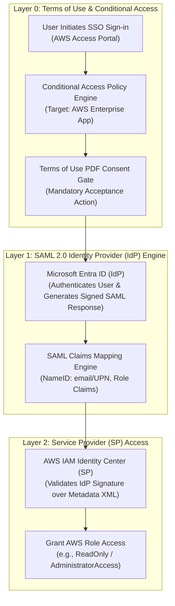
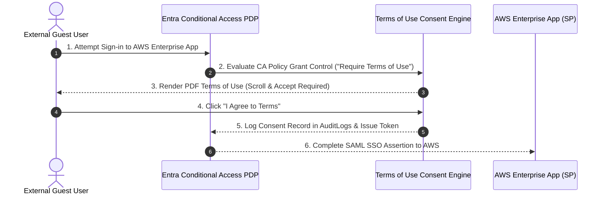

# SC-300 Day 16: PIM, Identity Governance & Application Registration in Microsoft Entra ID: Secure Access

> **Source Video Title:** PIM, Identity Governance & Application Registration in Microsoft Entra ID | Secure Access | Day 16  
> **Source URL:** [https://www.youtube.com/watch?v=MlLfbERI72M](https://www.youtube.com/watch?v=MlLfbERI72M&list=PL86wiCAX5vmTg8uubUrlHOqXrjXk6p-73&index=16)  
> **Instructor:** Raghuveer  
> **Refactored & Expanded By:** Senior Principal Engineer & Distinguished Technical Fellow (ex-FAANG / MANGOS)  
> **Target Certification Track:** Microsoft Certified: Identity and Access Administrator Associate (SC-300) | Bridge to Cybersecurity Architect (SC-100), SC-200 & Cloud and AI Security Engineer Associate (SC-500 - Successor to AZ-500)  
> **Technical Currency:** Updated as of **August 2026**

---

## Executive Summary & Curriculum Blueprint

Welcome to **Day 16** of the Microsoft Entra ID Security Masterclass.

In enterprise application architecture, **Federated Single Sign-On (SSO) & Terms of Use (ToU) Governance** consolidate access control across SaaS environments like AWS, Salesforce, and ServiceNow. Security administrators must master **Microsoft Entra Terms of Use via Conditional Access**, **Enterprise Application Integration**, **SAML 2.0 Federated Authentication**, **SCIM 2.0 User Provisioning**, and **Attribute Claim Mapping (NameID Format)**.

This document transforms the raw Day 16 lecture transcript into an **executive engineering reference manual**. We break down Terms of Use consent enforcement, SAML 2.0 authentication exchanges between Entra ID (IdP) and AWS IAM Identity Center (SP), SCIM 2.0 automated provisioning, and troubleshooting SAML assertion attributes from first principles.



---

## Module 1: Entra ID Terms of Use (ToU) Governance

Terms of Use policies enforce legal compliance, non-disclosure agreements (NDAs), and security guidelines prior to granting access to applications.

### 1.1 Terms of Use Policy Design

```
┌─────────────────────────────────────────────────────────────────────────┐
│                   TERMS OF USE GOVERNANCE MATRIX                        │
├───────────────────────────────┬─────────────────────────────────────────┤
│ Configuration Parameter       │ Enterprise Standard Specification       │
├───────────────────────────────┼─────────────────────────────────────────┤
│ **Document Format**           │ PDF File (Multi-language support)       │
│ **Consent Enforcement**       │ Mandatory scroll-to-bottom acceptance   │
│ **Re-consent Frequency**      │ Every 90 Days or per Policy Update      │
│ **Conditional Access Integration**│ Enforced under CA Grant Controls    │
└───────────────────────────────┴─────────────────────────────────────────┘
```



---

## Module 2: Federated Application Integration (SAML 2.0 & SCIM 2.0)

### 2.1 Legacy Authentication vs. Modern Federated SSO

```
┌─────────────────────────────────────────────────────────────────────────┐
│               LEGACY AUTH vs. MODERN FEDERATED SAML 2.0                 │
├───────────────────────────────┬─────────────────────────────────────────┤
│ Dimension                     │ Legacy Local App Authentication         │
├───────────────────────────────┼─────────────────────────────────────────┤
│ **Credential Location**       │ Isolated local app database (Siloed)    │
│ **MFA Enforcement**           │ Inconsistent or unsupported             │
│ **Offboarding**               │ Manual deletion across 50+ apps         │
│ **CAPEX / OPEX**              │ High Infrastructure CAPEX               │
├───────────────────────────────┼─────────────────────────────────────────┤
│ Dimension                     │ Modern Federated SAML 2.0 SSO           │
├───────────────────────────────┼─────────────────────────────────────────┤
│ **Credential Location**       │ Centralized Microsoft Entra ID (IdP)    │
│ **MFA Enforcement**           │ **Mandatory CA & Phishing-Resistant MFA**│
│ **Offboarding**               │ Instant deactivation at Entra ID        │
│ **CAPEX / OPEX**              │ Cloud OPEX (Zero local auth servers)   │
└───────────────────────────────┴─────────────────────────────────────────┘
```

---

### 2.2 SAML 2.0 Integration Architecture: AWS IAM Identity Center

Integrating AWS IAM Identity Center with Microsoft Entra ID establishes SAML 2.0 federated SSO.

```
┌─────────────────────────────────────────────────────────────────────────┐
│               AWS SAML 2.0 SSO CONFIGURATION STEPS                      │
├─────────────────────────────────────────────────────────────────────────┤
│ 1. Entra Enterprise App   : Add "AWS IAM Identity Center" from Gallery.  │
│ 2. Federation Metadata XML: Download Entra SAML Metadata & upload to AWS│
│                            IAM Identity Center.                         │
│ 3. ACS URL & Audience URI : Copy AWS Assertion Consumer Service (ACS)   │
│                            URL into Entra SSO Configuration.            │
│ 4. SAML Claims Mapping    : Map NameID format to `user.mail` / UPN.     │
│ 5. SCIM 2.0 Provisioning  : Configure Automatic User/Group sync token.  │
└─────────────────────────────────────────────────────────────────────────┘
```

---

## Module 3: Hands-On Verification & Principal Fellow Lab Guide

### 3.1 Lab 16.1: Creating Terms of Use Policy & Enforcing via Graph PowerShell

#### Execution Script:
```powershell
# Step 1: Connect to Microsoft Graph API with Agreement Administration Scope
Connect-MgGraph -Scopes "Agreement.ReadWrite.All", "Policy.ReadWrite.ConditionalAccess"

# Step 2: Upload Terms of Use Document Policy
$ToUParams = @{
  DisplayName = "ToU-Vendor-Data-Privacy-2026"
  IsViewingBeforeAcceptanceRequired = $true
  ReacceptRequiredFrequency = "P90D" # Every 90 Days
  UserSet = "All"
}

# Execute creation of Terms of Use object
$Agreement = New-MgAgreement @ToUParams
```

---

### 3.2 Lab 16.2: Provisioning SAML 2.0 Enterprise App for AWS via Azure CLI

#### Execution Script:
```azcli
# Step 1: Instantiate AWS IAM Identity Center Enterprise App from Entra Gallery
app_id=$(az ad app create \
  --display-name "AWS-IAM-IdentityCenter-Production" \
  --web-redirect-uris "https://region.signin.aws.amazon.com/platform/sso/saml/acs/00000000" \
  --query appId --output tsv)

# Step 2: Create Service Principal for Enterprise App
sp_id=$(az ad sp create --id $app_id --query id --output tsv)

# Step 3: Configure SAML Single Sign-On Endpoint Properties via Graph REST
az rest --method PATCH \
  --uri "https://graph.microsoft.com/v1.0/servicePrincipals/$sp_id" \
  --body '{
    "preferredSingleSignOnMode": "saml"
  }'
```

---

## Module 4: Executive Knowledge Check & First-Principles Exam Readiness

### 4.1 The "What, Why, How, Where, When" Core Matrix

| Topic | What is it? | Why does it exist? | How does it work under the hood? | Where & When to use it? |
| :--- | :--- | :--- | :--- | :--- |
| **Terms of Use (ToU)** | Legal consent agreement PDF. | Enforces compliance & NDA agreements. | CA policy checks acceptance timestamp in Entra audit logs. | Require for external guests and sensitive apps. |
| **Federated SSO** | Centralized auth via SAML 2.0/OAuth. | Eliminates app credential silos. | IdP signs SAML token; Service Provider validates signature via Metadata XML. | Deploy for all enterprise SaaS applications. |
| **SAML NameID** | User identity claim in SAML payload. | Identifies user on external Service Provider. | Maps Entra `user.mail` or `userPrincipalName` into SAML assertion XML. | Verify when SSO login fails due to user mismatch. |
| **SCIM 2.0 Sync** | Automated provisioning protocol. | Syncs user/group changes to AWS/Salesforce. | Entra provisioning service pushes user updates via HTTPS JSON payload. | Enable alongside SAML SSO for lifecycle automation. |

---

### 4.2 Distinguished Fellow Architectural Scenarios

#### Scenario 1: The SAML Assertion Mismatch Failure
* **Question:** An engineer attempts to log into the AWS Access Portal via Entra SAML SSO but receives an error from AWS: `SAML response does not contain a valid NameID claim matching an active AWS user`. How do you resolve this error?
* **Answer:** The SAML NameID claim format in Entra ID does not match the attribute stored in AWS IAM Identity Center.
* **Remediation:** In Entra Admin Center, navigate to **Enterprise Applications > AWS IAM Identity Center > Single sign-on > Attributes & Claims**, edit the **Unique User Identifier (Name ID)**, and set its source attribute to `user.mail` or `user.userPrincipalName` matching the AWS user directory.

#### Scenario 2: Unenforced Legal NDA Compliance Gap
* **Question:** A external auditor accesses your company's AWS cloud environment without accepting the company's mandatory 2026 Non-Disclosure Agreement (NDA). How do you enforce NDA consent automatically prior to issuing SAML tokens?
* **Answer:** Terms of Use was not attached to the Conditional Access policy gating AWS.
* **Remediation:** Create a **Terms of Use** PDF containing the NDA. Create a **Conditional Access Policy** targeting the *AWS IAM Identity Center Enterprise App*, and under **Grant controls**, select **Require terms of use**. Users must scroll and accept the NDA before SAML tokens are issued.

---

## Conclusion & Next Steps

Day 16 has established Terms of Use governance, SAML 2.0 federated single sign-on architecture, AWS IAM Identity Center integration, and SCIM 2.0 provisioning.

### Preparation for Day 17:
In **Day 17**, we advance to **App Registration & Integration with Microsoft Entra ID: Secure Authentication & SSO**, exploring custom multi-tenant app registrations, OAuth 2.0 authorization codes, client secrets, certificate credentials, and API permission consent scopes.

> *"Consolidate authentication at Entra ID, enforce Terms of Use at the boundary, and automate SAML/SCIM SSO integration."*