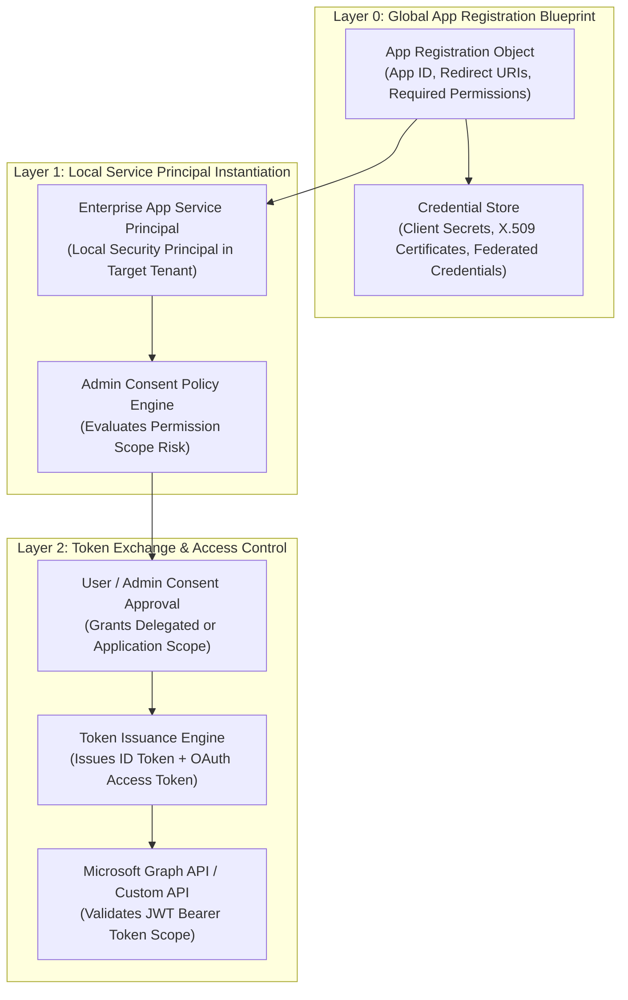
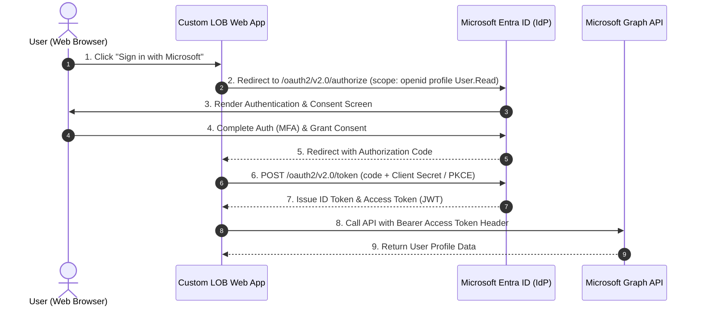

# SC-300 Day 17: App Registration & Integration with Microsoft Entra ID: Secure Authentication & SSO

> **Source Video Title:** App Registration & Integration with Microsoft Entra ID | Secure Authentication & SSO | Day 17  
> **Source URL:** [https://www.youtube.com/watch?v=ExmWFCJT_XA](https://www.youtube.com/watch?v=ExmWFCJT_XA&list=PL86wiCAX5vmTg8uubUrlHOqXrjXk6p-73&index=17)  
> **Instructor:** Raghuveer  
> **Refactored & Expanded By:** Senior Principal Engineer & Distinguished Technical Fellow (ex-FAANG / MANGOS)  
> **Target Certification Track:** Microsoft Certified: Identity and Access Administrator Associate (SC-300) | Bridge to Cybersecurity Architect (SC-100), SC-200 & Cloud and AI Security Engineer Associate (SC-500 - Successor to AZ-500)  
> **Technical Currency:** Updated as of **August 2026**

---

## Executive Summary & Curriculum Blueprint

Welcome to **Day 17** of the Microsoft Entra ID Security Masterclass.

In enterprise software engineering and cloud security, **Application Registration & Workload Identity Protection** govern how custom line-of-business (LOB) applications, microservices, and third-party APIs authenticate to Microsoft Entra ID. Security architects must master **App Registration vs. Service Principal Relationships**, **OAuth 2.0 / OpenID Connect (OIDC) Flows**, **Delegated vs. Application Permissions**, **Admin Consent Policies**, and **Workload Identity Federated Credentials (Zero Secrets Architecture)**.

This document transforms the raw Day 17 lecture transcript into an **executive engineering reference manual**. We break down OIDC token acquisition, Authorization Code Flow with PKCE, Client Credentials Grant flow, Workload Identity OIDC federation with GitHub Actions/Kubernetes, and admin consent governance from first principles.



---

## Module 1: App Registration vs. Service Principal Architecture

A core concept in Entra application architecture is the distinction between an App Registration and a Service Principal:

```
┌─────────────────────────────────────────────────────────────────────────┐
│              APP REGISTRATION vs. SERVICE PRINCIPAL MATRIX              │
├───────────────────────────────┬─────────────────────────────────────────┤
│ Architectural Object          │ App Registration (Application Object)   │
├───────────────────────────────┼─────────────────────────────────────────┤
│ **Scope & Locality**          │ Global Blueprint (Home Tenant)          │
│ **Function**                  │ Defines App ID, Redirect URIs, Secrets, │
│                               │ and requested API permissions.          │
├───────────────────────────────┼─────────────────────────────────────────┤
│ Architectural Object          │ Service Principal (Enterprise App)      │
├───────────────────────────────┼─────────────────────────────────────────┤
│ **Scope & Locality**          │ Local Instance (Target Tenant)          │
│ **Function**                  │ Governs actual access controls, RBAC,   │
│                               │ Conditional Access, & User Assignments. │
└───────────────────────────────┴─────────────────────────────────────────┘
```

---

## Module 2: OAuth 2.0 & OpenID Connect (OIDC) Token Flows

### 2.1 OIDC Authorization Code Flow with PKCE

Used by Single Page Apps (SPAs), Mobile Apps, and Web Applications with signed-in users.



---

### 2.2 Client Credentials Grant Flow (Daemon / Backend Services)

Used by background workers, cron jobs, and server-to-server daemon services with zero signed-in user.

```
[ Backend Daemon Service ] ──► 1. POST /oauth2/v2.0/token
                                  (grant_type=client_credentials, client_id, client_secret)
                           ──► 2. Entra ID Validates App Secret & Grants Application Scope
                           ──► 3. Returns JWT Access Token
                           ──► 4. Daemon calls Microsoft Graph API with Access Token Header
```

---

## Module 3: Modern Workload Identity Federation (Zero Secrets Architecture)

> [!IMPORTANT]
> **2026 ZERO SECRETS PARADIGM:**  
> Storing long-lived Client Secrets or X.509 Certificates in code repositories (e.g. GitHub Actions, Azure DevOps, Kubernetes) creates severe credential leakage risks. Enterprises MUST deploy **Workload Identity Federated Credentials**.

```
┌─────────────────────────────────────────────────────────────────────────┐
│               WORKLOAD IDENTITY FEDERATED CREDENTIALS                   │
├─────────────────────────────────────────────────────────────────────────┤
│ 1. GitHub Actions issues OIDC Token when pipeline executes.             │
│ 2. GitHub Actions sends OIDC token to Microsoft Entra ID.               │
│ 3. Entra ID validates Issuer (`token.actions.githubusercontent.com`),  │
│    Subject (`repo:org/repo:environment:prod`), and Audience.            │
│ 4. Entra ID exchanges GitHub OIDC token for Entra ID Access Token.      │
│ 5. Pipeline deploys Azure infrastructure WITHOUT static secrets!        │
└─────────────────────────────────────────────────────────────────────────┘
```

---

## Module 4: API Permissions & Admin Consent Governance

```
┌─────────────────────────────────────────────────────────────────────────┐
│                DELEGATED vs. APPLICATION PERMISSIONS                    │
├───────────────────────────────┬─────────────────────────────────────────┤
│ Permission Type               │ Delegated Permission                    │
├───────────────────────────────┼─────────────────────────────────────────┤
│ **Execution Context**         │ Acts on behalf of signed-in user        │
│ **Effective Privilege**       │ Intersection of User rights & App scope │
│ **Example Scope**             │ `User.Read`, `Files.Read.All`           │
├───────────────────────────────┼─────────────────────────────────────────┤
│ Permission Type               │ Application Permission                  │
├───────────────────────────────┼─────────────────────────────────────────┤
│ **Execution Context**         │ Acts autonomously (Zero user present)   │
│ **Effective Privilege**       │ Full permission scope across all tenant │
│ **Example Scope**             │ `User.ReadWrite.All`, `Directory.Read`  │
│ **Admin Consent Rule**        │ **MANDATORY Admin Consent Required!**   │
└───────────────────────────────┴─────────────────────────────────────────┘
```

---

## Module 5: Hands-On Verification & Principal Fellow Lab Guide

### 5.1 Lab 17.1: Registering LOB Web App & Configuring Redirect URIs via PowerShell

#### Execution Script:
```powershell
# Step 1: Connect to Microsoft Graph API with Application Management Scope
Connect-MgGraph -Scopes "Application.ReadWrite.All"

# Step 2: Register Custom Line-of-Business Web Application
$AppParams = @{
  DisplayName = "App-Finance-Dashboard-Prod"
  SignInAudience = "AzureADMyOrg" # Single Tenant
  Web = @{
    RedirectUris = @("https://finance.kwinsecurity.com/signin-oidc")
    ImplicitGrantSettings = @{
      EnableIdTokenIssuance = $true
      EnableAccessTokenIssuance = $false
    }
  }
}
$App = New-MgApplication @AppParams

# Step 3: Instantiate Service Principal in Local Tenant
New-MgServicePrincipal -AppId $App.AppId
```

---

### 5.2 Lab 17.2: Creating Workload Identity Federated Credential for GitHub Actions via Azure CLI

#### Execution Script:
```azcli
# Step 1: Obtain App Object ID
app_object_id=$(az ad app list --display-name "App-Finance-Dashboard-Prod" --query "[0].id" --output tsv)

# Step 2: Provision Workload Identity Federated Credential for GitHub Actions
az rest --method POST \
  --uri "https://graph.microsoft.com/v1.0/applications/$app_object_id/federatedIdentityCredentials" \
  --body '{
    "name": "GitHub-Actions-Prod-Deploy",
    "issuer": "https://token.actions.githubusercontent.com",
    "subject": "repo:kwin-org/finance-repo:environment:Production",
    "description": "Allows GitHub Actions production environment to deploy without secrets",
    "audiences": ["api://AzureADTokenExchange"]
  }'
```

---

## Module 6: Executive Knowledge Check & First-Principles Exam Readiness

### 6.1 The "What, Why, How, Where, When" Core Matrix

| Topic | What is it? | Why does it exist? | How does it work under the hood? | Where & When to use it? |
| :--- | :--- | :--- | :--- | :--- |
| **App Registration** | Global blueprint of an application in Entra ID. | Defines identity properties, secrets, and API permissions. | Stores app metadata in Entra directory schema. | Create when developing custom apps or integrating third-party APIs. |
| **Service Principal** | Local security principal instance of an app. | Governs local tenant access, RBAC, and CA policies. | Instantiated in local tenant when app is installed or consented. | Automatically created upon app registration or enterprise consent. |
| **Delegated Permission** | Permission granted to app acting on user's behalf. | Limits app rights to what the logged-in user can access. | OAuth token contains both user identity (`scp`) and app claims. | Use for interactive client-facing web and mobile apps. |
| **Application Permission** | Permission granted to autonomous daemon service. | Enables background processes to run without user sign-in. | OAuth token contains `roles` claim for app principal. | Use for background sync daemons; requires mandatory Admin Consent. |
| **Federated Credentials** | Secretless authentication for external workloads. | Eliminates credential leaks from code repositories. | Exchanges external OIDC token (GitHub/K8s) for Entra access token. | Mandate on all CI/CD pipelines and Kubernetes clusters. |

---

### 6.2 Distinguished Fellow Architectural Scenarios

#### Scenario 1: The Hardcoded Client Secret Breach
* **Question:** A junior developer commits an App Registration Client Secret to a public GitHub repository. Within 10 minutes, an automated bot scrapes the secret, authenticates to Microsoft Graph API, and attempts to exfiltrate user data. How do you permanently eliminate this vulnerability architecture?
* **Answer:** Move from static Client Secrets to **Workload Identity Federated Credentials**.
* **Remediation:** Revoke the compromised Client Secret immediately. Configure a **Federated Identity Credential** on the App Registration linking the GitHub repository OIDC issuer (`https://token.actions.githubusercontent.com`) and subject scope. Pipelines authenticate dynamically without hardcoded secrets.

#### Scenario 2: Illicit Consent Grant Attack Mitigation
* **Question:** An attacker sends a phishing link enticing employees to grant a third-party app delegated permissions (`Files.ReadWrite.All`, `Mail.Read`). The app steals corporate emails. How do you prevent users from granting consent to unverified apps?
* **Answer:** Default user consent settings permitted non-admin users to grant high-risk delegated permissions.
* **Remediation:** Configure **App Consent Policies** in Entra Admin Center. Set user consent to **"Do not allow user consent"** or **"Allow user consent for apps from verified publishers for low-risk permissions"**. Enforce mandatory **Admin Consent Requests** workflows for all other applications.

---

## Conclusion & Next Steps

Day 17 has established App Registrations, Service Principals, OIDC token flows, delegated vs. application permissions, Admin Consent policies, and Workload Identity Federated Credentials.

### Preparation for Day 18:
In **Day 18**, we advance to **Microsoft Entra Permission Management & Sentinel Identity Security & Monitoring**, exploring Cloud Infrastructure Entitlement Management (CIEM), over-permissioned service principal detection, and Microsoft Sentinel identity threat hunting.

> *"Eliminate static secrets with Federated Credentials, restrict application permissions via Admin Consent, and audit Workload Identities."*