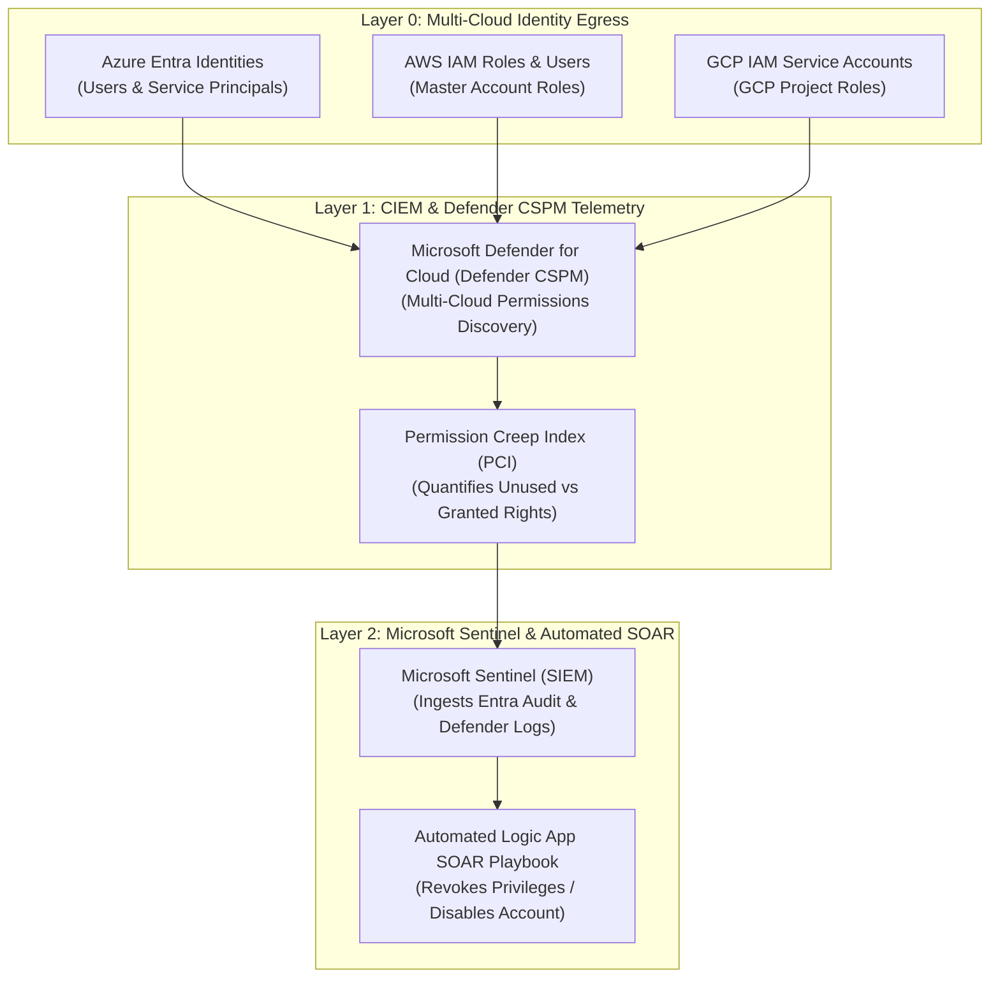

# SC-300 Day 18: Microsoft Entra Permission Management & Sentinel: Identity Security & Monitoring

> **Source Video Title:** Microsoft Entra Permission Management & Sentinel | Identity Security & Monitoring | Day 18  
> **Source URL:** [https://www.youtube.com/watch?v=Ec6vceyDUZU](https://www.youtube.com/watch?v=Ec6vceyDUZU&list=PL86wiCAX5vmTg8uubUrlHOqXrjXk6p-73&index=18)  
> **Instructor:** Raghuveer  
> **Refactored & Expanded By:** Senior Principal Engineer & Distinguished Technical Fellow (ex-FAANG / MANGOS)  
> **Target Certification Track:** Microsoft Certified: Identity and Access Administrator Associate (SC-300) | Bridge to Cybersecurity Architect (SC-100), SC-200 & Cloud and AI Security Engineer Associate (SC-500 - Successor to AZ-500)  
> **Technical Currency:** Updated as of **August 2026**

---

## Executive Summary & Curriculum Blueprint

Welcome to **Day 18** of the Microsoft Entra ID Security Masterclass.

In multi-cloud enterprise security architecture, **Cloud Infrastructure Entitlement Management (CIEM) & SIEM Security Monitoring** protect identities across Microsoft Azure, AWS IAM, and Google Cloud Platform (GCP). Security architects must master **Permission Creep Index (PCI)** metrics, **Microsoft Defender for Cloud (Defender CSPM) Integration**, **Microsoft Sentinel Identity Data Connectors**, and **Automated Security Incident Response (SOAR)**.

This document transforms the raw Day 18 lecture transcript into an **executive engineering reference manual**. We break down multi-cloud CIEM discovery, the transition of standalone Entra Permissions Management into Defender for Cloud, Permission Creep Index calculation, Microsoft Sentinel identity data streams, and automated threat hunting playbooks from first principles.



---

## Module 1: Cloud Infrastructure Entitlement Management (CIEM) Architecture

### 1.1 The 3 Pillars of CIEM

```
┌─────────────────────────────────────────────────────────────────────────┐
│                       THE 3 PILLARS OF CIEM                             │
├─────────────────┬───────────────────────────────────────────────────────┤
│ CIEM Pillar     │ Architectural Function                                │
├─────────────────┼───────────────────────────────────────────────────────┤
│ **1. Discover** │ Maps ALL human and workload identities across Azure,  │
│                 │ AWS, and GCP to reveal granted vs. used permissions.  │
├─────────────────┼───────────────────────────────────────────────────────┤
│ **2. Remediate**│ Right-sizes over-permissioned identities, stripping    │
│                 │ unused actions and generating least-privilege roles.  │
├─────────────────┼───────────────────────────────────────────────────────┤
│ **3. Monitor**  │ Continuously audits permission drift and alerts on    │
│                 │ unauthorized role escalation attempts in real time.   │
└─────────────────┴───────────────────────────────────────────────────────┘
```

---

### 1.2 Permission Creep Index (PCI) Metrics

The **Permission Creep Index (PCI)** quantifies the gap between permissions *granted* to an identity and permissions *actually used* over a 90-day evaluation window.

$$\text{PCI} = \left( \frac{\text{Granted Permissions} - \text{Used Permissions}}{\text{Total Granted Permissions}} \right) \times 100$$

```
┌─────────────────────────────────────────────────────────────────────────┐
│                 PERMISSION CREEP INDEX (PCI) RISK MATRIX                │
├─────────────────┬───────────────────┬───────────────────────────────────┤
│ PCI Score Range │ Risk Level        │ Required Enterprise Action        │
├─────────────────┼───────────────────┼───────────────────────────────────┤
│ **0 to 33**     │ Low Risk          │ Optimal least-privilege alignment │
├─────────────────┼───────────────────┼───────────────────────────────────┤
│ **34 to 66**    │ Medium Risk       │ Schedule permission right-sizing  │
├─────────────────┼───────────────────┼───────────────────────────────────┤
│ **67 to 100**   │ **High Risk**     │ **CRITICAL VULNERABILITY!**       │
│                 │                   │ Immediate automated remediation.  │
└─────────────────┴───────────────────┴───────────────────────────────────┘
```

> [!IMPORTANT]
> **2026 Architectural Platform Update:**  
> Microsoft Entra Permissions Management was **retired as a standalone product on November 1, 2025**. All CIEM capabilities—including the Permission Creep Index (PCI) and multi-cloud IAM discovery across Azure, AWS, and GCP—are now fully integrated into **Microsoft Defender for Cloud (Defender CSPM Plan)**.

---

## Module 2: Microsoft Sentinel Identity Monitoring & Threat Hunting

Microsoft Sentinel ingests identity logs to detect attacks in real time.

### 2.1 Entra ID Sentinel Log Stream Classification

```
┌─────────────────────────────────────────────────────────────────────────┐
│               SENTINEL ENTRA ID DATA CONNECTOR STREAMS                  │
├───────────────────────────────┬─────────────────────────────────────────┤
│ Log Stream Name               │ Security Telemetry Value                │
├───────────────────────────────┼─────────────────────────────────────────┤
│ **AuditLogs**                 │ Administrative changes, role updates,   │
│                               │ PIM activations, App consent events.    │
├───────────────────────────────┼─────────────────────────────────────────┤
│ **SigninLogs**                │ Interactive user logins, MFA prompts,   │
│                               │ source IP, user agent, Conditional Access│
├───────────────────────────────┼─────────────────────────────────────────┤
│ **ServicePrincipalSigninLogs**│ Non-human workload identity sign-ins    │
│                               │ (App Registrations / Service Principals)│
├───────────────────────────────┼─────────────────────────────────────────┤
│ **NonInteractiveUserSignInLogs│ Background silent token refreshes.       │
└───────────────────────────────┴─────────────────────────────────────────┘
```

---

## Module 3: Hands-On Verification & Principal Fellow Lab Guide

### 3.1 Lab 18.1: Connecting Entra ID Log Streams to Microsoft Sentinel via Azure CLI

#### Execution Script:
```azcli
# Step 1: Obtain Log Analytics Workspace Resource ID
workspace_id="/subscriptions/00000000-0000-0000-0000-000000000000/resourceGroups/rg-secops-sentinel/providers/Microsoft.OperationalInsights/workspaces/law-secops"

# Step 2: Configure Entra ID Diagnostic Settings to Stream Audit & Signin Logs to Sentinel
az monitor diagnostic-settings create \
  --name "ds-entra-to-sentinel" \
  --resource "/providers/Microsoft.aadiam" \
  --workspace $workspace_id \
  --logs '[
    {"category": "AuditLogs", "enabled": true},
    {"category": "SignInLogs", "enabled": true},
    {"category": "NonInteractiveUserSignInLogs", "enabled": true},
    {"category": "ServicePrincipalSignInLogs", "enabled": true}
  ]'
```

---

### 3.2 Lab 18.2: Writing KQL Threat Hunting Query for High PCI & Impossible Travel

#### Execution Script:
```kql
// Identify Users with High Risk Sign-ins and Excessive Administrative Rights
SigninLogs
| where TimeGenerated > ago(24h)
| where RiskLevelDuringSignIn in ("high", "medium")
| extend UPN = UserPrincipalName
| join kind=inner (
    AuditLogs
    | where Category == "RoleManagement"
    | where ActivityDisplayName == "Add member to role completed (PIM activation)"
    | extend UPN = tostring(parse_json(InitiatedBy).user.userPrincipalName)
) on UPN
| project TimeGenerated, UPN, RiskLevelDuringSignIn, IPAddress, Location, ActivityDisplayName
| order by TimeGenerated desc
```

---

## Module 4: Executive Knowledge Check & First-Principles Exam Readiness

### 4.1 The "What, Why, How, Where, When" Core Matrix

| Topic | What is it? | Why does it exist? | How does it work under the hood? | Where & When to use it? |
| :--- | :--- | :--- | :--- | :--- |
| **CIEM** | Cloud Infrastructure Entitlement Management. | Controls permissions across multi-cloud (Azure/AWS/GCP). | Evaluates granted permissions vs 90-day execution telemetry. | Integrated into Defender for Cloud (Defender CSPM). |
| **PCI Metric** | Permission Creep Index (0-100 scale). | Identifies over-permissioned identities at risk of compromise. | Calculates percentage of unused permissions. | Remediation required when PCI exceeds 66 (High Risk). |
| **SigninLogs Stream** | Entra sign-in telemetry ingestion stream. | Provides visibility into authentication attempts & risk. | Streams OAuth sign-in tokens to Log Analytics / Sentinel. | Mandatory data stream for Sentinel identity threat hunting. |
| **SOAR Playbook** | Automated incident response workflow. | Takes immediate action (blocks user / revokes token) upon breach. | Triggers Azure Logic App webhook when Sentinel incident fires. | Deploy to automate containment of high-risk compromised accounts. |

---

### 4.2 Distinguished Fellow Architectural Scenarios

#### Scenario 1: Over-Permissioned AWS Service Account Vulnerability
* **Question:** An AWS IAM Role assigned to a third-party analytics application possesses `AdministratorAccess` (10,000+ permissions), but historically only executes 5 S3 read commands per day. What is its Permission Creep Index (PCI), and how do you remediate it?
* **Answer:** Its PCI score is **99.9 (High Risk)** because 99.9% of granted permissions are unused.
* **Remediation:** In **Microsoft Defender for Cloud (Defender CSPM)**, run permission right-sizing remediation. Generate a custom, least-privilege IAM policy granting ONLY `s3:GetObject` on the target S3 bucket, and attach it to the role.

#### Scenario 2: Compromised Service Principal Detection
* **Question:** An attacker steals the Client Secret of a background Service Principal and begins calling Microsoft Graph API from an unauthorized IP address in Eastern Europe. How will your Sentinel SIEM configuration detect and contain this attack?
* **Answer:** `ServicePrincipalSignInLogs` streams non-human identity sign-ins to Microsoft Sentinel.
* **Remediation:** A Sentinel Analytics rule detects anomalous `ServicePrincipalSignInLogs` coming from an unapproved IP range. The rule triggers an automated **SOAR Logic App playbook**, which immediately disables the Service Principal object in Entra ID and revokes all active OAuth tokens.

---

## Conclusion & Next Steps

Day 18 has established Cloud Infrastructure Entitlement Management (CIEM) concepts, the Permission Creep Index (PCI), Defender for Cloud integration, and Microsoft Sentinel identity threat hunting.

### Preparation for Day 19:
In **Day 19**, we conclude the masterclass series with **Microsoft Entra Governance & Lifecycle Automated Identity Management**, synthesizing all 19 days into a master enterprise capstone architecture covering Lifecycle Workflows, automated onboarding/offboarding, and Zero Trust certification mastery.

> *"Right-size permissions via Defender for Cloud, monitor PCI metrics, and automate identity threat containment in Sentinel."*