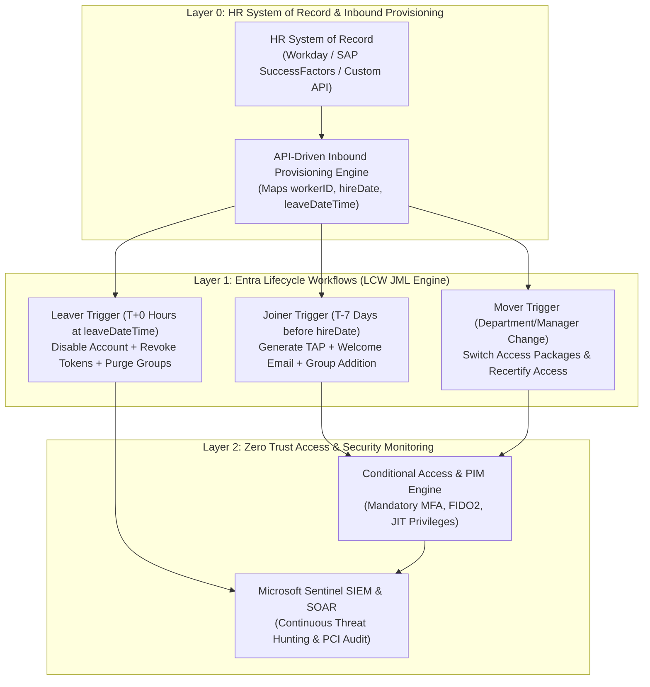
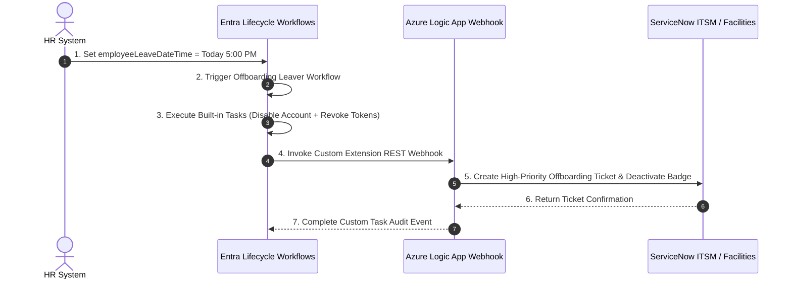

# SC-300 Day 19: Microsoft Entra Governance & Lifecycle: Automated Identity Management (Masterclass Capstone)

> **Source Video Title:** Microsoft Entra Governance & Lifecycle | Automated Identity Management | Day 19  
> **Source URL:** [https://www.youtube.com/watch?v=Zo1tt0lB2Zs](https://www.youtube.com/watch?v=Zo1tt0lB2Zs&list=PL86wiCAX5vmTg8uubUrlHOqXrjXk6p-73&index=19)  
> **Instructor:** Raghuveer  
> **Refactored & Expanded By:** Senior Principal Engineer & Distinguished Technical Fellow (ex-FAANG / MANGOS)  
> **Target Certification Track:** Microsoft Certified: Identity and Access Administrator Associate (SC-300) | Bridge to Cybersecurity Architect (SC-100), SC-200 & Cloud and AI Security Engineer Associate (SC-500 - Successor to AZ-500)  
> **Technical Currency:** Updated as of **August 2026**

---

## Executive Summary & Masterclass Capstone Blueprint

Welcome to **Day 19**—the final capstone module of the Microsoft Entra ID Security Masterclass.

In modern Zero Trust enterprise architecture, **Automated Identity Lifecycle Management & Governance** automates the entire employee journey: **Joiner, Mover, and Leaver (JML)**. Manually creating, updating, and offboarding accounts creates severe security risks, such as orphaned accounts retaining privileged access months after termination. Security architects must master **API-Driven Inbound HR Provisioning**, **Microsoft Entra Lifecycle Workflows (LCW)**, **Temporary Access Pass (TAP) Generation**, **Custom Extensions (Logic Apps Integration)**, and **What-If Simulation Testing**.

This document transforms the raw Day 19 lecture transcript into an **executive engineering reference manual and capstone framework**. We synthesize all 19 days of identity security engineering into an end-to-end architecture covering HR system sync, Joiner pre-hire onboarding, Mover role transitions, real-time Leaver termination, and SC-300 certification mastery.



---

## Module 1: API-Driven Inbound HR Provisioning Architecture

HR systems (Workday, SAP SuccessFactors, or custom HR databases) serve as the authoritative **Source of Truth** for identity lifecycle events.

### 1.1 Inbound HR Provisioning Pipeline

```
┌─────────────────────────────────────────────────────────────────────────┐
│                INBOUND HR PROVISIONING ARCHITECTURE                     │
├─────────────────────────────────────────────────────────────────────────┤
│ 1. HR System creates new employee record with `hireDate`.              │
│ 2. Entra Inbound Provisioning Service polls HR API or receives SCIM push.│
│ 3. Attribute Engine maps HR properties (`workerID` ──► `employeeId`).   │
│ 4. Provisioning agent creates User Object in Entra ID / On-Prem AD.     │
│ 5. Account created in `AccountEnabled = false` until pre-hire workflow. │
└─────────────────────────────────────────────────────────────────────────┘
```

---

## Module 2: Microsoft Entra Lifecycle Workflows (JML Engine)

Lifecycle Workflows automate tasks based on time-based triggers (`employeeHireDate` and `employeeLeaveDateTime`).

### 2.1 The Joiner, Mover, Leaver (JML) Taxonomy Matrix

```
┌─────────────────────────────────────────────────────────────────────────┐
│                    JML LIFECYCLE WORKFLOW MATRIX                        │
├─────────┬─────────────────────────────┬─────────────────────────────────┤
│ Stage   │ Execution Trigger           │ Automated Workflow Actions      │
├─────────┼─────────────────────────────┼─────────────────────────────────┤
│ **Joiner**│ **Pre-Hire (T-7 Days)**   │ 1. Generate Temporary Access    │
│         │                             │    Pass (TAP)                   │
│         │                             │ 2. Send Welcome Email to Manager│
│         │                             │ 3. Add to Baseline Groups & SKU │
├─────────┼─────────────────────────────┼─────────────────────────────────┤
│ **Mover** │ **Department / Manager**    │ 1. Revoke legacy Access Package │
│         │ **Attribute Change**        │ 2. Trigger Access Package request│
│         │                             │    for new role                 │
│         │                             │ 3. Notify new manager           │
├─────────┼─────────────────────────────┼─────────────────────────────────┤
│ **Leaver**│ **Real-Time (T+0 Hours at** │ 1. **Revoke Active Refresh Tokens│
│         │ **`employeeLeaveDateTime`)**│ 2. **Disable User Account**     │
│         │                             │ 3. Remove all Group Memberships │
│         │                             │ 4. Delete object after 30 days  │
└─────────┴─────────────────────────────┴─────────────────────────────────┘
```

---

### 2.2 Custom Extensions (Logic Apps Integration)

When built-in lifecycle tasks are insufficient, **Custom Extensions** trigger **Azure Logic Apps** or webhooks to interact with external ITSM tools (ServiceNow offboarding tickets, physical access badge revocation).



---

## Module 3: Master Capstone Synthesis: The 19-Day Entra Security Blueprint

```
┌─────────────────────────────────────────────────────────────────────────┐
│               MASTER ENTRA ID SECURITY ARCHITECTURE (SC-300)            │
├─────────────────────────────────────────────────────────────────────────┤
│ • Days 01-05: Cloud Infrastructure, VNet Peering, NSGs & Storage RBAC   │
│ • Days 06-10: Log Analytics, AMA/DCR, Entra Identity & Dynamic Groups   │
│ • Days 11-12: Zero Trust Conditional Access, SSPR & External ID B2B   │
│ • Days 13-16: PIM JIT Elevation, Access Reviews & SAML 2.0 / SCIM SSO   │
│ • Days 17-19: Workload Identities, Defender CIEM & Lifecycle Workflows  │
└─────────────────────────────────────────────────────────────────────────┘
```

---

## Module 4: Hands-On Verification & Principal Fellow Lab Guide

### 4.1 Lab 19.1: Creating Pre-Hire Onboarding Lifecycle Workflow via PowerShell

#### Execution Script:
```powershell
# Step 1: Connect to Microsoft Graph API with Lifecycle Workflow Scopes
Connect-MgGraph -Scopes "IdentityGovernanceTasks.ReadWrite.All", "User.ReadWrite.All"

# Step 2: Provision Joiner Pre-Hire Lifecycle Workflow (Triggers 7 Days Before Hire Date)
$WorkflowParams = @{
  DisplayName = "Joiner-PreHire-Onboarding-7Days"
  Description = "Generates TAP and adds employee to baseline groups 7 days before hire date"
  Category = "joiner"
  ExecutionConditions = @{
    "@odata.type" = "#microsoft.graph.timeBasedAttributeTrigger"
    Attribute = "employeeHireDate"
    OffsetInDays = -7 # 7 Days Before Hire Date
  }
  Tasks = @(
    @{
      TaskDefinitionId = "1b555e50-705e-4b76-9d0a-42c2f62a4a35" # Generate TAP Task
      DisplayName = "Generate Temporary Access Pass"
      IsEnabled = $true
      ExecutionSequence = 1
    },
    @{
      TaskDefinitionId = "0407137b-91f8-4720-94d0-40a248559092" # Send Welcome Email Task
      DisplayName = "Send Welcome Email to Manager"
      IsEnabled = $true
      ExecutionSequence = 2
    }
  )
}

# Step 3: Instantiate Workflow Object
New-MgIdentityGovernanceLifecycleWorkflow @WorkflowParams
```

---

### 4.2 Lab 19.2: Simulating Offboarding Leaver Workflow using "What-If" Mode via Azure CLI

#### Execution Script:
```azcli
# Execute What-If Simulation for Offboarding Leaver Workflow
az rest --method POST \
  --uri "https://graph.microsoft.com/v1.0/identityGovernance/lifecycleWorkflows/workflows/00000000-1111-2222-3333-444444444444/microsoft.graph.whatIf" \
  --body '{
    "whatIfConditions": {
      "userFilter": "department eq 'Sales' and accountEnabled eq true"
    }
  }'
```

---

## Module 5: Executive Knowledge Check & First-Principles Exam Readiness

### 5.1 The "What, Why, How, Where, When" Core Matrix

| Topic | What is it? | Why does it exist? | How does it work under the hood? | Where & When to use it? |
| :--- | :--- | :--- | :--- | :--- |
| **API Provisioning** | Inbound HR identity ingestion engine. | Bridges external HR systems with Entra ID automatically. | Processes SCIM JSON payloads to create/update user accounts. | Deploy when integrating Workday or SuccessFactors. |
| **Lifecycle Workflow** | Event-driven JML automation service. | Automates Joiner, Mover, and Leaver identity tasks. | Evaluates `employeeHireDate` and `employeeLeaveDateTime` triggers. | Mandatory service for enterprise identity lifecycle automation. |
| **Joiner Pre-Hire** | Workflow executing 7 days before hire date. | Ensures new hires have credentials and access on Day 1. | Generates TAP and emails manager 7 days prior to `employeeHireDate`. | Provision for all newly hired enterprise employees. |
| **Real-Time Leaver** | Workflow executing on employee termination date. | Prevents orphaned access security breaches upon offboarding. | Instantly revokes refresh tokens, disables account, and purges groups. | Enforce on 100% of employee terminations. |
| **What-If Mode** | Lifecycle Workflow simulation engine. | Validates workflow scope without affecting production users. | Simulates trigger conditions and returns execution logs. | Run before publishing any new Lifecycle Workflow to production. |

---

### 5.2 Distinguished Fellow Architectural Scenarios

#### Scenario 1: The First-Day Productivity Crisis
* **Question:** A newly hired Cloud Engineer arrives on their first day of work at 9:00 AM, but IT takes 3 days to provision credentials, assign licenses, and generate passwords, leading to lost productivity. How do you automate Day 1 readiness using Entra ID Governance?
* **Answer:** Configure a **Joiner Pre-Hire Lifecycle Workflow**.
* **Remediation:** Create a Lifecycle Workflow configured with the trigger `employeeHireDate` offset by **-7 days**. The workflow automatically generates a **Temporary Access Pass (TAP)**, emails the pass to the hiring manager, assigns M365 licenses, and adds the engineer to baseline security groups 7 days before their start date.

#### Scenario 2: Terminated Employee Access Exfiltration
* **Question:** A disgruntled employee is terminated at 5:00 PM. At 7:00 PM, the former employee uses an active mobile session cookie to exfiltrate proprietary source code from SharePoint. Why did account disabling fail to prevent data theft, and how do you fix it?
* **Answer:** Disabling a user account (`AccountEnabled = false`) does NOT invalidate active OAuth 2.0 refresh tokens immediately.
* **Remediation:** Update the **Leaver Offboarding Lifecycle Workflow** to include the explicit task **"Revoke User Sessions (Revoke Refresh Tokens)"** alongside account disabling. This instantly revokes all active OAuth tokens, invalidating browser sessions globally.

---

## Conclusion & Masterclass Graduation

Congratulations! You have completed all 19 Days of the **Microsoft Entra ID Security & Identity Masterclass**.

By mastering **Identity Foundations**, **Networking & Compute Security**, **Monitoring & Threat Detection**, **Conditional Access**, **Privileged Identity Management (PIM)**, **App Registrations**, **CIEM Permissions Management**, and **Automated Lifecycle Workflows**, you possess the first-principles knowledge required to excel in the **SC-300 Certification** and serve as a **Lead Cybersecurity & Identity Architect** in top-tier global enterprises.

> *"Automate the identity lifecycle from pre-hire to termination, enforce Zero Trust at every boundary, and never stop learning."*